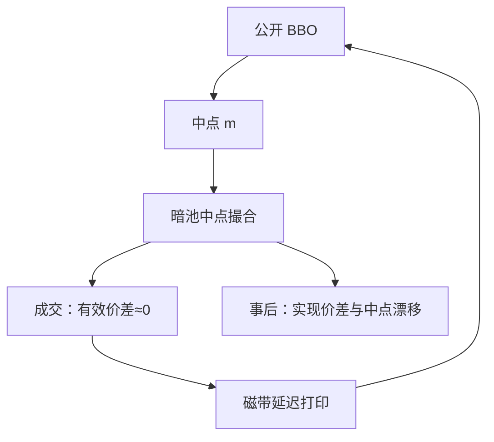

# 暗池、ATS 与中点单

不展示买卖报价的场所把匹配移到公开栅格内部，最常见的锚是公开中点。事前透明被牺牲，换的是更少的展示冲击，以及更难检验的对手方。

<footer>—— 据 Ready, The Tale of Two Exchanges, 以及 Zhu 对暗池与知情交易选择的理论；对照 SEC 对 ATS 的公开披露框架</footer>

[价格栅格](/quant/price-grid-tick)说明公开限价不能挂在半 tick 中点上。[订单类型](/quant/order-types)已经把暗池当成一种场所，没有写匹配锚与分段后的会计。本课的缺口是市场设计：ATS / 暗池用什么价格成交（中点、参考价改善、定期交叉）、谁被允许进来、成交如何打印回公开磁带。Ready 比较不同结构的执行成本；Zhu 问知情者会不会更爱暗处。后课的市场分割把暗池放进多场所系统；本课只把中点协议写清楚。

## 问题

公开连续簿的状态是 BBO 与深度。暗池的状态常常只有：你的单是否还在、有时有指示性量，没有公开的对方报价。中点单（midpoint peg / midpoint cross）把成交价钉在当时公开中点 $m$，买卖双方各让一半展示价差。对 taker 这是价格改善；对 maker 这是放弃报价价差、只赚（可能的）回扣或减少信息泄露。问题是 $m$ 来自哪一张公开簿、延迟多少、以及暗池里的对手是不是知情者。

若中点来自已经过时的 SIP，$m$ 可能已经被直连报价越过，中点成交其实是在过时的「中间」成交，经济上偏向一方。这与后课 SIP 对照衔接，本课先记下：中点协议寄生在公开报价上，公开报价的时钟质量就是暗池的定价质量。Zhu 的机制是：知情者在暗处隐藏规模，非知情者提供中点流动性时承担逆向选择。暗池不是免费的中点。

### 中点、参考价改善与定期交叉不是同一种 ATS

中点撮合：买卖单在 $m$ 上配对，常要求最小数量、或禁止会锁定公开市场的价格。参考价改善：允许在 $m$ 与 BBO 之间的价格成交。定期交叉：像迷你集合竞价，每隔一段时间用中点或出清价批量配对。三者的价差会计不同。中点成交的有效价差相对当时 $m$ 接近零，但不能说成本为零——你承担了等待、不成交、以及对手知情时的事后冲击。定期交叉更接近[集合竞价](/quant/continuous-vs-auction)，只是锚通常仍是公开中点。

「暗」指事前不展示报价，不是事后永不打印。美股成交仍须向磁带报告；延迟与场所代码决定研究能否把它从公开成交里认出来。A 股没有对等的股票暗池生态，本课的制度对象以 ATS 文献为主，对照写在边界。

## 方法

执行会计把暗池成交单独成列：到达中点、等待时长、成交价相对到达时公开中点、成交价相对成交时公开中点（两者因延迟可能不同）、以及随后 $\tau$ 的实现价差。相对到达中点的偏差度量时钟；随后中点移动度量逆向选择。Comerton-Forde 与 Putniņš 等对暗池份额与价格发现的经验工作，问的是暗成交增加时公开市场质量变好还是变差，而不是「暗池里省了半个价差」。

样本要按场所类型分：竞价交易所、做市商内化、中点 ATS、零售批发。全部混成「场外」会把零售改善与机构暗池挤在一个均值里。没有场所代码时，只能用「成交在公开 BBO 内部」当粗糙代理，该代理也包含零股与本所隐藏单，见[手数](/quant/lot-size-odd-lot)。

### 准入、分段与规模筛选

许多 ATS 对参与者做分段：零售、机构、高频。分段是为了降低毒性，等于在暗处做对手方选择。研究若把所有中点成交当同质，会低估分段场所的实现价差、高估开放场所的。规模筛选（minimum quantity）把小的探测单挡在外面，大单才匹配，这改变了冰山式的信息泄露，也改变了填成率。方法是把场所规则当成执行算法的状态，而不是当成一个滑点常数。

## 机制

中点协议把公开价差的一半做成匹配锚。公开做市商仍在格子上报价，为全市场生产 $m$；暗池免费（或几乎免费）使用这个锚。于是出现搭便车：展示流动性的激励下降，中点成交的份额上升，公开深度可能变薄。这是市场设计的反馈，不是道德批评。若公开 BBO 变宽，$m$ 的质量下降，中点成交的「改善」以更差的锚为参照，改善是幻觉。

信息写入：暗成交若延迟打印，公开簿短时间内不知道发生过交易。知情买入可以先在暗处吸量，再出现在公开跳价里。价格发现的领先滞后会偏向公开报价场所，即使成交量已经大量离开。Hasbrouck 式份额用报价新息，暗池没有报价，份额自然不算它——这是度量的盲区，不是暗池没有信息。

不要用 [Roll](/quant/roll-model) 去估暗池价差：暗池经常没有买卖回跳，成交钉在中点，协方差结构被设计成接近零。有效价差相对 $m$ 也接近零。有信息的是实现价差和填成率。

### 中点锚的延迟就是暗池的定价误差

锚若来自过时 SIP，$m$ 已不是可成交中间。实现价差会把管道延迟写成逆向选择。对照应同时报到达中点与成交中点，分叉归时钟，漂移归信息。

## 边界

欧洲的暗交易限制、美股对 ATS 的透明度规则、中国股票市场几乎不存在对等暗池，不能互相外推结论。债券、CDS 的「暗」是 OTC 询价，见[公司债 OTC](/quant/corporate-bond-otc)，匹配锚不是股票 SIP 中点。加密的非展示订单在中心化交易所内部，法律地位与 ATS 不同。

A 股没有对等 ATS 中点生态。把美股暗池改善率搬到沪深连续竞价，制度对象不存在。

本课不讨论如何识别或规避暗池里的有毒对手，只要求：中点不是免费午餐，锚的时钟和对手方分段决定实现成本。下一课把暗池放进多场所与 NBBO 的系统里。

## 小结

- 中点单寄生在公开 BBO 上；公开报价的时钟就是暗池的定价质量。
- 有效价差接近零不表示成本为零，要实现价差、等待与不成交。
- 中点撮合、改善撮合、定期交叉是三种 ATS，会计不同。
- 分段与最小数量改变毒性，不能把所有暗成交当同质。
- 暗成交挤出展示深度时，中点锚本身会变差。
- 出处：Zhu, *RFS*, 2014；Ready 对执行场所的比较；Comerton-Forde and Putniņš 等对暗池与价格发现的经验工作；SEC ATS 披露文件。
