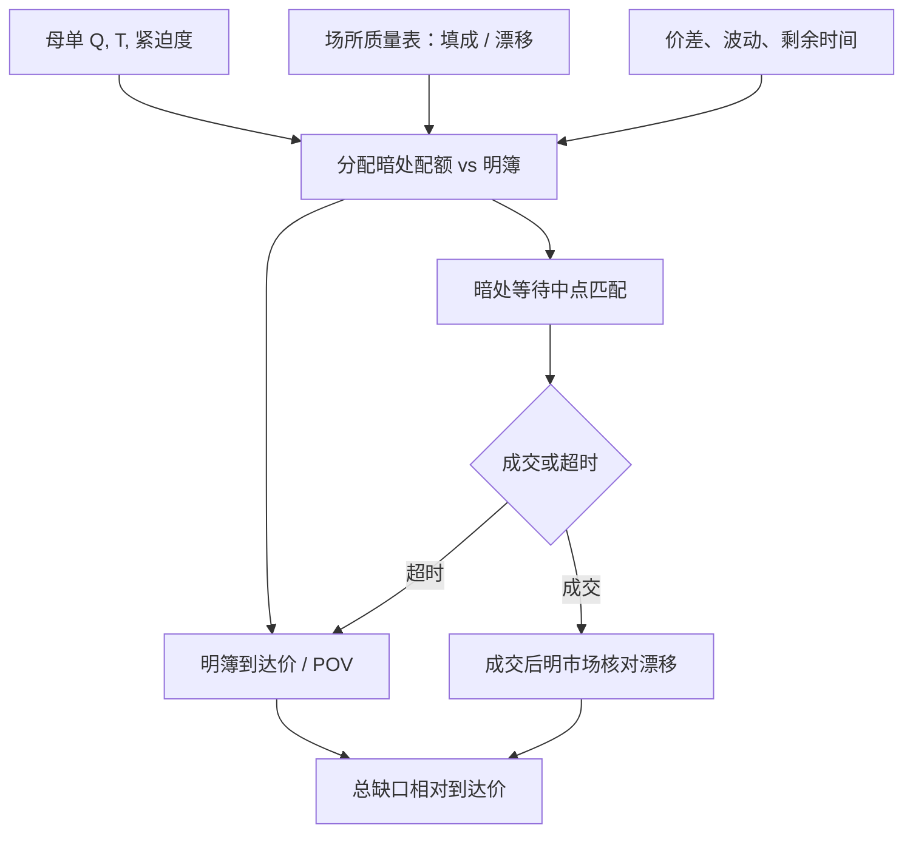

# 暗池路由

    
事前不展示报价的场所，用公开中间价附近的匹配换更少的脚印；路由要问的是成交概率与逆向选择如何随场所质量变化，而不是如何把探测单做成干扰他人的工具。

    <footer>—— 据 Harris 对事前 / 事后透明的区分；对照 Buti, Rindi and Werner 以及 Ye 对暗池与市场质量的研究</footer>

[上一课](/quant/arrival-price)以到达中点 $M_0$ 为参照优化实施缺口，无漂移下基准为确定性轨迹，完成率政策决定末端块。缺口是场所分配：一块母单的多少比例、在何种状态下被送到不展示报价的场所，其余仍走明簿或竞价。暗池路由权衡脚印、填成概率与逆向选择，不是冲击为零的仓库。本课写这条市场结构，以及中点相对 BBO 的节省必须用成交后明市场漂移核对。不重写到达价的 $\lambda$ 与 $T$ 映射。A 股没有美股式 ATS，名称不能翻译。

## 问题

母单要在 $T$ 内完成，明簿提供事前深度与确定的优先规则，但展示与主动成交会留下脚印，冲击进入到达价缺口。暗池提供事前不透明：对手看不见你的量，你也看不见对手是否存在。路由是分配过程 $q_{\mathrm{dark}}(t)+q_{\mathrm{lit}}(t)$，使期望缺口可接受。问题不是「暗池更便宜所以全走暗」，而是：中点成交省下的半价差，有多少会被随后明市场的不利跳动（逆向选择）吐回去；以及暗处不成交时，延误如何变成时机成本。

场所之间质量不同。有的只与自营或零售流匹配，有的与对冲基金流匹配，有的定期交叉。学术度量用成交后明市场中点的方向性移动来代理逆向选择，用成交率代理填成。路由模型若把所有暗池当成同一个「中点、零冲击」仓库，会高估暗处的净优势。监管与数据契约还决定你事后能不能识别哪一笔来自暗处：没有标志，TCA 无法分场所归因。

### 中点节省不是净边缘

买入在中点成交，相对当时买一似乎省了半价差。若对手方知情，中点在随后窗口向不利方向跳，$\tau$ 后的中点可能已经差过当初的卖一。有效成本是到达中点到成交后对照中点的缺口，而不是相对 BBO 的瞬时改善。这与[价差分解](/quant/spread-decomposition)里实现价差的逻辑同构：做市商的实现收入，对应主动方的事后成本。暗池路由必须用事后窗口评价，不能用「中点 vs 吃卖一」的事前算术。

最小数量、条件单与中点匹配规则改变谁愿意待在暗处。门槛高，小单进不去，剩余流的知情比例可能上升。这是场所设计对逆向选择的影响，不是建议用探测单去测量隐藏量。

## 方法

研究与执行设计共用一套可观测状态，但不共用「试探对方」的手法。状态包括：明簿价差与深度、近期波动、自身剩余量与剩余时间、该场所历史填成率与成交后漂移（按股票、时段、方向分层）。分配规则可以是静态比例（例如先把不超过 $p_{\mathrm{dark}}$ 的量放在中点等待，其余按到达价在明簿执行），或条件规则（仅当明簿价差宽于阈值、且该场所样本外漂移可接受时才路由到暗处）。条件必须来自事先校准的场所质量表，并定期样本外更新。

填成与冲击的联合目标近似为

$$
\mathbb{E}[C]=\mathbb{E}\bigl[q_{\mathrm{d}}(\tfrac{s}{2}\text{节省}+\text{事后漂移})+q_{\ell}(\text{明簿冲击}+\text{价差})\bigr]+\mathbb{E}[\text{未完成}].
$$

事后漂移用成交后短窗明市场收益对成交方向的回归来估，按场所与流动性桶分层，时间切分交叉验证。填成率用自身历史指令的存活分析，协变量含剩余时间、价差、波动，见[排队与成交概率](/quant/fill-probability)——暗处没有 FIFO 档位，但仍有「等到匹配或等到取消」的竞争风险。明簿腿仍受[参与率封顶](/quant/participation-cap)约束，避免暗处不成交时把全部剩余在明簿上一次性倒出。

### 场所质量如何进表，而不进探测脚本

可报告的质量指标：成交率、成交后 $1$–$5$ 分钟（或 ADV 时间）方向性移动、相对同期明市场的价格改善分布、拒绝/取消率、以及与自身母单紧迫度的交互。指标用于**选择进入哪些场所、给多大静态上限**，以及事后 TCA。不把短间隔的小单序列设计成测量对方隐藏意向的工具——那既超出本篇对象，也把市场质量研究滑向干扰。文献中讨论的 pinging / gaming 是监管与场所设计要缓解的现象（对手方识别、最小数量、随机延迟、定期拍卖），执行研究的响应是避开质量差的场所、收紧最小数量与等待时间，而不是复制那些模式。

A 股侧应单独建表：大宗交易的价格限制与披露时滞、盘后固定价格交易的量与时间、港股暗盘与竞价的分割。把美股 ATS 的中点节省直接乘到沪深股票上，场所都不存在。跨境与互联互通还有额度与时段约束，路由状态机要加制度节点。

## 机制

事前不透明降低数量泄露：明簿上的大显示单会改变他人的报价与抢跑激励；暗处匹配把博弈从「看见深度」改成「是否相遇」。代价是双边都看不见供给，匹配依赖随机到达或周期性交叉，填成是概率。柠檬机制：对自身价值知情的交易者相对更偏好少留脚印的场所，非知情大单也为了冲击而来，两者相遇使暗处的平均对手方可能劣于明簿上与做市商或零售流的相遇。结果是中点成交的条件期望漂移不为零。明簿做市者若预期知情流已分流，可能加宽价差或变薄深度，暗池对市场质量的净效应在不同论文与样本中符号并不统一——这正是要自己估场所表的原因。

价格发现机制：若大量成交发生在暗处且打印延迟，明簿报价含信息变少。Reg NMS 环境下的打印规则与延迟是制度变量。评价路由不应假设暗处成交对后续明市场价格没有影响；自己的暗处成交仍可能通过打印与他人推断进入 $M_t$。

### 与明簿到达价如何分工

暗处腿像一张随机填成的限价（价格钉在中点），明簿腿像带冲击的主动或被动执行。剩余时间短时，暗处等待的机会成本上升，最优是提高明簿参与、降低暗处配额——与 OW「期末不再等待弹性」同构。波动升高时，中点本身跳动大，暗处的价格改善方差变大，场所漂移估计更噪，应缩小暗处上限而不是加大。母单若必须参加收盘竞价，暗处配额要在竞价前终止，以免两处抢量或两处都未完成。

暗池路由的「智能」若无法复述成：进入条件、数量上限、等待上限、失败后回明簿的规则，以及场所质量表的更新频率，那就只是供应商黑箱。TCA 应按场所拆开短fall。

## 边界与工程取舍

没有成交标志时无法做场所归因，只能把整个经纪商算法当黑箱对比。暗处成交与冰山是不同对象：后者仍在明簿价格–时间队列里，前者不在这张簿上。把隐藏量与暗池加总成「非显示流动性」会混掉优先规则与中点参照。期货主市场、加密货币「隐藏单」与股票 ATS 不可共用一套 $\eta$。

不要用全样本「含暗池的算法短fall 更低」来证明路由最优：可能是母单更被动、$T$ 更长。应在相似紧迫度与 $T$ 下比较。不要把文献中的市场质量结论当成某一家场所的保证。核对：分场所成交后漂移是否样本外稳定、暗处配额提高时完成率与 IS 分位数如何变、明簿价差在自身大量走暗之后是否走阔（容量与拥挤）。合规上遵守各市场对暗盘、大宗披露与最佳执行的公开规则；本篇不讨论规避披露或干扰撮合的做法。

A 股研究若只有连续竞价 L2，没有暗池可路由。此时本篇的决策变量退化为：多少量放在大宗/盘后、多少量放在连续与开收盘竞价。仍是场所分配，仍用成交后价格与披露规则评价，而不是套用 ATS 名词。

## 小结

- 暗池路由是在事前不透明场所与明簿之间分配数量，权衡脚印、填成概率与逆向选择，不是冲击为零的仓库。
- 中点相对 BBO 的节省必须用成交后明市场漂移核对；柠檬问题使净优势随场所质量变化。
- 质量表用于选择场所与静态上限，并做 TCA；执行研究不把探测序列当作工具。
- 剩余时间短、波动高、须参加竞价时，应降低暗处等待、提高明簿可执行速率。
- 名称与制度不能跨市场翻译；A 股对应的是大宗与盘后等公开机制。
- 出处：Harris, *Trading and Exchanges* 对透明性的论述；Buti, Rindi and Werner, *Diving into Dark Pools*, 工作论文 / 市场质量研究；Ye, *A Glimpse into the Dark* 一类对暗池与价格发现的实证；对照 Mittal 对对手方质量与市场结构的讨论（作为质量文献，而非操作说明）。
