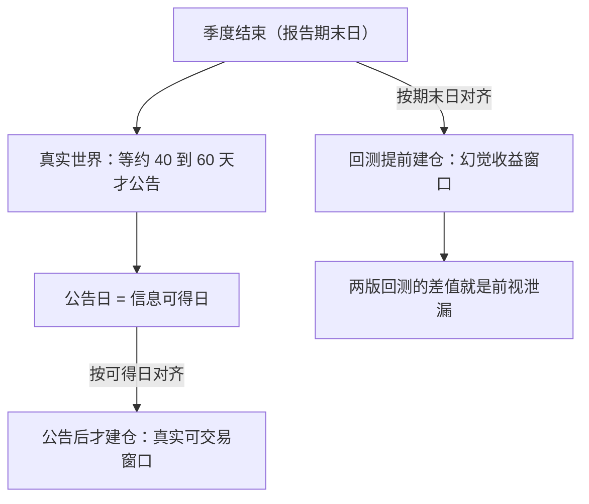
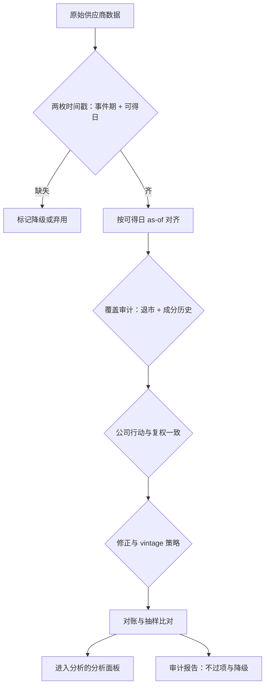

# 数据获取与审计

回测里最贵的错误不是算错，而是把「数据存在」当成了「当时已知」。

<footer>—— 据时点数据库（CRSP / Compustat 点时快照）与 SEC Reg FD（2000）的实务口径整理</footer>

[上一课](/quant/hypothesis-preregistration)把假设合同签在动手之前，其中 universe、排除规则与成本假设都要落到具体数据上。本课是「假设与数据」单元的最后一道闸：让数据配得上合同。前视与幸存者的理论分别在[前视偏差](/quant/look-ahead-bias)与[幸存者偏差](/quant/survivorship-bias)讲过；本课不重讲理论，把它们用成一张可执行的审计清单。

## 问题

注册文档写「公告后六十个交易日」，数据集给你的字段是报告期末日；写「当时可交易的股票」，数据集给的是今天还活着的列表；写「财报数字」，供应商给的是修正过三轮的最新值。三种错都发生在获取这一步，且全都不报错——数字看起来都像样。点时逻辑在[时点基本面](/quant/point-in-time)与 [Point-in-time 基本面](/quant/pit-fundamentals)里已经立起：每个字段带两枚时间戳，事件归属期与信息可得日。本课的问题是：拿到任何一份新数据，怎么在动手前系统地确认它经得起这两枚时间戳的拷问。

「两枚时间戳」翻译成大白话：一条财报数据既要说清它描述的是哪个季度（事件期），又要说清你最早在哪一天能查到它（可得日）。回测在 $d$ 日做决策时，只有可得日 $\le d$ 的记录才算「当时已知」，其余一律不许进信号。

## 方法

审计清单五项，按序过。**一，时点性**：每个用于构造信号的字段有无「可得日」；回测按可得日做 as-of 对齐，做法见[点-in-time 基本面对齐](/quant/pit-alignment)与[财报滞后与可用日期](/quant/filing-lag-available-date)。没有可得日的字段，标记不可用或只用于截面比较。**二，覆盖与 universe**：退市股在不在面板里；指数成分有无历史（[指数成分历史](/quant/index-constituents-history)）；起止日期画分布，别只看总行数。**三，公司行动**：复权方式与信号计算一致（[分红、拆股与复权](/quant/corporate-actions)），股本变动有历史版本。**四，修正与重述**：拿到的是初值还是最新值（[基本面数据与重述](/quant/fundamentals-restatements)）；有 vintage 快照用快照，没有就把修正字段整体降权。**五，对账**：行数、唯一键、重复时间戳、校验和，抽样与第二来源比对（选择口径见[数据供应商对照](/quant/data-vendors)）。

审计报告一页，附在注册文档后：每项过或不过，不过时给出降级用法。

SEC 对大型加速申报人的期限：10-K 为期末后 60 天，10-Q 为 40 天。把报告期末日当公告日用，等于让 PEAD 回测在公告之前就开始持有——信号的头几十个交易日是幻觉。

### 审计改变结论的例子

同一个 SUE 信号：按期末日对齐，回测 IC 漂亮；换可得日对齐，公告前那段的「信号」消失，只剩公告后的真实漂移。差异不是模型调好了，而是审计把一段不存在的可交易期从结果里删掉了。

初学者容易以为把数字放进报告期那一行只是「排序习惯」。实际上对齐日决定了信号从哪一天起才可交易：按期末日对齐，回测在公告前就开始「持有」，这段收益现实中根本拿不到；换成可得日对齐，幻觉窗口整体消失，剩下的才是真实可得的信号。

## 机制

审计守三件事。守**知识集合的单调性**：$t$ 日的决策只能用 $t$ 日前已公开的信息——理论是前视偏差，清单把它落到每一列。守**宇宙的完整性**：面板里少一只退市股，等于给每个截面的多头腿做了一次正向筛选。守**值的代际**：用修订值做信号、用初值算漂移，两条线一混，剩下的差异全是数据工程噪声。这三件事没有一件能靠统计事后修正——它们发生在似然函数写成之前，这正是审计排在评估前面的原因。

## 边界

审计只保证「错误方向已知且偏保守」，不保证数据正确：缺失就是缺失，回填得再平滑也不产生信息（[回填偏差](/quant/alt-data-backfill-bias)）。vintage 数据贵，很多研究只能用最新值加修正标记，降级用法要写进审计报告，让读者知道结论带多少水分。审计绑定数据版本：供应商一升级，清单重跑。最后，清单不能替代抽查——每季度抽几只股票手工走一遍生命周期（上市、公告、拆股、退市），人眼比脚本更能发现「字段都在但语义不对」的错。

数字感受覆盖缺失：假设每年约 4% 的公司退市或被并购，$0.96^{10}\approx0.66$，十年下来约三分之一的样本消失了。若面板只留活到今天的股票，等于每个截面都先删掉失败者再选股，回测收益被系统性抬高，而且全程没有任何报错。同理，「vintage 快照」就是给数据库每天拍一张底片：调的是当时的原始值，不是被后来几轮修订改过的「最终答案」。

## 小结

- 数据审计五项：时点性、覆盖与 universe、公司行动、修正与重述、对账。
- 时点性的核心是两枚时间戳：事件归属期与信息可得日；回测按可得日对齐。
- 审计错误发生在似然函数写成之前，统计修正救不回来。
- 审计报告一页入台账，降级用法显式化；数据版本变更即重审。
- 出处：CRSP / Compustat 点时数据库实务口径；SEC Reg FD (2000) 与申报期限规则；点时与幸存者理论见站内对应课。
