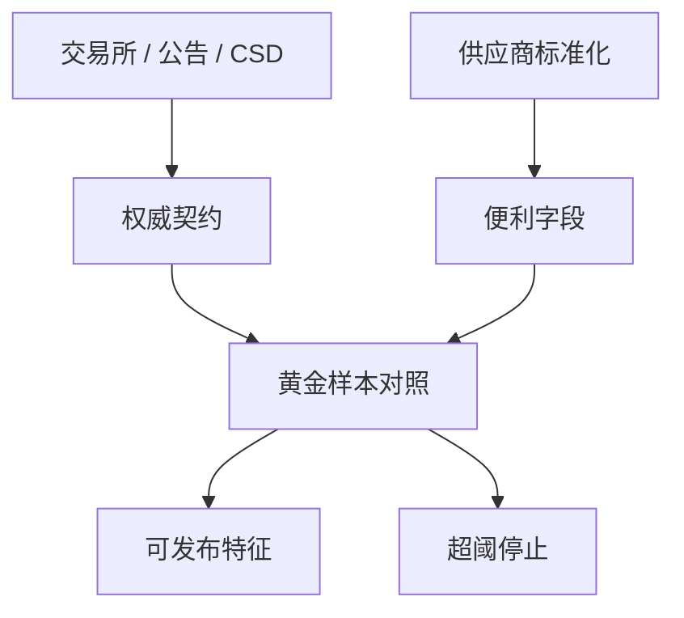

# 数据供应商对照

同一字段名在不同供应商里可以是不同的经济对象：复权链、共识口径、成分生效日各不相同。对照不是比哪家「更准」，是声明你的契约。

<footer>—— 对照 WRDS 对各库的说明；Hasbrouck 对微观结构数据源的讨论；IBES / Compustat / 交易所官方源的口径差异</footer>

[上一课](/quant/adjustment-implementation)把复权做成研究收益与下单价格分列：公司行动按除权日点-in-time 接入，涨跌停与 tick 用未复权官方前收盘。前六课分别接入 CRSP/Compustat、TAQ、重述、共识、指数成分、复权。缺口是**横向对照**：换一家终端，面板会动多少，以及哪些差是错误、哪些是定义。本课写供应商对照，不重推复权公式。后课特征商店把对照后的字段收成可版本化的特征。

## 问题

常见差：价格是否含分红、是否前复权；盈利是 GAAP 还是供应商「报告盈利」；指数权重是自由流通还是总市值；时间戳是交易所还是入库。把两家的「收盘价」并成一列取平均，没有经济含义。问题是对每个进入信号的字段列出：权威源、备源、允许的最大偏差、偏差时以谁为准。权威源通常是交易所/CSD/公司公告；供应商是便利的标准化层。

许可与延迟不同。官方源可能更慢或更难用；供应商更快但有清洗与错误。实时交易用供应商、研究用官方修订版，会制造研究–实盘缺口。应把「研究源」与「交易源」写成配置，并测量二者信号差，而不是在事故后才发现。

### 代码与名称不是主键

股票代码复用、公司更名、多交易所上市，使 ticker 不能当历史主键。应用 permno / gvkey / ISIN + 市场 + 生效区间。供应商内部代码（FIGI 等）有助于对齐，但仍要生效区间。上一课复权链在不同供应商上的除权日差一天，足以毁掉事件研究；对照应包括公司行动日历，不只是价格。

A 股 Wind、聚源、恒生聚源、交易所官方、中国结算，字段同名不同义的情况同样普遍。北向持股、两融余额的披露时点各源不同，情绪课会再用到。

## 方法

黄金样本：随机抽证券–日期，拉取各源的价格、成交量、分红、成分标志、共识。报告偏差分布，而不是只报告相关系数。相关系数高仍可有系统性偏差（单位、复权）。设置告警：偏差超过阈值则停止该字段的特征发布。新供应商接入必须先过黄金样本，再进生产。

血缘：每个特征记录 `source_id`、`schema_version`、`pulled_at`。换源等于新特征，直到对照显示可替代。论文复现应写出供应商与库版本；只写「我们用会计数据」不可复现。

### 微观结构源尤其不能混

TAQ、直连、行情商 L2、经纪商推送，延迟与层次不同，见 SIP 课。对照若只比日收盘，会给出「大家都一样」的假象。应按用途分：日频因子允许供应商日线；执行研究必须钉交易所馈送。

## 机制

标准化是有损压缩。供应商帮你填缺失、调单位、选「主交易场所」，也帮你引入过滤器偏差。换源等于换过滤器，因子衰减可能是数据契约变了，不是 alpha 死了。McLean–Pontiff 一类样本外衰减研究，若前后用不同库，衰减里含契约跳跃。

成本：官方源 + 点-in-time 仓储贵，但比错误 alpha 便宜。多源冗余用于对账，不用于平均出「更真」的价格——真价格是成交，唯一。

## 边界

不提供破解终端、绕过许可或爬取受版权保护的整库。对照在许可范围内做。另类数据（卫星、信用卡）另有供应商风险，本课原则适用，细则不在此展开。

## 小结

- 字段对照比相关系数；权威源与交易源必须配置化。
- 换源视为新特征；公司行动日历与价格同样要对。
- 日频一致不等于微观结构一致。
- 出处：WRDS 库文档；Hasbrouck；各官方编制与公告源。
