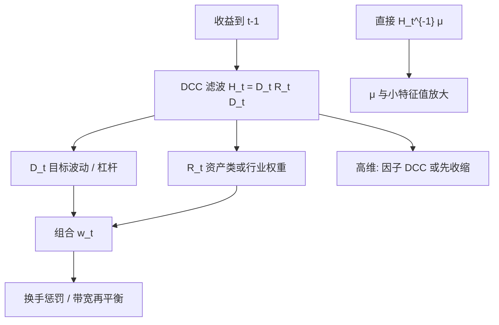

# DCC 动态相关入组合

    
条件相关在下跌日升高，不是把静态 $\Sigma$ 再估一遍就能看见的；把 $H_t=D_t R_t D_t$ 送进配置规则，组合才能在相关体制切换时改口，而不是只在波动上加杠杆。

    <footer>—— 据 Engle, Dynamic Conditional Correlation, JBES 2002，把同一套 $H_t$ 接到均值–方差与风险预算</footer>

[动态条件相关](/quant/dcc) 的论文回答的是：高维 $H_t$ 怎么估。组合构建要回答的下一句是：$H_t$ 估出来之后，最小方差、[ERC](/quant/erc)、切点或杠杆目标要不要每天跟着 $R_t$ 改。静态 [Markowitz](/quant/markowitz) 用一张 $\Sigma$，危机里股票–债券、行业内、跨国相关一起跳，事前风险与欧拉贡献同时失真。Engle 的 DCC 把相关做成慢速均值回复的状态，恰好可以当战术 $\Sigma_t$。本篇不重复两步准似然的推导，只写把 $H_t$ 接入优化器时的对象、换手、与 [EWMA 协方差](/quant/ewma-cov) 的差别，以及为什么「相关动了」不等于「你应该交易」。

## 问题

配置规则对 $\Sigma$ 的依赖是二次的。相关从 $0.3$ 升到 $0.8$，分散化在公式里几乎消失，最小方差会把权重从「看似对冲」的多腿上撤走，ERC 会降低高相关簇里每一名字的权重以免重复计数。若你仍用五年等权协方差，这些调整要等新样本把旧相关稀释掉才发生，往往已经是危机中段。问题不是再发明一个优化器，而是让**输入**的二阶结构与当前体制对齐，同时控制因 $H_t$ 滤波噪声引起的虚假换手。

DCC 的识别来自分解 $H_t=D_t R_t D_t$：对角可以跟得很快（GARCH），相关跟得较慢（$a,b$）。组合若只对对角做目标波动、相关仍用常数，得到的是「波动目标 + 静态分散化」，2008 与 2020 里第二项会失效。若把整块 $H_t$ 每天逆一遍做切点，则 $D_t$ 的高频抖动会通过 $\Sigma^{-1}$ 变成权重抖动，$\mu$ 的误差叠上去更糟。需要规定：哪一层组合吃 $R_t$，哪一层只吃 $D_t$，再平衡频率如何与 $a+b$ 的持久性匹配。

### 静态相关在组合里错在哪

CCC 或长窗相关假定 $R$ 不变。经验上股权相关在市场下跌时升高，这正是你最需要分散化的时候分散化消失。用静态 $R$ 做的风险平价，事前各资产类贡献相等，事后股票贡献可以占 80%——不是 ERC 定义错了，是 $\Sigma$ 不是那张。用静态 $R$ 做的最小方差「股票–债券」对冲，会在相关跳到 1 附近时变成单纯的久期或 beta 赌注。把 DCC 的 $R_t$ 接到同一规则上，是让规则在相关体制里有一阶响应，而不是改目标函数。

相关升高与波动升高经常绑在一起。若你已经用 EWMA 或 GARCH 对角做了目标波动，组合的名义杠杆已经在降；再让 $R_t$ 驱动行业内权重，才是 DCC 相对 EWMA 的增量。若只把 $H_t$ 当一张更吵的协方差去逆，增量会被换手吃掉，看不出相关通道的贡献。

## 方法

记 $t$ 日开盘前已有 $\hat H_t$（用 $t-1$ 及以前的收益，避免把当日收益泄漏进权重）。三类接入：

**风险预算 / ERC。** 用 $\hat H_t$ 替换 $\Sigma$，解 $w\circ(\hat H_t w)\propto\mathbf{1}$ 或按政策向量 $b$ 做预算。相关簇收紧时，簇内名字的权重自动下降。这一层对 $\mu$ 免疫，是 DCC 入组合最干净的用法。

**最小方差 / 目标波动。** $w_t\propto\hat H_t^{-1}\mathbf{1}$，再按 $\sigma^\star/\sqrt{w^\top\hat H_t w}$ 缩放。对角度高时，逆矩阵对 $R_t$ 的小特征值敏感，必须先对 $\hat H_t$ 收缩或改用因子 DCC。不要把未正则的 $\hat H_t^{-1}$ 直接当股票池权重。

**切点 / BL。** $w\propto\hat H_t^{-1}\mu$ 或 $\Pi=\delta\hat H_t w_{\mathrm{eq}}$。此时 $H_t$ 进入均值通道：波动升高会压低隐含超额的尺度（若 $\delta$ 固定），相关结构改变会旋转 $\Pi$ 的方向。[Black-Litterman](/quant/black-litterman) 的战略叙事用慢速 $\Sigma$ 更稳；战术 BL 可以用 DCC，但 $\tau$ 与观点 $\Omega$ 要按 $H_t$ 的尺度重标，否则观点精度会被日度波动带着跑。

估计仍用 Engle 的两步：一元 GARCH 得 $D_t$，标准化残差上估 $a,b$ 与 $\bar Q$，滤波出 $R_t$。资产很多时标量 DCC 的共用 $a,b$ 过刚，组合侧应改用分组或因子 DCC，让行业内相关与跨市场相关可以不同速。$\bar Q$ 建议用衰减或收缩，以免十年前的危机永远抬高平静期的分散化幻觉。

### 再平衡：滤波频率不等于交易频率

$H_t$ 每天更新，不意味着每天把组合推到新的 $w_t^\star$。$a+b$ 贴近 1 时 $R_t$ 极持久，日度权重变化里很大一块是 $D_t$ 的抖动。实务上常见的拆法：用 $D_t$ 做日度杠杆 / 目标波动（便宜、与波动目标产品一致）；用一周或一月平滑后的 $R_t$ 做资产类或行业权重。这与 [换手惩罚](/quant/turnover-penalty) 是同一件事的两种写法：要么在目标里加 $|w-w_0|$，要么在输入上先把 $R_t$ 走慢。评价时应报告「只用对角时变」相对「对角+相关都时变」的样本外增量，以及各自的换手；只有 $H_t$ 更准但换手翻倍，净收益可以更差。

## 机制

机制分两层。对角 $D_t$：单资产波动升，目标波动规则降杠杆，ERC 降该资产权重，最小方差亦然——EWMA 也能做。相关 $R_t$：标准化残差同号大冲击抬高 $Q_t$，若干资产被识别为更冗余，优化器在簇内做减法、在簇间做加法。这是静态 $\Sigma$ 做不到的「分散化的状态依赖」。危机里两层同时动：杠杆降、簇内更集中被惩罚，组合的事前风险不会仍按平静期相关来报。

与 EWMA 的差别在识别。EWMA 的交叉项混有波动；DCC 先剥掉 $\sigma_{it}$，相关通道更干净。代价是边缘 GARCH 误设会污染 $e_t$，进而污染 $R_t$ 与组合。一元杠杆效应（GJR/EGARCH）没吸干时，DCC 会把剩余的下跌–波动关系读成相关跳动，行业中性组合可能在大跌日错误地「认为科技股更同涨」而过度分散到看似独立、其实只是还没跌的板块。

把 DCC 的 $R_t$ 某个元素当成可交易的「相关 alpha」去买方差互换或相关互换，已经离开本篇的对象。这里 $R_t$ 是风险输入，不是信号。相关溢价与相关交易要另做可交易性与成本，见价差与冲击那一层，不要用组合优化器的换手去「实现」一个没有执行模型的相关观点。

### 估计误差如何变成错误的主动权重

$a,b$ 估不准，$R_t$ 要么几乎常数（退化成 CCC），要么近单位根（危机后粘在高相关）。前者让 DCC 入组合没有增量；后者让危机结束后很久仍按「永久高相关」配置，股票–债券平价会持续超配债券、低配股票，直到滤波慢慢回来。这是另一种幽灵效应，只是发生在相关而不是方差上。缓解：对 $R_t$ 做向 $\bar Q$ 的额外收缩、设 $a+b$ 上限、或在组合约束里钉住战略暴露的走廊，让 DCC 只在走廊内做战术。

高维时 $\bar Q$ 本身病态，滤波出的 $R_t$ 正定但不代表可逆后可用来优化。因子 DCC（相关由少数因子载荷驱动）或先做行业指数再在指数层 DCC、指数内用静态收缩，是把维度从优化器里拿掉的办法。个股层直接 DCC 再 Markowitz，几乎总是错误最大化。

## 边界与工程取舍

不要用 DCC 协方差替换 CVaR 情景还声称管理了尾部：DCC 是二阶，尾依赖要 Copula 或压力情景。[CVaR 优化](/quant/cvar-opt) 的输入应是路径，不是一张 $R_t$。不要在有跳跃的日子把 $e_t$ 当高斯外积：一次跳可以让随后几十天的 $R_t$ 歪掉，组合会为一次数据错误持续再平衡。不同步成交会压低高频 $R_t$，跨国组合用日度收盘做 DCC 已经勉强，用小时更糟。

无观点的切点加上每日 $H_t$，会把波动当信号：低波动资产在 $D_t$ 下降时被加杠杆，这与低波动异常的拥挤叠加。若这不是你要的暴露，应把 $\mu$ 钉死（BL 或风险平价）只让 $H_t$ 改风险预算。约束很多时，$H_t$ 的变化大部分被可行集吃掉，转移系数很低，估 DCC 的成本就浪费了——先检查 [多空约束](/quant/long-short-constraints) 是否已经把组合钉在角点。

Engle（2002）的模型是 simple class，入组合时更应保持简单：资产类或因子层，而不是 3000 只股票的标量 DCC。论文可估计不等于优化器可消化。

## 小结

- 把 Engle DCC 的 $H_t$ 作为时变 $\Sigma$ 接入 ERC、最小方差或战术 BL，让配置对相关体制有响应。
- 对角与相关应拆开用：日度杠杆吃 $D_t$，较慢的权重吃 $R_t$；滤波频率不等于交易频率。
- 相对 EWMA，DCC 分离「波动」与「标准化相关」，增量在第二通道；未正则的 $H_t^{-1}$ 仍会误差最大化。
- 高维用因子 / 分组 DCC；$\bar Q$ 与 $a+b$ 近 1 会制造相关幽灵，需收缩或战略走廊。
- $R_t$ 是风险输入不是相关 alpha；尾部仍要情景或 CVaR，不要用二阶矩阵代替。
- 出处：Engle, *JBES*, 2002；组合应用与两步估计见 Engle and Sheppard 工作论文；非对称相关见 Cappiello, Engle, Sheppard, 2006。
