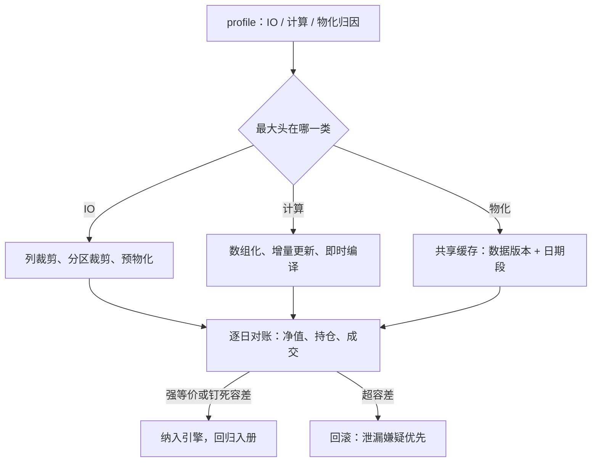

# 回测性能优化

过早优化是万恶之源；但在回测里，优化晚了照样是恶——省下的每一小时都被换成多扫一轮参数，泄漏跟着速度一起涨。

<footer>—— 据 Knuth, Structured Programming with go to Statement, 1974；与站内回测向量化的合法性判据整理</footer>

[上一课](/quant/de-distributed-backtest)把回测摊到集群，前提是每个叶子任务别太慢；本课回到单任务：一个回测跑十小时，集群再大也白搭。性能优化的对象是算法复杂度与数据访问，方法来自普通工程；特殊之处在约束——每一处「提速」都可能顺手改变信息集，把泄漏当加速。判据沿用[回测向量化](/quant/backtest-vectorization)：优化前后信息集必须逐日相同。

## 问题

性能问题先诊断再动手，症状分三类。IO 密集：时间花在扫描与反序列化，十小时里八小时在读 tick——解法在数据侧，选型课的列存与分区裁剪在这里兑现。计算密集：时间花在逐行循环与重复计算——解法在算法侧。无谓密集：时间花在重算不变的东西——解法在物化侧。不区分就优化的典型下场：把最热的查询路径重写成更快的逐行循环，而时间根本不在那里。诊断工具就是 profiler：按函数、按数据段计时，先找到那八小时。

### 三类优化各有边界

数据侧：列式读取按需取列（[Apache Arrow](/quant/apache-arrow) 的零拷贝列式内存让多引擎共享同一份缓冲），分区裁剪限制日期段，特征预物化成只读快照——但物化的统计量必须只用截至当日的数据，全样本均值是泄漏不是加速。算法侧：把逐行 Python 循环换成数组运算或即时编译，把滚动统计换成增量更新；窗口语义要与原实现逐点对齐。物化侧：同一实验网格共享的特征段算一次，按（数据版本、日期段）键控缓存，与[特征存储的深入](/quant/fml-feature-store-deep)的快照口径一致。

滚动均值与方差的增量更新把窗口代价从 $O(w)$ 降到 $O(1)$：$\bar x_t=\bar x_{t-1}+(x_t-x_{t-w})/w$，方差用同构的平方和递推。十年日频、一年窗口，重算与增量差约两百倍——够把一次过夜批变成一次交互。

## 方法

优化流程四步，每步带验收。**一，profile 定位**：分 IO、计算、物化三类归因，记录火焰图入实验档案。**二，单点替换**：每轮只改一处，替换前后对同一小样本跑逐日对账——净值、持仓、成交三张表逐日 diff，超容差即回滚；这与特征店的影子对比同构，只是压到了日粒度。**三，等价性分级**：数值完全一致为强等价；浮点求和顺序改变导致的舍入差为弱等价，容差要钉死并写进引擎文档，因为弱等价的回测跨机器不可精确复现，会污染上一课的结果登记。**四，回归入册**：把对账脚本留在持续集成里，引擎或缓存任何变更自动重跑。

## 机制

性能与正确性在这里共用一条机制：回测的成本结构与信息集结构是同一张图。逐日对账能同时抓住两类错——泄漏与数值漂移——因为两者都表现为「提速后某天的持仓变了」。这也解释了为什么优化顺序应从数据侧开始：列裁剪与分区裁剪不触碰计算语义，是无风险的第一段收益；算法替换（增量更新、数组化）都在改写计算的组合方式，风险随深度上升。缓存把风险移到键上：键少一个数据版本，就制造一次「修了 bug 结果不变」的事故——键的完整性是缓存唯一要守的约束。性能收益的归宿在研究侧：单任务从十小时到十分钟，走窗验证才能从「季度一次」变成「每次改动」，协议的严格性与速度是同一枚硬币。

## 边界

本课不优化「不该存在的计算」：若一个信号本可向量化却依赖盘中路径，先回看[回测向量化](/quant/backtest-vectorization)的判据改设计，再谈速度。即时编译与向量化带来的浮点重排不可避免，强等价常达不到——容差是工程决策，不是悄悄吸收的误差。分布式加速见上一课；引擎内的事件循环与成交模拟怎么写快，属于下一门回测框架课程。

## 小结

- 先 profile 再动手：IO、计算、物化三类归因，最大头优先。
- 数据侧优化无风险优先做；算法替换必须过逐日对账。
- 等价性分级：强等价、钉死容差的弱等价；超容差按泄漏嫌疑处理。
- 缓存键必须含数据版本与日期段，缺一项就制造静默事故。
- 性能的归宿是研究节奏：单任务快十倍，走窗才可能常态化。
- 出处：Knuth, 1974；站内[回测向量化](/quant/backtest-vectorization)、[Apache Arrow](/quant/apache-arrow)与[特征存储的深入](/quant/fml-feature-store-deep)各课。
