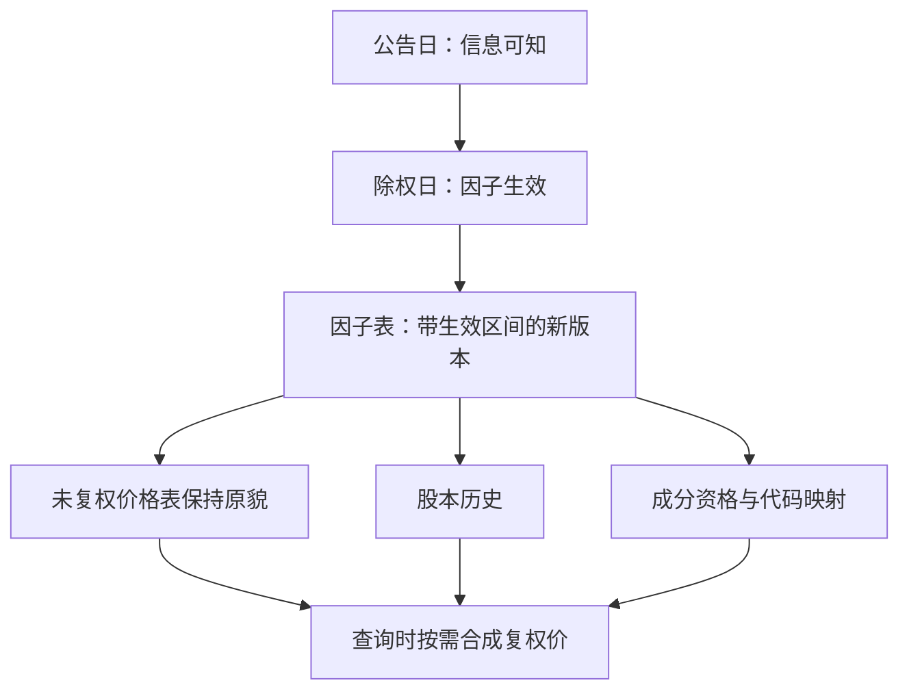

# 公司行动处理的深入

公司行动不是「修正错误的价格」，是同一只证券换了计数单位；处理它的全部难点在于，哪一天、按什么比例、对哪几张表生效。

<footer>—— 据 CRSP 调整因子文档口径；A 股除权除息实务整理</footer>

[上一课](/quant/de-marketdata-cleaning)把单日内的字节洗成带账目的序列；但序列在日界上仍会断裂——除息日开盘价跳低、送转日股数翻倍、退市日收益终止，这些不是坏数据，是证券换了计数单位。[分红、拆股与复权](/quant/corporate-actions)立过基础口径：不复权无法算持有收益。本课写深钻的三个问题：复权有几种、各喂哪类信号；一次行动要联动几张表；调整因子为什么必须是事件链而不是就地改价。

## 问题

一次公司行动同时打在多张表上，只修价格是第一类错。分红与送转改价格与股数，配股改价格与出资人，分拆与合股还会改代码与成分资格，退市决定收益序列在哪里终止——漏掉任何一张表，市值、换手、EPS 与成分资格就各说各话。第二类错是比例语义：现金分红按每股金额除息，送转按比例除权，把 A 股「10 转 10」当成分红，除权缺口会被算成收益；反向拆细与合股的比例小于 $1$，符号错一行，整条历史反向。第三类错在复权口径：供应商调整因子、交易所除权参考价、自算因子常有分位级差异，而收益率要求因子连续，价差信号要求绝对水平，两种用途共用一条复权链必有一边错。

### 复权的两种用途分开

后复权（自上市日起向前累乘因子）保持历史值不随未来行动改变，适合算收益与累积净值；前复权（把最新价锚定为当前真实价）直观，但每次分红都改写全部历史——研究库可以存，特征库不该依赖它。喂给[特征：滞后、截面 rank](/quant/cs-rank-features) 的价格特征，应以后复权或未复权加显式调整项为准，让「哪些天被调整过」可查。

复权因子链要含退市与停牌：最后的除息发生在退市公告之后时，因子链若在退市日截断，最后一段持有收益就凭空少一笔——这正是[幸存者偏差](/quant/survivorship-bias)在数据层的样子。

## 方法

把公司行动做成事件链引擎，三条规则。**一，事件先行**：公告日、除权日、支付日各入一行，特征按公告日可知、价格按除权日生效——与[时点基本面](/quant/point-in-time)的两枚时间戳同构。**二，因子独立存储**：调整因子是带生效区间的独立序列，价格表保持未复权原貌，复权在查询时按需合成。**三，多表联动**：一次行动在同一事务里更新价格因子、股本历史、成分资格与代码映射四张表，[指数成分历史](/quant/index-constituents-history)的口径在这里被消费。验收用不变量：除权日按因子调整后的收益率应与公告比例一致，并逐股票抽五次历史行动手工对账。

## 机制

因子独立存储之所以是核心，在于它把「历史」与「我们对历史的当前理解」分开：价格表是观测，因子表是解释，解释可修订而观测不动。这直接决定下游成本——用前复权价存库，每次分红触发全表改写，十年历史的缓存、特征与回测结果全部失效；用因子链，改写只落在一张小表的新版本里，下游按需重建。比例语义也由此可查：每个因子的推导都挂在事件上，审计一条因子就是审计一次行动，而不是信任供应商的黑盒乘数。错误在这里的形态是静默的：比例错一档不会让程序崩溃，只会让因子在除息日附近系统性偏移，回测里表现为「除息季节性」，实为数据病灶。

## 边界

本课不重讲基础复权公式，见[分红、拆股与复权](/quant/corporate-actions)；不处理期权与可转债的调整，那是衍生品口径。因子链也覆盖不了极端事件：破产清算、私有化要约、缩股换代码需要人工事件表兜底。供应商因子与自算因子要定期对账；因子表同样是数据，进版本化，由下一课接管。

## 小结

- 一次公司行动联动价格因子、股本、成分、代码四张表，只修价格必错。
- 现金分红按金额、送转按比例，比例语义错一档是静默的系统性偏移。
- 后复权喂收益与特征，前复权只做展示，特征库不依赖会改写历史的前复权。
- 因子独立成带生效区间的版本序列，价格表保持原貌，改写不触历史。
- 出处：CRSP 调整因子文档口径；A 股除权除息实务；站内[分红、拆股与复权](/quant/corporate-actions)、[时点基本面](/quant/point-in-time)。
