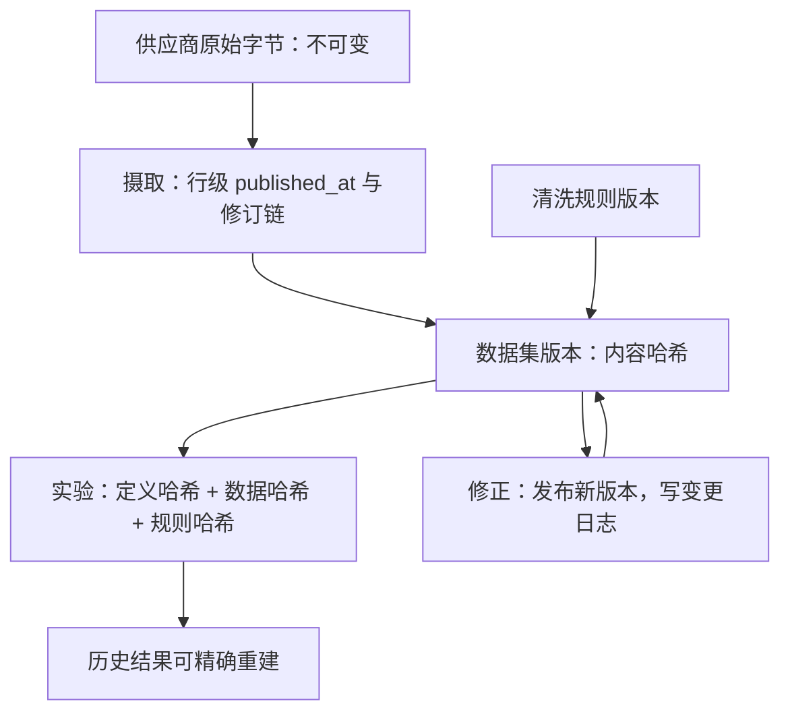

# 数据版本化

代码有版本控制而数据没有，实验就不可复现；更糟的是，没人能证明它不可复现。

<footer>—— 据 Ljungqvist, Malloy and Marston, Rewriting History, Journal of Finance, 2009；Lakehouse 时间旅行（Delta Lake、Iceberg）公开规范整理</footer>

[上一课](/quant/de-corporate-action-deep)把调整因子做成带生效区间的版本序列，改写不触历史；那只是四张表里的一个特例。本课把同一原则推广到全平台：供应商会重述，清洗规则会修订，复权口径会升级——每一次改写都把「上周的回测」变成无法重建的幽灵。缺口是让数据像代码一样有版本：任何历史结果都能钉回到当时那份字节上。

## 问题

不可复现有三个来源，全都不报错。**就地更新**：供应商修正写到旧行上，值变好了，历史没了；[点时基本面](/quant/point-in-time)记录过 I/B/E/S 推荐历史被整体改写，没有 vintage 快照的团队连「数据动过」都无法发现。**选择性重拉**：新数据补了 2020 年以后的行情，更早的还是旧管道产物，一张表里混着两代口径，差异只在个别字段与边缘日期——像数据、像泄漏、像 alpha，无法区分。**规则漂移**：清洗规则改了，同一批原始字节产出不同序列，而结果表没有任何字段记录用了哪条规则。三者共同的下游症状是：两次运行同一份代码得到不同数字，且回答不了「哪一次对」。

### 版本化的对象与粒度

粒度三级，按需取用。快照级：整库某日的只读视图，最贵但最无歧义，用于归档与审计。数据集级：数据集标识加版本号加日期分区，是实验引用的默认单位。行级：每行带 published_at 与修订链，是[面板构造](/quant/alt-panel-construction)与 as-of 查询的底层。三者不是竞争关系：行级是摄取层的事，数据集级是实验层的事，快照级是合规层的事。

内容寻址是版本号不出错的关键：版本标识用内容的哈希而不是人起的日期名。两张「v2024-06-01」的表若哈希不同，说明重算过——人名会撞车，哈希不会。

## 方法

落地四条。**一，存储不可变**：已写入的分区只读，修正写新分区；这与[时序数据库的选型](/quant/de-tsdb-selection)的 append-only 不变量是同一件事在治理层的表达。**二，三要素哈希**：每个实验钉住定义哈希、数据版本哈希、清洗规则哈希的三元组，与[特征存储的深入](/quant/fml-feature-store-deep)的钉法一致——特征、数据、规则在同一个哈希空间里对齐。**三，schema 演化走前向兼容**：加列可以，改语义必须升数据集大版本，旧版本继续可读。**四，重算即发布**：因为供应商修正或规则升级而重算历史时，发布新版本并写变更日志，而不是覆盖；下游显式迁移，才允许引用切换。

## 机制

版本化的收益不是「以防万一」，而是把两类原本不可判定的争论变成可判定。第一类是复现争议：结果表钉了三元哈希后，「上周那个模型」可以逐字节重建，差异必然来自代码、数据或规则三者之一的显式变更——排查从考古变成查日志。第二类是修正偏好的争议：供应商重述与自建修正同时存在时，两个版本并列保留，因子在两代口径上的差值本身成为一个可测对象；把它测出来，就知道研究结论有多少建立在最新修正上。机制上，不可变存储是这三件事的共同前提：只有旧版本永不动，新版本才有资格被称为「新」。这也是[复盘](/quant/research-postmortem)口径在数据层的落点——死因要落在判据上，而判据引用的每个数字都必须能溯源到一次具体的发布。

## 边界

版本化有成本：存储翻倍、目录治理、迁移纪律，小团队常以「先跑通再说」跳过，等第一轮无法复现的研究事故再补，代价更大。行级修订链不是万能替代品：有些供应商根本不提供历史快照，此时只能统一滞后近似并显式记录，见[数据获取与审计](/quant/data-acquisition-audit)的降级口径。版本也不自动带来正确：两个版本可能都错，对账靠外部证据，监控由后续质量课接管。

## 小结

- 不可复现三源：就地更新、选择性重拉、规则漂移，全都静默。
- 粒度三级：行级管摄取、数据集级管实验、快照级管归档。
- 实验钉三要素哈希：定义、数据版本、清洗规则，与特征存储同构。
- 修正走发布不覆盖，旧版本永不可变，迁移显式化。
- 出处：Ljungqvist, Malloy and Marston, *Rewriting History*, *JF*, 2009；Delta Lake 与 Iceberg 公开规范；站内[特征存储的深入](/quant/fml-feature-store-deep)的三元组口径。
