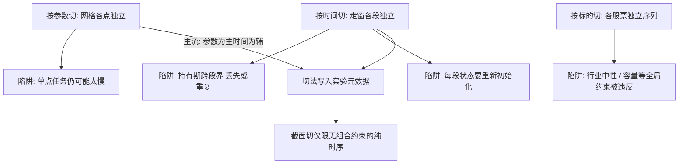
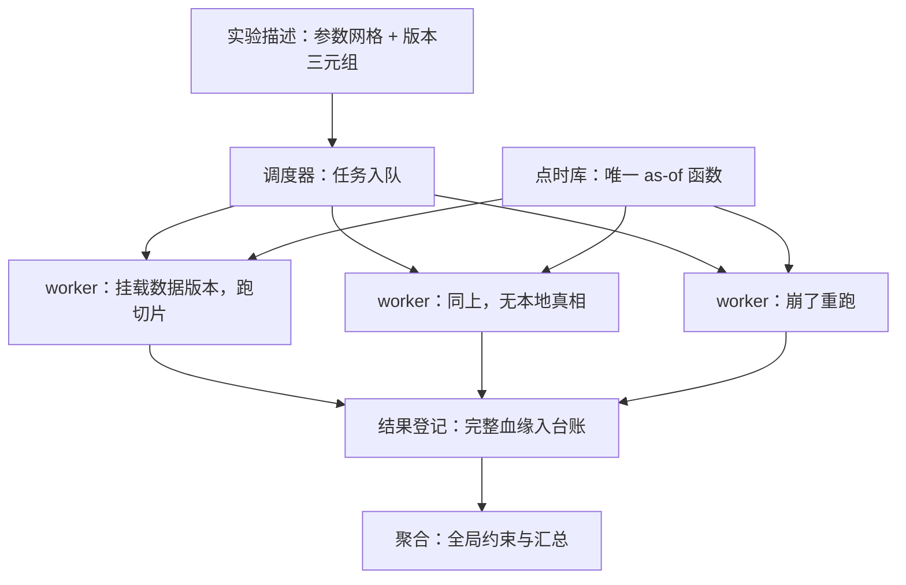

# 分布式回测架构

参数扫描的并行度不是引擎给的，是数据给的：数据不可变，任务才能随便挪；数据会漂，集群只会更快地生产互相矛盾的回测。

<footer>—— 据 Amdahl, Validity of the Single-Processor Approach, AFIPS 1967；与站内点时数据库的不可变口径整理</footer>

[上一课](/quant/de-pointintime-db)把「任一决策日的数据视图」做成全平台唯一的 as-of 函数；本课处理这个函数被成千上万个回测任务并发调用时的架构。单个回测是研究，参数扫描、走窗验证与批量消融是生产。[回测向量化](/quant/backtest-vectorization)讲过单引擎的形状选择，本课讲集群层：怎么切任务、怎么共享数据、怎么让一万个结果仍可比。

## 问题

分布式回测的第一错误不是慢，是漂。worker 各自拉「最新数据」，任务排队几小时，队头队尾看到的数据集已经不同——同一批实验内部口径不一致，比较失去意义。直觉类比：数据漂就像考试开考两小时后悄悄换了教材——先做的考生和后做的考生答的不是同一套题，最后比分数毫无意义。钉住数据版本，等于给全体考生发同一版教材的复印件。第二错误是边界：按时间切段时，持有期跨过段界的收益要么丢失要么重复计入；按标的截面切时，组合层的约束（行业中性、容量上限）在段内各自满足、全局违反。第三错误是缓存不一致：特征缓存键漏掉数据版本，数据修正后旧特征照用，「修了 bug 结果不变」。三个错误共享一个根源：把并行当成纯计算问题，忘了它是数据一致性问题。

### 切分维度的选择

任务有三个可切维度。按参数切：网格各点独立，天然并行，但同点内仍受单任务时长限制。按时间切：走窗各段独立，适合样本外协议，但必须处理持有期跨界与状态初始化。按标的切：只在策略是无截面约束的纯时序时合法。多数研究取「参数为主、时间为辅」的两级切分；切法本身要作为实验元数据登记，因为切法影响结果的可比性。

加速比的上限常在存储而非算力：数百 worker 并发扫同一张 tick 表，瓶颈是对象存储带宽与缓存命中率。扩 worker 之前先看 IO 等待占比，是分布式回测的第一课。

## 方法

架构四件套。**调度器**：把任务（参数点、时间段、策略版本、数据版本、规则版本）入队，任务描述里显式钉住数据版本与清洗规则版本——沿用[数据版本化](/quant/de-data-versioning)的三要素哈希，任何 worker 不许自行解析「最新」。**无状态 worker**：拉任务、挂载数据版本、跑、写结果，崩了重跑不影响别人；本地状态只是缓存。术语翻译：无状态就是「worker 不记事」——它自己不保存任何别人依赖的东西，任务的所有信息（参数、数据版本、规则）都由调度器发给它。好处是某台机器挂了，把任务丢给任何一台空闲机器重跑即可，结果完全一样；有状态的话，挂掉就等于丢工作。**数据平面**：点时库与特征缓存按（数据版本、日期段）键控，任务间共享只读挂载；这是 append-only 存储的直接红利。**结果登记**：每个结果带完整血缘（任务描述、引擎版本、数据哈希）入台账，供复盘与聚合，口径与[复盘](/quant/research-postmortem)一致。聚合层在全部叶子完成后做全局约束与汇总统计，不许在 worker 内偷偷做全局判断。

## 机制

这套架构的机制核心是「一致性由数据版本承担，不由任务时刻承担」。任务钉死版本后，排队、重跑、复算都与队内他人无关，因为大家读同一份不可变字节；数据修正意味着发新版本、新实验，旧结果自动归档而非被改写。Amdahl 的老话在这里换个读法：不可并行的是数据准备与全局聚合，它们是串行段；把特征物化前置成批量、把聚合做成叶子任务的浅层合并，串行段越短，集群规模才越有用。反过来，容忍数据漂的集群会把方差引入实验：同一网格两次扫描结果不同，研究者会把噪声当成参数敏感性——这是分布式回测特有的伪发现来源，单机时代不存在。

## 边界

本课只管「把同一个回测跑一万遍」的架构；回测引擎内部的事件循环、成交模拟是下一门回测框架设计课程的对象，本课不重讲。分布式也不免费：任务粒度太细，调度与 IO 开销吃掉收益；粒度太粗，故障重跑代价大。切分粒度应让单任务落在分钟级。数字实例：Amdahl 定律说，若串行段（数据准备、全局聚合）占 10%，就算加到无穷多台机器，总加速也超不过 10 倍——100 台机器的实际加速只有约 9.2 倍。所以缩短串行段（特征前置物化、浅层聚合）比堆机器更划算。最后，架构不能修复坏实验：并行让多重检验更便宜，$N$ 的台账与折价纪律反而更要严格执行，见[回测过拟合](/quant/backtest-overfitting)。

## 小结

- 分布式回测的第一风险是数据漂移，第一纪律是任务钉版本三元组。
- 切分三维：参数、时间、截面；切法本身是实验元数据。
- 时间切段必须处理持有期跨界，截面切段不能承载全局组合约束。
- 无状态 worker 加共享只读数据平面，一致性由数据版本承担。
- 瓶颈先查存储带宽与缓存命中，再谈加机器。
- 出处：Amdahl, AFIPS 1967；站内[数据版本化](/quant/de-data-versioning)、[回测向量化](/quant/backtest-vectorization)与[回测过拟合](/quant/backtest-overfitting)各课。
