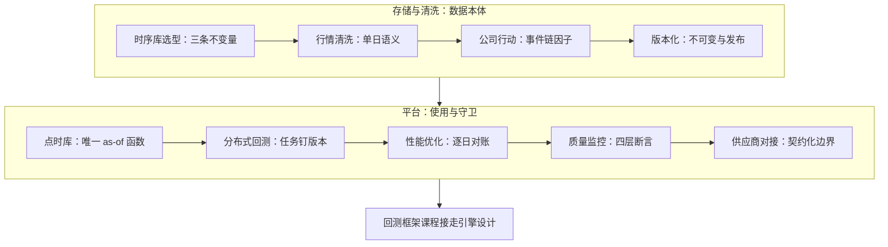

# 数据工程收束

数据平台不是一堆表的集合，是一组被强制执行的时间约定：什么不可变、什么何时可知、什么按哪个版本被引用；约定松一寸，回测的数字就虚一尺。

<footer>—— 据 Croushore and Stark, Journal of Econometrics, 2001；López de Prado, Advances in Financial Machine Learning, Wiley, 2018 整理</footer>

[上一课](/quant/de-vendor-integration)把外部世界的契约收拢进平台边界，最后一段管道落定。本课收束全课程：把十课重排成一张地图，重申贯穿的口径，交还边界，指明下一门课从哪里接走。本课程到此收束。

## 问题

十课走完，要收的不是功能清单，而是三条容易走散的主线。其一，存储与清洗单元给了数据的「本体」：引擎守住 append-only、分区、列式三条不变量，清洗把单日字节翻译成语义，公司行动把跨日界的调整做成事件链，版本化让改写走发布。其二，平台单元给了「使用」：点时库把任一决策日的知识集收成一个函数，分布式回测与性能优化让这个函数撑得起大规模实验，质量监控与供应商对接守住边界内外的契约。其三，两个单元被同一件事缝合：哈希——定义、数据版本、清洗规则的三元哈希，让「任何一个数字为什么是这个值」永远可答。

## 方法

收束的方法是应力测试般的重读：把十课压成一张地图与三问，往后每次平台变更、每个新数据集接入，都拿地图照一遍——接在哪条线上、动了哪条不变量、哈希哪一位要换。地图按读序重排：

- [时序数据库的选型](/quant/de-tsdb-selection)：查询形状定引擎，不变量先于性能。
- [行情数据的清洗](/quant/de-marketdata-cleaning)：硬校验、定序去重、标记过滤、快照对账，逐段入账。
- [公司行动处理的深入](/quant/de-corporate-action-deep)：因子独立成版本序列，四表联动。
- [数据版本化](/quant/de-data-versioning)：不可变存储，修正走发布，实验钉三元哈希。
- [点时数据库的构建](/quant/de-pointintime-db)：双时间轴表加唯一 as-of 函数，研究生产共用。
- [分布式回测架构](/quant/de-distributed-backtest)：任务钉版本，无状态 worker，一致性由数据版本承担。
- [回测性能优化](/quant/de-backtest-perf)：先归因再动手，每次提速过逐日对账。
- [数据质量监控](/quant/de-quality-monitoring)：四层断言三档处置，研究教训沉淀为闸门。
- [供应商对接](/quant/de-vendor-integration)：六项契约落纸，影子双跑后切换，第二来源做锚。

## 机制

把十课压成一个视角：平台 = 不变量 × 时间语义 × 契约。不变量由引擎与治理共同维持（append-only、分区、因子链、不可变版本），绕过不变量的捷径——就地更新、前复权存库、缓存漏版本——都在为未来的不可复现付利息。时间语义集中在双时间轴与唯一 as-of 函数上，平台的价值在于让「当时可知」成为可精确调用的对象，而不是研究者的记忆。契约贯穿内外：对内是每张表的质量契约与告警分级，对外是供应商的六项条款；契约不是文档，是被断言强制执行的行为。三者的次序也解释了课程排序：不变量先于时间语义（没有不可变存储就没有可靠的事务时间），时间语义先于契约（没有 as-of 函数就没有可对账的影子对比）。

贯穿口径一句话：研究里的每个数字都应能回答三个问题——哪份字节（数据版本）、哪条规则（定义与清洗哈希）、哪个知识集（as-of 时点）。三问皆答，复现是工程；有一问答不出，复现是运气。

## 边界

收束课不新增机制，边界重申三条。平台的承诺止于「数据配得上用途」：信号有没有效、因子是不是幸存者，仍由统计协议裁决，平台不背预测的锅。技术选型随生态漂移：引擎与表格式几年一换，不变量与时间语义却是稳定的，迁移带走的是约定而非实例。成本约束真实：vintage、双源、影子期的开销按研究价值分配，核心表全套、长尾表降级。深钻层到此为止：主干与这门平台的工程，构成下一阶段回测框架课程的全部前提——引擎设计从此建立在可信数据之上。本课程到此收束。

## 小结

- 一条本体线：选型不变量 → 单日清洗 → 公司行动事件链 → 版本化发布。
- 一条平台线：唯一 as-of 函数 → 分布式与性能 → 质量断言 → 供应商契约。
- 缝合线是三元哈希：定义、数据版本、清洗规则，任何数字可溯源到三者。
- 贯穿口径三问：哪份字节、哪条规则、哪个知识集；三问答不出，复现靠运气。
- 边界三条：不背预测的锅、约定比实例稳定、成本按研究价值分配。
- 出处：Croushore and Stark, *Journal of Econometrics*, 2001；López de Prado, *Advances in Financial Machine Learning*, Wiley, 2018；及本课程各课所引文献。
