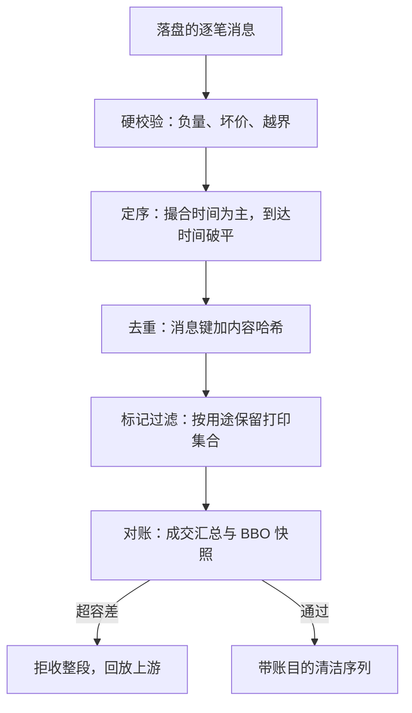
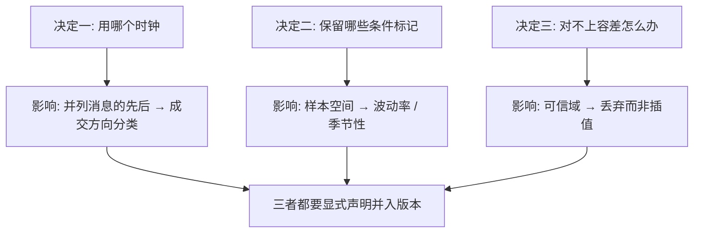

# 行情数据的清洗

馈送给你的是撮合引擎的投影，不是一条干净序列；清洗的全部工作，是把「引擎说过什么」与「你想研究什么」之间的落差一一显式化。

<footer>—— 据 NASDAQ TotalView-ITCH 消息规范；NYSE TAQ 成交条件字段的公开说明整理</footer>

[上一课](/quant/de-tsdb-selection)把选型钉在查询形状上，数据有了住处；但落盘的字节还不是序列。行情清洗的缺口从这里开始：逐笔消息里有错误打印、重传重复、乱序到达、盘外成交与错误更正，全都长得像正常数据。清洗不改变事件，只把每个「看上去像」翻译成明确语义。本课写单日内的清洗——跨日界的调整是公司行动一课的对象。

## 问题

清洗要回答四个问题。术语翻译：内容哈希就是把整条消息（时间、价格、量、标的等字段）压成一枚固定长度的「指纹」——两条消息指纹相同，几乎必然是同一条内容的重传。用「消息键 + 内容哈希」判重，比只比时间戳可靠得多，因为不同消息也可能落在同一毫秒里。**消息级硬校验**：负量、非正价、超出当日价格带的打印，通常是馈送或解码错误；量级小，但混进波动率估计就是一条假跳变。数字实例：价格带可以直接用当日涨跌停（A 股 ±10%）当断言——10 元的股票打印出 11.5 元的成交，一条就越界，立刻入账剔除。没有这条断言，它混进日内收益率序列就是一次 +15% 的假跳变，把当日已实现波动率抬高数倍。**去重与重排**：行情协议的缺失与重传让同一条消息到达两次，乱序让到达序不等于撮合序；用毫秒时间戳给纳秒市场排序，并列序内的先后只能靠到达序，次序错了买卖方向分类就在临界处随机翻转。**条件标记过滤**：成交打印里相当一部分不是常规连续撮合——开盘竞价、大宗、交叉、错误更正各带专门标记（TAQ 的成交条件字段）；不过滤，开盘与收盘的已实现波动率被重复计入，日内季节性一半来自标记构成而非交易行为。**快照对账**：重建的簿与自报快照要对得上，负深度与交叉簿是重建错误，按[LOBSTER 与 ITCH 行情](/quant/lobster-itch-feed)立下的不变量当数据测试失败处理，不许插值糊过去。

每类清洗动作都要留下计数账——过滤了多少硬错误、多少重复、多少非常规打印、多少并列序。账不全，就说不清一段序列「干净」到什么程度；回测异常时，这张账是第一个排查对象。

## 方法

管线按序五段，段与段之间只传带账目的中间结果。第一段硬校验，按字段级断言剔除坏行入账。第二段定序：主时钟用撮合引擎时间戳，到达时间只用于并列序破平；跨源数据先对时，见[延迟预算](/quant/latency-budget)的口径，[SIP vs 直连行情](/quant/sip-vs-direct)的结论在这里兑现——报价与成交不同源时，定序先坏。第三段去重：以消息键与内容哈希判重，重传与首传合并。第四段标记过滤：按研究用途决定保留集合——日内波动率只要常规连续成交，成交方向分类可以放宽，逐项写进数据字典。第五段对账：与交易所日终汇总对成交量、与快照对 BBO，超容差整段拒收并回放上游。

## 机制

清洗的本质是把三类「沉默的语义决定」显式化。其一，时钟决定因果：并列序内谁先谁后理论上不可识别，工程上必须选一个可重复的规则并声明它；换规则会改变成交方向分类与冲击估计，所以要像参数一样入版本。其二，标记决定样本空间：「市场」不是全部打印，而是被研究问题选中的子集，清洗把这个选择写成可审计的保留清单。常见误区：初学者容易以为开盘竞价、大宗这些「非常规」打印是坏数据、一律删掉。它们不是错，只是不属于特定研究问题——波动率研究不要它们，成交方向分类反而可能要放宽保留。错不在数据，在于不声明保留清单就默认全收或全删。其三，对账决定可信域：抽查对得上的时段才可信，对不上的宁可整段丢弃也不修补——修补会在最需要数据的压力日引入最强的人为结构。入账让「这段序列怎么来的」成为可引用的事实，而不是手艺。

## 边界

本课不重讲馈送与契约本身：消息语义见[LOBSTER 与 ITCH 行情](/quant/lobster-itch-feed)，管道延迟见[SIP vs 直连行情](/quant/sip-vs-direct)。清洗只处理单日内的字节；除权除息与代码变更会在日界上留下看似错误的跳价，那是下一课的对象，不要在这里当坏数据删掉。清洗也不承诺救回坏馈送：整段丢包、时钟漂移超容差的数据，丢弃是唯一正确动作。最后，清洗规则本身要版本化——规则一改，同一批原始数据变成另一段序列，这个绑定关系由版本化一课接管。

## 小结

- 清洗四问：硬校验、去重定序、标记过滤、快照对账，每段动作入账。
- 主时钟用撮合时间，到达时间只破平；跨源先对时，混源先坏定序。
- 「市场」是被保留清单选中的打印子集，清单可审计而非默认。
- 对不上容差的时段整段丢弃不修补；压力日最忌人为结构。
- 清洗规则随数据一起版本化，绑定关系交给下一课。
- 出处：NASDAQ TotalView-ITCH 消息规范；NYSE TAQ 成交条件字段说明；站内[LOBSTER 与 ITCH 行情](/quant/lobster-itch-feed)与[延迟预算](/quant/latency-budget)的口径。
