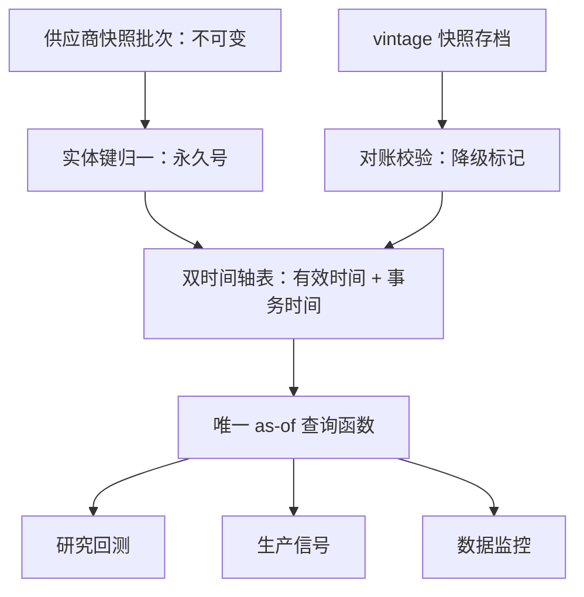

# 点时数据库的构建

宏观经济学家花了一个十年才建成实时数据集，因为他们发现政策评估里的「当时知道」无法靠回忆重建；投研平台的教训相同，只是代价以假 alpha 计。

<footer>—— 据 Croushore and Stark, A Real-Time Data Set for Macroeconomists, Journal of Econometrics, 2001 整理</footer>

[上一课](/quant/de-data-versioning)让每个数据集有了不可变的版本链；本课把这些版本收成一个可查询的库：给定任意决策日 $t$ 与任意字段，返回「截至 $t$ 已公开的最新值」。为什么与怎么的分工已经立好——[时点基本面](/quant/point-in-time)与 [Point-in-time 基本面](/quant/pit-fundamentals)讲清了 latest-available 为何泄漏，本课讲库怎么建：模式、摄取、查询与校验四层。回测对齐的做法在[点-in-time 基本面对齐](/quant/pit-alignment)有基础版，本课把它变成平台函数。

## 问题

PIT 库的核心是一张双时间轴表。每行 $(entity, field, value)$ 带两枚时间戳：有效时间（这行关于哪个时期，如财季结束日）与事务时间（这行何时进入知识集，如公告日、更正日落库日）。教科书里叫有效时间与事务时间，宏观传统叫 vintage，投研叫可得日——三套名字一件事。难点都在边缘：更正是覆盖还是并列（收入重述通常并列保留旧值，错误更正通常覆盖）；公告在非交易时段时，事务时间要归到下一个可交易的决策时点，否则回测会「在公告当晚收盘前」交易；行业分类、股本、指数成分都是字段，同样要进这张表——只把报表 PIT 化而成分用今天的列表，等于修了一条腿的泄漏，见[幸存者偏差](/quant/survivorship-bias)。

Croushore 与 Stark 建实时数据集的动机与本课同构：GDP 初值与终值系统性不同，用终值评估「当时的美联储」是让政策制定者预知未来。基本面的初值与终值同理，见[基本面数据与重述](/quant/fundamentals-restatements)。

## 方法

四层落地。**摄取层**：供应商快照原样落盘为不可变批次，不做任何合并——这是事务时间的唯一可信来源，任何「聪明的合并」都等于销毁证据；映射到统一实体键（永久号而非代码），口径与[面板构造](/quant/alt-panel-construction)一致。**模式层**：上述双时间轴表加字段级元数据（单位、口径、来源）；供应商改字段定义等同新字段，沿用[数据获取与审计](/quant/data-acquisition-audit)的重审义务。**查询层**：全平台只有一个 as-of 函数——研究、生产、监控共用同一实现，把 $\mathrm{published\_at}\le t$ 的最大有效行收成一次扫描；不同的调用方写自己的包装，不许写自己的实现。**校验层**：每期抽若干实体，把 as-of 结果与留存的 vintage 快照对账；没有快照的字段标记降级。

## 机制

单点实现之所以是关键，在于泄漏治理与软件缺陷治理同构：逻辑散在多处时，修一处漏一处，你永远不知道生产在用什么知识集。唯一的 as-of 函数让「平台的时间语义」成为一个可测试的对象——函数升级走回归测试，测试集就是校验层攒下的 vintage 对账用例。双时间轴的另一个收益是可逆：从今天往回看是「最新值」，从事后任意一天往回看是「当时值」，两个视角由同一份数据支持，因为事务时间从未被抹去。这正是上一课版本化在字段粒度的延续：版本链管数据集，双时间轴管行，快照对账管整体。于是「同一因子在 A 库显著、B 库不显著」这类争论有了第三个出口——两家库的事务时间政策不同，可以把差值定位到具体字段的具体更正，而不是停在「数据不一样」。

## 边界

PIT 库不解决语义：它保证「当时在场」，不保证字段含义跨年可比（会计准则变更要在字段层另建口径）。覆盖有硬边界：更正链的完整性取决于供应商是否交付历次快照，早期年份常只有初值，降级用法要写进审计报告。性能上，双时间轴表比宽表贵，查询要靠分区与物化视图撑——这是下一课分布式回测架构的题目。最后，文本、舆情类另类数据的转载与修订同样吃事务时间，接[回填偏差](/quant/alt-data-backfill-bias)的口径，不在本课展开。

## 小结

- PIT 的核心是双时间轴：有效时间管「关于何时」，事务时间管「何时可知」。
- 摄取只落原始快照，合并即销毁证据；归一到永久实体键。
- 全平台唯一 as-of 函数，研究、生产、监控共用，升级走回归测试。
- 行业、股本、成分同 as-of，只修报表是单腿泄漏。
- vintage 对账决定字段可用等级，没有快照就显式降级。
- 出处：Croushore and Stark, *A Real-Time Data Set for Macroeconomists*, *Journal of Econometrics*, 2001；站内[时点基本面](/quant/point-in-time)与[点-in-time 基本面对齐](/quant/pit-alignment)各课。
