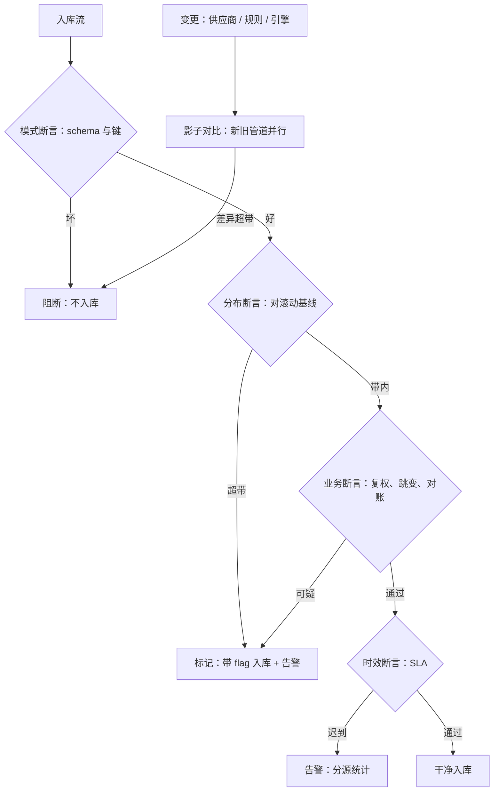

# 数据质量监控

数据质量不是「准确」一个维度，而是消费者在一组维度上的满意；没有声明谁在什么用途下消费，质检就没有判据。

<footer>—— 据 Wang and Strong, Beyond Accuracy: What Data Quality Means to Data Consumers, JMIS, 1996 整理</footer>

[上一课](/quant/de-backtest-perf)让流水线快了起来；快而脏是更危险的组合——坏数据以更快的速度流进更多实验。本课在入库与消费之间装监控：不问「有没有数据」，问「数据是否配得上它的用途」。一次性审计的口径在[数据获取与审计](/quant/data-acquisition-audit)立过五项，本课把它变成常开的断言，与[数据质量体系](/quant/alt-data-quality)的另类数据口径并轨。

## 问题

质量退化是静默的，因为三种最贵的坏都不报错。字段悄悄变义：供应商改了字段定义或单位，值域看起来正常，口径已换；管道悄悄退化：某只标的的日终文件晚到三小时，晚到率从千分之一涨到百分之五，没人订阅这个数；对账悄悄漂移：第二来源与主源的差逐月增大，单日看都在容差内。更根本的问题是阈值：太松，退化数月才发现；太紧，天天误报，团队把告警渠道静音——静音的监控比没有更糟，因为它给出「有监控」的错觉。

### 断言分四层，处置分三档

断言自下而上四层。**模式层**：schema、类型、非空、键唯一，坏即阻断入库。**分布层**：缺失率、异常值率、值域对滚动基线的偏离，超带即标记并告警。**业务层**：复权因子连续性、收益率跳变与停牌对账、成交量为零天数、财报值与公告对账——业务层断言是量化团队独有的护城河，通用数据平台不会替你写。**时效层**：数据到达时间对 SLA 的达成率，分数据源统计。处置三档：阻断（不可入库）、标记（入库带 flag，下游可查）、告警（事后修）。每张核心表一张契约，写明四层断言与阈值。

对账不必买第二套全库：抽二十只股票、若干关键日，与第二来源比价格、股本与成分。系统性差异超过一个 tick 或一股时，先怀疑实体键映射，再怀疑值本身——键错一档，值全错。

## 方法

落地四条。**一，契约先行**：每张表入库前写契约（四层断言、阈值、处置档位），契约版本随数据版本钉进实验引用。**二，基线滚动**：分布层阈值相对滚动基线（如过去六十个交易日）计算，不写绝对数——市场自身的季节性会让绝对阈值失灵。**三，告警分级路由**：阻断类进值班，标记类进日报，漂移类进周报；误报率本身入监控，连续误报的断言要么修阈值要么下线。**四，变更联动**：供应商升级、规则修订、引擎替换触发断言全量重跑与影子对比——新旧管道并行喂一段，差异分布超带即停，与[特征存储的深入](/quant/fml-feature-store-deep)的双跑一致。

## 机制

监控之所以必须是常开的断言而非定期抽查，在于质量退化的分布是重尾的：一年里绝大多数日子无事，问题集中在供应商升级日、公司行动密集期与市场压力日。定期抽查的发现时间以月计，常开断言把发现压到当次批次。处置分档对应错误的可逆性：模式错是不可逆污染，宁可阻断；分布超带可能只是市场极端日，标记保数据、告警保知情。业务层断言的机制地位最特殊：它是把研究知识前移到数据层的通道——回测里发现的「除息季节性」病灶，下次以断言形式在入库时被拦住，知识不再只活在研究员脑子里。这是本课程反复出现的循环：清洗、复权、版本化、性能，每课的教训最终都沉淀为一条断言。

## 边界

监控不产生正确性：断言只能守住已知的坏形，全新的坏要靠对账与研究异常反推，源头口径见[数据获取与审计](/quant/data-acquisition-audit)。阈值维护有真实人力成本，只花在核心表；长尾数据集宁可只留模式层断言，别铺没人维护的假监控。供应商侧的契约与重审义务是质量的另一半，那是下一课供应商对接的对象。

## 小结

- 质量是用途维度的函数：模式、分布、业务、时效四层断言。
- 处置三档：阻断、标记、告警，对应错误的可逆性而非严重性。
- 阈值相对滚动基线；误报率本身入监控，静音的监控比没有更糟。
- 变更触发全量重跑与影子对比，差异超带即停。
- 业务层断言把研究教训沉淀为入库闸门，是平台最值钱的一层。
- 出处：Wang and Strong, *Beyond Accuracy*, *JMIS*, 1996；站内[数据获取与审计](/quant/data-acquisition-audit)、[数据质量体系](/quant/alt-data-quality)。
