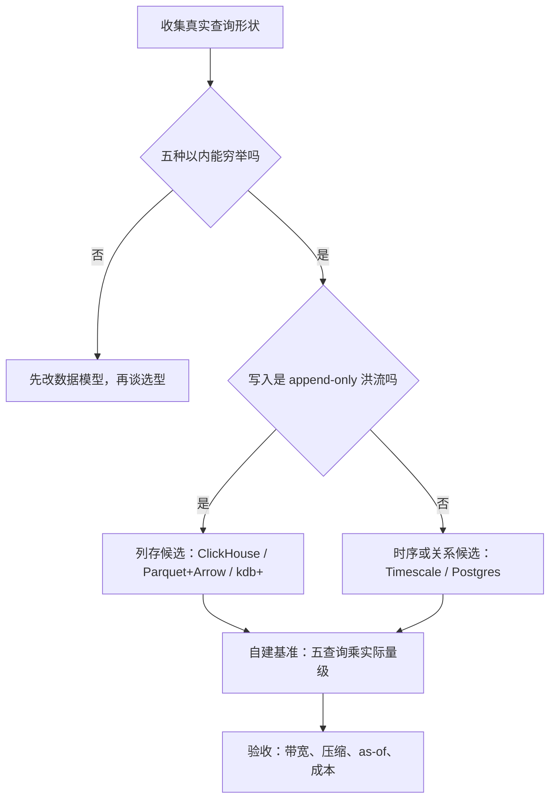
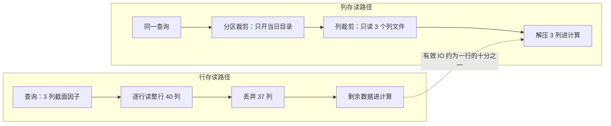

# 时序数据库的选型

选型不是挑「最快的数据库」，而是先承认自己的查询只有几种形状，再找一个把弯路修在磁盘布局里的引擎。

<footer>—— 据 Pelkonen 等, Gorilla: A Fast, Scalable, In-Memory Time Series Database, VLDB 2015；kdb+、ClickHouse、TimescaleDB 等引擎的公开文档整理</footer>

[上一课](/quant/sl-map)把策略生命周期治理收成七条不变量，台账里的每个数字只引用数据的哈希——至于哈希底下数据住在哪、以什么形状住着，是治理交给下一门课程的问题。本课程写这台数据平台的工程。存储引擎的选型此前被[特征存储的深入](/quant/fml-feature-store-deep)显式留白——那课声明「存储引擎与表格式选型是数据工程课程的对象」，本课接走这个问题：先定选型判据，随后三课沿入库前后的数据本体推进，行情怎么洗、公司行动怎么调、历史怎么版本化，再进平台单元。后课默认你已经知道数据住在哪、以什么形状住着。

## 问题

市场数据的写读形状与通用业务负载不同。写是 append-only 的洪流：逐笔成交与委托按事件时间到达，永不就地 UPDATE，一天动辄数亿条。读是少数几种固定形状的扫描：按标的乘日期段切片、按列取特征、按 as-of 取当时快照、按窗口滚动聚合、按日截面 rank。通用 OLTP 行存库为点查与事务优化，把 tick 塞进去，扫描带宽差出一两个数量级；反过来，为扫描优化的引擎不支持行级事务，把成交回传当业务表写会丢掉事件序。选型错的症状不是慢，而是查询形状与引擎假设不匹配——研究者只好在引擎外各补一层私有缓存，平台的真相从此不止一份。

术语翻译：as-of 查询就是「回到过去那一刻，取当时已知的最新状态」。比如今天想看 3 月 5 日研究时数据库里长什么样，就取所有 published_at 不晚于 3 月 5 日的行——不是取「关于 3 月 5 日、但可能上周才修正过的数据」。没有 as-of 语义，回测会不知不觉用未来修正值，这叫前视偏差。

## 方法

选型判据五条，按序过。**一，查询形状**：把团队真实的查询收成五种以内，写不出清单就先改数据模型再谈选型。**二，写入吞吐与有序性**：摄取按到达序写入但研究按事件序读取，引擎要支持分区追加与迟到数据。**三，压缩与扫描带宽**：列存加 delta、Gorilla 类轻量编码，时间戳与价格列的压缩比和解压带宽直接决定回测速度。**四，as-of 语义**：能否把「取 published_at 不晚于 $t$ 的最新行」写成一次顺序扫描，而不是每行一个子查询。**五，生态与人力**：团队能长期维护谁，比基准榜更硬。

候选谱系四档：通用关系库存日频与元数据够用；时序专用引擎运维轻、写路径好；列式分析引擎（ClickHouse，或对象存储上的 Parquet 加 Arrow 加 DuckDB）扫描最强；专用 tick 引擎（kdb+）带宽最高而许可与人才最贵。验收用自建基准——本团队五种查询乘真实数据量——不引用厂商跑分。

## 机制

列存赢在扫描的原因是列裁剪：一次截面回测往往只读几十列中的几列，行存必须整行过内存，列存把有效 IO 缩到十分之一量级。时间戳列做 delta-of-delta、浮点价做 Gorilla 类编码后，每样本可压到字节级——Gorilla 在生产中报告平均约 1.37 字节每样本；市场数据的压缩收益与之同源：价格在一个 tick 内不变、时间戳高度局部。分区键几乎总该是日期乘标的，因为五种查询无一不带日期范围，分区裁剪把扫描限制在当日目录。最关键的是 append-only 与版本化天然合拍：引擎不需要 UPDATE，供应商修正写成新分区新版本，旧版本不可变——这正是本课程版本化一课的地基。选型因此不是性能问题而是不变量问题：引擎替你守住的 append-only、分区、列式三条不变量，是后面每一课复用的前提。

Gorilla（Facebook 生产监控系统）报告平均 1.37 字节每样本、约十倍于定宽浮点编码的压缩。市场数据的压缩比同样依赖编码与样本：引用任何「通用压缩比」之前，先在自己一段真实 tick 上重测。

数字实例：一张 40 列的行情宽表，截面回测只读其中 3 列（日期、收盘价、成交量）。行存按行存储，必须把 40 列整行读进内存，IO 是 40 份；列存只碰 3 个列文件，有效 IO 是 3 份——还没算列内压缩再省下的部分。这就是同一段数据在两类引擎上回测差出量级的几何原因，与硬件快慢无关。

常见误区：初学者容易以为分区越细越好（比如按小时甚至按标的分区），实际上分区过细会产生海量小文件，元数据开销和打开文件的固定成本反而拖垮扫描。分区键要对齐查询形状——五种查询无一不带日期范围，所以「日期（乘标的）」几乎总是正确粒度，而不是越细越好。

## 边界

本课不宣布「最好的数据库」：引擎谱系随硬件与生态漂移，这张表三年后要重画。不写实时行情总线——分发与延迟是[SIP vs 直连行情](/quant/sip-vs-direct)的对象，本课以落盘为界。也不把裸 Parquet 当成「平台」：没有元数据目录与 as-of 函数，研究者会各自造轮子；下一课起的清洗与点时库，就是把裸存储补成平台的两步。

## 小结

- 选型判据是查询形状，不是泛化跑分：先把团队查询收成五种以内。
- 市场数据的写形状是 append-only 洪流，读形状是切片、列聚合、as-of、窗口、rank 五种。
- 列存加轻量编码把扫描带宽抬一个量级，分区键几乎总是日期乘标的。
- 引擎守住的三条不变量——append-only、分区、列式——是清洗、版本化与点时库的地基。
- 出处：Pelkonen 等, *Gorilla*, VLDB 2015；kdb+、ClickHouse、TimescaleDB 公开文档；站内[特征存储的深入](/quant/fml-feature-store-deep)的留白与判据。
