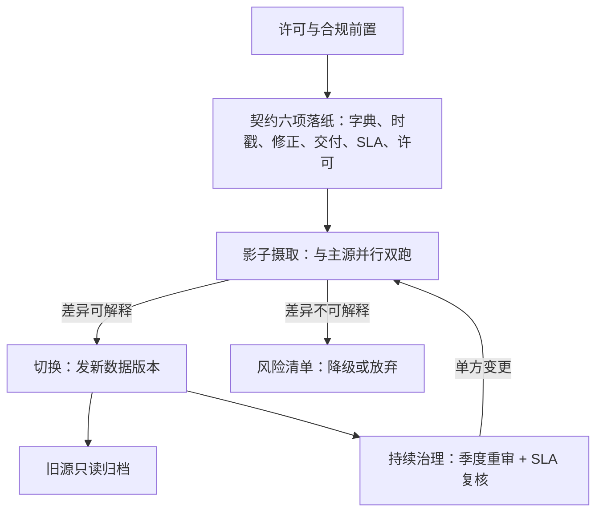

# 供应商对接

两家内容几乎相同的供应商，一家留历次快照、一家就地覆盖修正；对点时研究而言，这不是两家厂商，是两种物理定律。

<footer>—— 据 Bloomberg、LSEG（Refinitiv）等供应商公开的数据使用条款与修订政策口径整理</footer>

[上一课](/quant/de-quality-monitoring)的监控能发现质量问题，但多数质量问题的源头不在管道里，在合同里：字段怎么定义、修正怎么交付、晚到怎么补偿，都是对接那一刻谈定的。本课写对接的工程与治理：从许可到切换到退役的生命周期。[数据供应商对照](/quant/data-vendors)比较过各家数据内容的取舍，本课比较契约与修订政策——那半张更重要的清单。

## 问题

对接的失败模式有四个，都在切换之后才显形。**契约真空**：没写清时间戳语义、修正政策、晚到的处理，出问题只能靠邮件考古。**修订政策误配**：研究需要 vintage，供应商交付的却是「终版回填」，错误在交付那一刻已铸成，[数据获取与审计](/quant/data-acquisition-audit)的降级口径是唯一出路。**幂等缺失**：日终文件重推一次，成交量翻倍；增量补丁乱序应用，某几天成了几代口径的拼盘。**锁定**：唯一来源、私有键、按用量计价，退出成本逐年上升，议价与对账能力同步归零。

### 对接要谈的六项契约

字段字典（含义、单位、空值语义）；时间戳语义；修正与重述政策；交付方式（批量文件、API、推送流）与频率；SLA（到达时限、晚到补偿、历史回补义务）；许可（用途、转发、派生数据、留存）。最常被跳过的是修正政策与回补义务——恰好是 PIT 研究的命门。

切量级之前先切合同：供应商升级字段定义属于单方变更时，合同里有没有「提前通知与双轨并行期」条款，决定你是平滑迁移还是紧急救火——技术上的影子对比，要靠合同里的并行期才做得了。

## 方法

生命周期五段。**一，许可与合规前置**：用途、转发、派生与留存先过法务，爬虫类另类源沿用[爬虫的合规与工程](/quant/alt-crawler-compliance)的口径，许可不清不进试运行。**二，契约落纸**：六项写成对接附录，字段字典进平台元数据层，供应商改字段定义等同新字段。**三，影子摄取**：新源先旁路接入，与主源并行双跑一到三个月，按[数据质量监控](/quant/de-quality-monitoring)的对账口径逐日比对，差异定位到字段与日期，解释不了的入风险清单。**四，切换与退役**：切换日发新数据版本，旧版本只读归档，实验显式迁移——走[数据版本化](/quant/de-data-versioning)的发布流程。**五，持续治理**：每季度重跑审计清单、复核 SLA；批量文件要幂等键与乱序保护，推送流要会话恢复，二进制协议见[二进制协议：OUCH 与 SBE](/quant/binary-protocols-ouch-sbe)。

## 机制

对接的机制要点是「把外部依赖变成内部契约」。供应商的世界没有义务保持稳定，平台的职责是在边界处把不稳定翻译成自己已知的两样东西：不可变版本与显式契约。有了这两样，供应商的任何变化——字段变义、修正回填、交付延迟——都会撞在监控的断言上，而不是撞在三个月后的回测上；断言守的是契约的执行，不是供应商的善意。多源策略同理：第二来源是对账锚而非冗余主源，两套主源并存会制造「选哪个数」的成本，一主一锚让分歧本身成为可监控的量。锁定则要在买第一个数据集时就想：私有键进不了永久实体键体系的数据，接进来一天，退出成本就涨一天。

## 边界

本课不比较各供应商的数据内容与覆盖，见[数据供应商对照](/quant/data-vendors)；不谈采购议价与预算。影子期再长也买不回历史：新源宣称的覆盖与质量，以抽样回测验证而非以文档为准。合规边界永久有效：许可过期的历史数据按合同处置，不是「下线了但还在硬盘里」。对接成本常被低估：新供应商从签约到可信通常以季度计，要当成工程里程碑而不是一次下载。

## 小结

- 对接的核心是把外部依赖翻译成内部契约：六项条款落纸，字段字典进元数据层。
- 修订政策是 PIT 的命门：合同拿不到 vintage，就按审计口径显式降级。
- 摄取必须幂等：重推不重复，补丁可乱序恢复。
- 影子双跑后才切换，切换即发布新版本，旧源只读归档。
- 第二来源做对账锚，不做冗余主源；私有键是锁定的开始。
- 出处：Bloomberg、LSEG（Refinitiv）公开数据条款口径；站内[数据供应商对照](/quant/data-vendors)、[数据获取与审计](/quant/data-acquisition-audit)。
