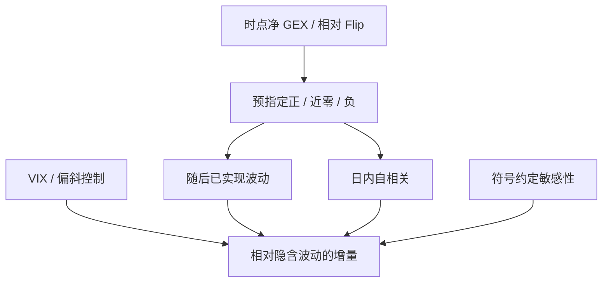

# 经销商正负 gamma 体制

做市商若净多 Gamma，对冲在上涨时卖、下跌时买，现货路径被阻尼；若净空 Gamma，对冲顺着价格走，冲击被放大。体制是存货符号的宏观投影，不是盘口里的下一笔方向。

<footer>—— Gârleanu, Pedersen and Poteshman, Demand-Based Option Pricing, Review of Financial Studies, 2009；对冲反馈与脆弱性的从业与学术讨论见 Mixon 以及 Barbon and Buraschi 等关于 gamma fragility 的工作</footer>

[GEX](/quant/gex-calculation) 给出带约定的净 Gamma 存量，[Gamma Flip](/quant/gamma-flip-level) 给出变号边界。体制要把存量翻译成**可检验的现货动态**：正经销商 Gamma 对应更强的日内均值回复、更低的已实现波动；负对应更强的趋势外推与尾部。这一映射来自 Delta 中性对冲的符号，在 Gârleanu–Pedersen–Poteshman（GPP）里是需求进入价格的均衡；在 Mixon 的定位讨论里是「公开 OI 只能近似残余做市」。Barbon 与 Buraschi 等人把短 Gamma 下的脆弱性写成可检验对象。本篇写体制定义、检验设计与边界，**不**写如何抢在经销商对冲之前下单。对冲频率与离散误差见 [Delta 对冲频率](/quant/delta-hedge-freq)，高阶时间项见 [Vanna / Charm](/quant/dealer-vanna-charm-flows)。

## 问题

理想连续对冲：经销商财富对 $S$ 的二阶导等于净 $\Gamma$。现货扩散 $\mathrm{d}S$，对冲交易 $-\Gamma\,\mathrm{d}S$（符号随多空）。市场吸收这些交易时，正 $\Gamma$ 像额外流动性（逆流而动），负 $\Gamma$ 像额外冲击（顺流而动）。问题是把这一局部陈述升级到日频指数：GEX 估计误差、离散对冲带、跳跃、以及期货与现货的基差，都会稀释。体制因此应定义为 **GEX 符号（或相对 flip 的位置）预指定的分层**，再看随后已实现波动、已实现偏度、日内自相关是否不同，而不是看某日某分钟的 K 线是否「像被对冲推动」。

第二个问题是内生性。高波动日顾客买保护，经销商变空 Gamma，同时已实现波动本来就高。用同期 GEX 与同期 RV 相关，会把需求与反馈混在一起。检验应用 $t$ 日终（或 $t$ 开盘前可获得的）GEX 预测 $t+1$ 的 RV 或 $t$ 日内的条件动态，并控制 VIX 或 [方差互换](/quant/variance-swap-vix) 水平。GPP 的对象是溢价，体制文献的对象是条件波动与路径形状，二者都要处理「期权需求与现货风险同时变」。

### 正体制与负体制不是对称的

正 Gamma 阻尼有上界：对冲量相对指数深度足够大才可测，且顾客可以在波动起来后迅速把符号翻过去。负 Gamma 放大在压力日与 OI 集中在平值附近时更明显，尾部不对称。经验上「负 GEX 日 RV 更高」比「正 GEX 日更平滑」更容易被 VIX 水平解释掉。预指定的检验应包括：相对 VIX 的增量、正负两侧分开的系数、以及剔除 0DTE 后是否还在。不对称是应报告的结果，不是把负体制讲成必然崩盘。

体制是状态，不是信号频率。日频 GEX 符号翻转几次，不等于策略应进出几次。把体制当择时，还要另付换手与错误符号约定的成本，那是另一篇回测，不是机制定义。

## 方法

**分层。** 用预指定口径的标准化 GEX（或 $S$ 相对 $S^\star$）把交易日分为正、负、近零三组。近零是缓冲区，避免根附近的噪声主导。分组必须只用当时可获得的期权链。样本外：固定口径，不改符号规则去拟合历史 RV。

**因变量。** 已实现波动、已实现核、开盘至收盘收益的平方、日内一阶自相关、已实现偏度。方向性收益（「负 GEX 则做多」）不是体制文献的主检验：机制对波动与自相关有符号预测，对漂移的预测要另加风险溢价假设，GPP 并不给出「负 Gamma 现货必跌」。

**控制。** VIX、[偏斜](/quant/vol-skew)、期现基差、是否到期日、是否 FOMC。到期日有独立的 [pin](/quant/pin-risk) 与 0DTE 几何，应单独分层，见 [0DTE](/quant/zero-dte-microstructure)。个股期权的经销商体制更难识别，本篇范围以指数为主。

### 与实现波动、方差风险溢价的分工

VIX 高可以是风险溢价也可以是已实现风险。GEX 是凸性存货。二者相关：保护需求同时推高 VIX、推负经销商 Gamma。正交化后若 GEX 不再预测 RV，则公开体制指标没有超出隐含波动的信息。这是有价值的空结果，应保留。若剔除 VIX 后日内自相关仍随 GEX 变号，才更接近「对冲反馈」而不是「大家一起买了看跌」。方差风险溢价本身见 [VRP](/quant/variance-risk-premium)。

把「负 gamma 体制」写成新闻标题式的崩盘预警，会忽略大多数负 GEX 日只是略高的 RV。文献要的是条件分布的移动，不是单日故事。

## 机制

对冲反馈：正 Gamma 经销商在上涨中成为供给、在下跌中成为需求，降低价格冲击的持续；负反之。流动性外表：同一客户市价单，在负 Gamma 日碰到更多「同方向的对冲单」，有效深度下降。这与 [Kyle](/quant/kyle-lambda) 的知情交易不是同一 $\lambda$，但可观测上都是冲击变大。GPP 补充价格水平：无法对冲的负存货要求期权更贵，现货侧的反馈是二阶现象。Mixon 补充识别：若顾客其实是净空（结构化产品发行），公开「负 GEX」可能标反，体制检验会得到错误符号——这是为什么必须做符号敏感性，而不是把某一厂商时间序列当作事实。

Barbon–Buraschi 一类 gamma fragility 把重点放在：短 Gamma 与拥挤的对冲在冲击到来时非线性恶化，而不是线性阻尼系数。检验上应允许负侧的凸性（RV 对 GEX 的斜率在负侧更陡），而不是只报一个相关系数。

### 0DTE 之后体制的时间尺度

日终 GEX 曾能代表数日存量。0DTE 使凸性在开盘建立、收盘消失，体制可以在一天内从正到负再回来，日频分层变粗。公开研究应把 0DTE Gamma 存量与隔夜存量分开：前者解释日内路径，后者解释隔夜与次日开盘。把二者混加再谈「今日体制」，会把不同时间尺度的反馈叠在一个符号里。

## 边界与工程取舍

体制文献不支持的用法：根据 GEX 符号预测下一笔现货方向、在盘口排队抢对冲、把 flip 当反转位。那些需要经销商算法、库存的实时路径，公开 OI 没有给出。支持的用法：状态分层、风险管理情景（负体制下提高冲击假设）、以及与 [期权链作为现货信号](/quant/options-as-spot-signal) 区分——后者是期权价格里的信息，前者是对冲存量的机械反馈。

跨市场：没有同一做市结构时不要输出「经销商体制」。个股「gamma 挤压」是空头 Gamma 加股票借券的混合叙事，识别比指数更差，不应从 SPX 的 GEX 符号外推到单名。

正体制里仍会有跳空：对冲反馈管的是连续段，不管隔夜信息。用日开盘跳去否定体制，是把不同时间尺度搅在一起。

## 小结

- 正（负）经销商 Gamma 对应逆（顺）向对冲反馈；体制是存货符号的条件动态，主检验是波动与自相关而非漂移。
- 必须用时点 GEX 预测随后 RV，并控制 VIX；同期相关不能识别反馈。
- 符号约定与 0DTE 时间尺度会改变分层；稳健性是方法的一部分。
- 公开文献解释机制与条件分布，不提供抢对冲单的执行配方。
- 出处：Gârleanu, Pedersen and Poteshman, *RFS*, 2009；Bollen and Whaley, *JF*, 2004；Barbon and Buraschi 等 gamma fragility；Mixon 对公开定位口径的讨论；对冲代数见标准希腊字母。
