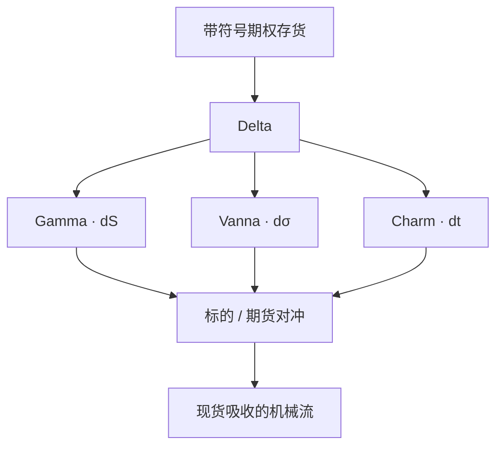

# 经销商 Vanna / Charm 到期流

即便现货暂时不动，隐含波动一变、日历一流逝，期权 Delta 也会变；经销商为维持中性而交易标的，形成与 Gamma 对冲不同的、由 Vanna 与 Charm 驱动的流量。

<footer>—— 混合偏导为 Black–Scholes 价格的直接推论，整理见 Hull；存货进入价格见 Gârleanu, Pedersen and Poteshman, RFS, 2009；公开从业把到期周的该类对冲称作 vanna/charm flows</footer>

[Delta / Gamma / Vega](/quant/greeks-hedge) 解释现货动时的对冲。[Charm / Color](/quant/higher-greeks) 写出 $\partial\Delta/\partial t$ 与 $\partial\Gamma/\partial t$。**Vanna** $\partial\Delta/\partial\sigma=\partial\nu/\partial S$ 写出波动一动时 Delta 的变化。把经销商账本的这些偏导加总，得到即使 $\mathrm{d}S=0$ 也会发生的对冲需求，从业者称为 vanna / charm flows。它们在到期周与 [0DTE](/quant/zero-dte-microstructure) 下午被放大，因为短 $\tau$ 上时间导数与交叉导数变尖。本篇写公开可计算的存量（把希腊字母按 OI 聚合）及其机制含义，口径问题同 [GEX](/quant/gex-calculation)：符号来自谁持仓。这不是盘中抢跑对冲单的流程，也不是「上午 charm、下午 vanna」的交易日程表。

## 问题

Delta 的全微分在模型坐标下为

$$
\mathrm{d}\Delta \approx \Gamma\,\mathrm{d}S + \mathrm{Vanna}\,\mathrm{d}\sigma + \mathrm{Charm}\,\mathrm{d}t +\cdots.
$$

经销商要抵消 $\mathrm{d}\Delta$，对冲交易约为 $-\,n\,\mathrm{d}\Delta$（$n$ 为带符号张数）。Gamma 项是大家熟悉的现货反馈；后两项是：**IV 变动引起的对冲**与 **时钟引起的对冲**。问题是把后两项写成与 GEX 平行的公开存量：对每个合约算 Vanna、Charm，乘 OI 与乘数，按同一顾客/经销商约定加总。单位必须声明：Charm 是「每个交易日 Delta 变多少」，Vanna 是「IV 变动一个波动率点 Delta 变多少」。混淆单位会把流量讲错一个数量级。

识别与 GEX 相同。公开 OI 没有符号；Mixon 的警告完全适用。此外 Vanna 还依赖微笑动态：sticky strike 与 sticky delta 给出不同的 $\partial\Delta/\partial\sigma_{\mathrm{mkt}}$。从业图上的「vanna flow」常常把 $\mathrm{d}\sigma$ 再乘一个假设（例如现货涨则 IV 跌），把 vanna 存量变成对现货的有效 Gamma。那是额外模型，须与纯 Charm（只需时钟）分开。

### 到期周为什么显得大

Charm 在平值、短到期最大：价内 Delta 被推向 1，价外推向 0。0DTE 把这一过程压缩到数小时，现货窄幅时仍可能看到期货上的对冲。Vanna 在短到期同样尖锐，且短端 IV 本身更吵。月期权到期周二者叠加，历史上被讲成「到期流」；加密到期之后，每个周五乃至每个下午都有一小段。公开研究应把 **日历时间的 Charm 存量** 与 **需要假设 $\mathrm{d}\sigma$ 的 Vanna 项** 分列，避免一张图里三条假设。

Charm 的符号在价内价外相反。加总前必须按合约计算再加，不能对「净 Delta」做一个时间衰减。用净 Delta 除以 $\tau$ 当 Charm，是错误的近似。

## 方法

**单合约希腊。** 用与 GEX 同一曲面、同一利率股息，算 $\Gamma$、Vanna、Charm。美式与欧式分开。Charm 的 $\mathrm{d}t$ 取到下一可对冲时刻（隔夜或一小时），以便与限额比较，见 [隔夜跳空](/quant/overnight-gap-hedge)。

**聚合。**

$$
\mathrm{CharmEx}=\sum n_i\,\mathrm{Charm}_i,\qquad \mathrm{VannaEx}=\sum n_i\,\mathrm{Vanna}_i,
$$

$n_i$ 为经销商带符号张数。再乘指数点值得到期货张数代理。标准化除以期货深度或指数市值，使跨日可比。按到期分桶：0DTE、周期权、标准月。

**把 Vanna 译成现货敏感（可选、须声明）。** 若假设 $\mathrm{d}\sigma=\rho\,\mathrm{d}S/S$ 一类经验规则，则有效 $\Gamma_{\mathrm{eff}}=\Gamma+\mathrm{Vanna}\cdot(\partial\sigma/\partial S)$。这是体制分析的扩展，不是定义。没有 $\rho$ 的估计就不要把 VannaEx 画成「等价 GEX」。

### 与 GEX、Flip 同一天的联合报告

GEX 回答 $\mathrm{d}S$ 的反馈；CharmEx 回答 $\mathrm{d}t$；VannaEx 回答 $\mathrm{d}\sigma$。三者可以同号或对冲。只报 GEX 会在 IV 崩塌日漏掉主要对冲。联合报告时使用同一符号约定、同一 OI 快照、同一 $S$。Flip 仍只对 $\Gamma(S)$ 定义，不要为 Charm 再解一个「charm flip」除非预指定并承认那是另一函数的根。

从业叙事常把「波动率下跌 → 经销商买现货」写成定律。该符号取决于看跌看涨的净持仓与 vanna 的符号。定律只在特定存货假设下成立，须与 GEX 的假设一致地写出。

## 机制

时钟项：时间过了，短看涨若仍虚值，Delta 向 0 走，空头该看涨的经销商（Delta 原为负）会发现 Delta 回升，可能需要买入标的以重新中性——具体符号由头寸决定。这就是 charm flow 的全部：没有新信息，只有 $\tau$ 减少。Vanna 项：IV 下跌改变风险中性密度的展开，平值附近 Delta 剖面变形，对冲再调。若顾客集中持有短看跌，IV 下跌与现货上涨经常同时出现，Gamma、Vanna 被同一宏观事件驱动，经验上难以拆开。公开文献能做的是：把三项存量作为状态，看随后一段现货的已实现协方差是否与预测的对冲方向一致，控制 $\mathrm{d}S$ 本身。这是脆弱的检验，因为 $\mathrm{d}\sigma$ 与 $\mathrm{d}S$ 内生。相对更干净的是 Charm：用非事件日、窄幅日的期货成交与 CharmEx 对照，仍然充满噪声，但至少时钟是外生的。

GPP 的存货定价主要针对无法对冲的期权风险；标的对冲流是可对冲部分。Vanna/Charm 流属于「可对冲、因而进入现货」的部分，与期权溢价不是同一张表。不要用 VIX 溢价去证明 charm 存在，也不要用 charm 去解释 VRP。

### 到期日下午的叠加

0DTE 下午：$\Gamma$ 尖、Charm 尖、短端 IV 跳、pin 阈值同时出现。把下午期货成交全部归因于「charm」无法识别。描述上应说：高阶希腊在短 $\tau$ 放大了对冲需求的**非现货**来源；定量归因需要账本，公开链没有。风险系统可以把 CharmEx$\times\Delta t$ 加入收盘预留 Delta，这是 [higher greeks](/quant/higher-greeks) 的正当工程；把同一数字当成明天指数的方向预测，不是。

## 边界与工程取舍

公开 Vanna/Charm 存量与 GEX 一样受符号约定支配，且多一个微笑动态假设。事件日 $\mathrm{d}\sigma$ 由跳跃主导，微分失效。个股借券与停牌使对冲无法按公式执行。A 股没有同构的公开经销商希腊加总。

不支持的用法：按星期几的「vanna 日程」做方向、在特定钟点抢跑。支持的用法：风险预留、与 GEX 分列的状态变量、在非事件窄幅日对时钟项做描述性对照。单位、分桶、符号三者缺一，图不可读。

Color（$\partial\Gamma/\partial t$）会改变次日 GEX，却不直接产生当日标的成交。不要把 Color 算进「flow」。Flow 对应的是 Delta 的变化，即 Charm 与 Vanna 与 Gamma。

## 小结

- 经销商对冲流来自 $\mathrm{d}\Delta$ 的三项可加来源：Gamma、Vanna、Charm；后两项在现货不动时仍可非零。
- 公开聚合与 GEX 同一识别问题；Vanna 还需微笑动态；Charm 相对更外生但仍需持仓符号。
- 到期与 0DTE 放大高阶项，但不能把下午成交单归因于 charm。
- 正当用途是限额预留与状态报告，不是钟点方向配方。
- 出处：Hull 对高阶希腊的整理；Gârleanu, Pedersen and Poteshman, *RFS*, 2009；Mixon 对公开定位的讨论；Black–Scholes 混合偏导；从业 vanna/charm 口径须与上述公式对齐。
