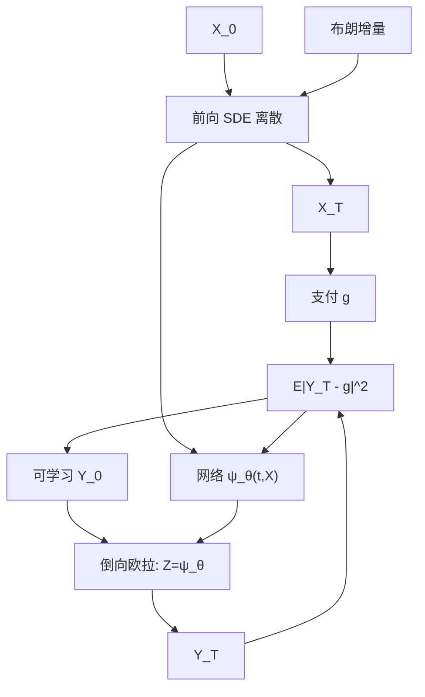

# Deep BSDE 求解器

    
高维抛物方程的解可以写成正倒向随机微分方程的起点；把倒向过程的控制当成神经网络，用终端匹配当损失，于是维数灾难从网格移到了抽样与梯度方差上。

    <footer>—— E, Han and Jentzen, Deep Learning-Based Numerical Methods for High-Dimensional Parabolic PDEs and BSDEs, 2017；Han, Jentzen and E, PNAS 2018</footer>

欧式定价在马尔可夫扩散下是抛物 PDE：[有限差分](/quant/option-pde) 在一到三维可靠，维数再升，网格爆炸。[蒙特卡洛](/quant/mc-pricing) 对欧式终端支付无偏，但对需要全局解或连续对冲过程 $Z$ 的问题，要另做回归。[Longstaff–Schwartz](/quant/longstaff-schwartz) 用基函数回归续流，美式可以做，高维基的选择又成问题。Weinan E、Jiequn Han 与 Arnulf Jentzen 把 PDE 与 BSDE 的等价写成可训练的离散格式：前向模拟状态，网络输出倒向的扩散系数，终端条件当监督。本篇写这一格式对应什么金融对象、损失为何是终端平方、以及它与 [Deep Hedging](/quant/deep-hedging-buehler)、[PINN](/quant/pinn-option-pricing) 的边界；不把一般 BSDE 理论从 Pardoux–Peng 重讲一遍。

## 问题

标准形式：状态 $X$ 满足前向 SDE，$\mathrm{d}X=b\,\mathrm{d}t+\sigma\,\mathrm{d}W$。价格过程 $Y$ 与对冲过程 $Z$ 满足倒向方程

$$
\mathrm{d}Y=-f(t,X,Y,Z)\,\mathrm{d}t+Z^\top\mathrm{d}W,\qquad Y_T=g(X_T).
$$

$Y_0$ 是定价，$Z_t$ 在扩散市场上对应 delta 一类控制。驱动 $f$ 含折现、分红、非线性定价（如不同借贷利率）时，$f$ 依赖 $Y,Z$，问题不再是线性期望。高维时，对 $(t,x)$ 铺网格不可解。Deep BSDE 把 $Z_{t_k}\approx \psi_{\theta_k}(t_k,X_{t_k})$（或共享权重的 $\psi_\theta$），$Y$ 从可学习的 $Y_0$ 出发按欧拉格式走到 $T$，损失为 $\mathbb{E}|Y_T-g(X_T)|^2$。最小化该损失，相当于强制离散倒向过程打中终端，从而 $Y_0$ 与 $\psi$ 逼近真解。

非线性 $f$ 是相对线性蒙特卡洛的真正理由：不同借贷利率、估值调整里的非线性、某些随机控制的 HJB，期望表示不再是简单的折现支付平均。线性欧式香草用 Deep BSDE 没有优势，普通模拟即可。

### 维数灾难移到了哪里

网格方法的复杂度对维数指数增长。Deep BSDE 的单次路径复杂度对维数近似线性（矩阵向量乘），这是 2018 年 PNAS 一文强调的点。代价是：估计 $Y_0$ 的误差来自离散偏差、网络逼近误差、以及随机梯度在终端损失上的方差。高维并不自动变容易——若 $g$ 只依赖 $X$ 的一个尖锐方向，朴素网络与朴素抽样会把容量浪费在无关坐标上。维数友好是对「解在扩散意义下足够正则、支付不太病态」的问题，不是对所有高维公式。

终端平方损失不是似然。它对应 $L^2$ 意义下打中 $g(X_T)$。风险度量下的对冲，或有摩擦的可执行策略，不是这个损失的解，应走 Deep Hedging。

## 方法

**离散。** 时间网格 $t_k$，

$$
X_{k+1}=X_k+b\Delta t+\sigma\Delta W_k,\qquad
Y_{k+1}=Y_k-f(t_k,X_k,Y_k,Z_k)\Delta t+Z_k^\top\Delta W_k,
$$

$Z_k=\psi_\theta(t_k,X_k)$。$Y_0$ 可设为标量参数（欧式单点定价）或网络（需要 $Y(0,x)$ 作为 $x$ 的函数）。布朗增量与 $X$ 的模拟必须与训练共用同一套格式；评估若改用更细的网格，要单独报告离散偏差，不能把差异写成「网络泛化」。

**网络。** 每步独立网络参数量大、难训；共享权重加时间输入更常见。支付不光滑（看涨折点、数字期权）时，$Z$ 接近到期会变尖，均匀时间网格不够，可在近到期加密或对 $g$ 做光滑近似并外推。控制变量：用已知的低维解或线性部分的闭式当基线，网络只学残差，方差会下降。

**非线性驱动。** $f$ 依赖 $Z$ 时，每步都要把当前网络输出送进 $f$，计算图变长，梯度沿时间反传，与 RNN 同型的稳定性问题会出现：步数多时需梯度裁剪或检查点。非线性估值调整若把对手方强度写成 $Y$ 的函数，还要保证离散格式不破坏单调性，否则会出现负价格或振荡。

### 美式与最优停

标准 Deep BSDE 对准欧式（固定终端）。美式是最优停或反射 BSDE，不能只把 $g(X_T)$ 换成路径上的 $\max$。需要在每步做一次继续值与行权值的比较，并训练继续值网络，精神上接近 Longstaff–Schwartz，只是基函数换成深度网络。没有这层，把美式支付在到期才结算，学到的是欧式。障碍、提前行权应显式进格式，见树方法与 LSM 篇的问题定义，不要指望终端损失自己长出自由边界。

## 机制

Feynman–Kac 把线性 PDE 写成期望；BSDE 把半线性 PDE 写成倒向随机方程。Deep BSDE 是该表示的 Galerkin：函数类是神经网络，内积是路径上的终端 $L^2$。梯度同时更新 $Y_0$ 与 $Z$ 网络，意味着定价与对冲过程被联合识别。在完备扩散市场上，学到的 $Z$ 对应可复制策略的扩散系数，无摩擦时与 delta 一致。这与 Deep Hedging 的可执行持仓不同：$Z$ 是瞬时暴露，不是「下一离散时刻、含价差」的下单量。

终端损失的信息沿时间反传，近 $t=0$ 的 $Z$ 梯度要穿过许多步噪声，早期对冲的学习信号弱。这解释了为何 Deep BSDE 对短到期、步数不多的问题更稳，对长到期要加残差连接、多级网格或把 $Y_0$ 的学习率单独调。PINN 则在 $(t,x)$ 配点上惩罚 PDE 残差，不模拟 $W$；高维时配点如何覆盖状态空间是另一套方差问题。两种方法都不是「深度学习取消了维数」，而是用抽样换网格。

### 与蒙特卡洛希腊值

路径上对参数的自动微分可以给出 $Y_0$ 对 $X_0$ 的导数，应与 $Z_0$ 对照。两者系统性偏离，优先查离散格式与网络容量，而不是报告「新希腊」。线性问题应用普通蒙特卡洛加似然比或路径导数做对照：Deep BSDE 的点估计若比 MC 更噪，没有理由上生产。非线性问题没有这条对照时，应用粗网格低维切片、已知渐近、以及独立实现的二次损失是否还能降。

E–Han–Jentzen 的演示含高维 Black–Scholes 与 HJB。把演示里的维数直接写成「已解决百维香草生产定价」会误导：支付结构、相关系数与边界在演示里往往很规则。

## 边界与工程取舍

跳扩散的 BSDE 含补偿随机测度，朴素欧拉不够；粗糙波动非半鞅，经典 BSDE 形式也不直接适用。局部随机波动若要校准香草，Deep BSDE 是内层定价器，外层校准仍是优化问题，梯度穿过两层会很脆，实务上内层常冻结或换更快的定价。计算图随步数增长，生产应限制 $N$，并用同一 $N$ 做风险报告，避免「定价用细、风控用粗」。

Deep BSDE 假定生成元 $(b,\sigma,f,g)$ 已知。生成元来自错误校准，求解再准也是错方程。它不吸收买卖价差。[Neural SDE](/quant/neural-sde) 学的是前向生成元；Deep BSDE 学的是给定生成元下的倒向解。二者可接：先用 Neural SDE 拟合 $\mathbb{P}$ 或 $\mathbb{Q}$ 的前向，再在该前向上跑 Deep BSDE——测度与折扣必须交代清楚，混用 $\mathbb{P}$ 路径去解 $\mathbb{Q}$ 的 $f$ 没有意义。

损失降到很小只说明离散倒向打中了终端，不说明中间时刻的 $Y_{t_k}$ 是条件期望。应在中间时刻抽取检验：冻结 $t_k$ 之后的网络，看 $Y_{t_k}$ 是否匹配从该时刻重模拟的续流均值（线性情形）。

非线性 $f$ 使解可能不唯一或爆炸。训练发散时先查 $f$ 的 Lipschitz 与时间步，而不是加宽网络。理论保证依赖驱动的正则，论文假设比柜台里的 CVA 公式更干净。

## 小结

- Deep BSDE 用神经网络参数化倒向过程的 $Z$，以终端 $L^2$ 匹配求解半线性抛物方程 / BSDE，$Y_0$ 为价格。
- 相对网格，复杂度对维数更友好；误差来自时间离散、逼近与梯度方差，不是免费午餐。
- 线性欧式不必用它；非线性驱动、高维马尔可夫扩散才是动机。
- 美式、摩擦、可执行下单不是终端匹配的解；分别走向 LSM/反射 BSDE 与 Deep Hedging。
- 生成元必须给定且与测度一致；中间时刻应另做条件期望检验。
- 出处：E, Han and Jentzen, *Communications in Mathematics and Statistics*, 2017；Han, Jentzen and E, *PNAS*, 2018。
