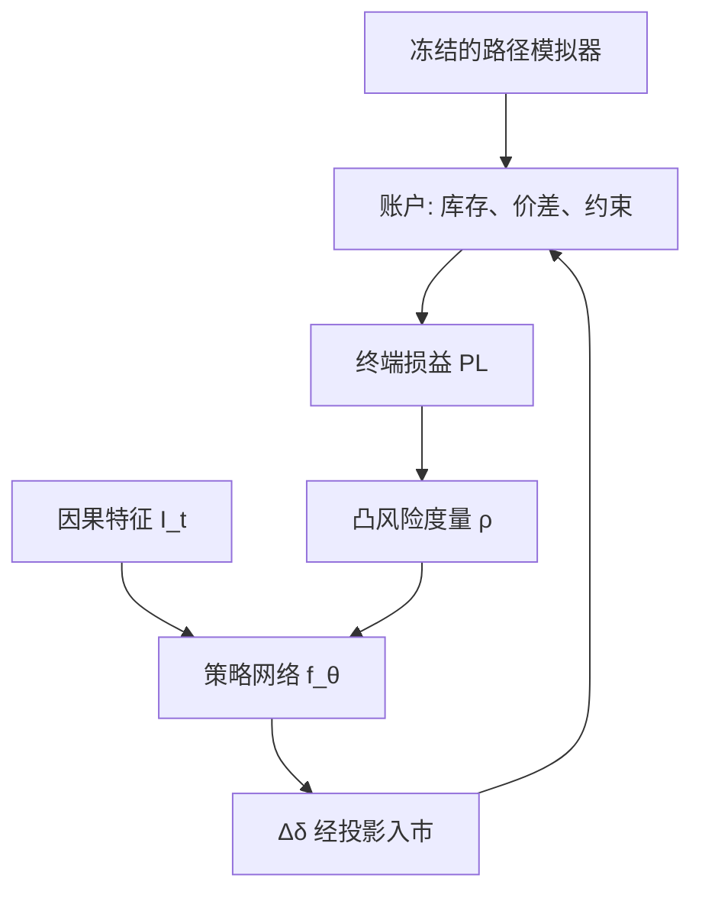

# Deep Hedging

    
把对冲当成在模拟器里训练的策略：每一步的持仓是信息的函数，目标是凸风险度量下的终端损益，交易成本与约束写进环境，而不再假设完备市场里的复制。

    <footer>—— Buehler, Gonon, Teichmann and Wood, Deep Hedging, Quantitative Finance, 2019</footer>

Black–Scholes 的 delta 来自完备市场的复制：连续交易、无摩擦、波动已知。真实柜台面对的是离散时间、买卖价差、头寸限额、以及模型只是模拟器。[离散对冲误差](/quant/discrete-hedge-error) 与 [对冲频率](/quant/delta-hedge-freq) 写的是摩擦存在时经典 delta 会剩什么。Hans Buehler、Lukas Gonon、Josef Teichmann 与 Ben Wood 把剩余问题收成强化学习式的风险最小化：对冲策略由神经网络输出，在情景上最小化凸风险度量。本篇写目标为何必须是风险度量而不是期望、模拟器从哪来、以及它与 [Deep BSDE](/quant/deep-bsde) 的差别；不把 PDE 网格再推一遍，也不把生成器评估协议写完，后者见 [生成式回测的评估](/quant/generative-backtest-eval)。

## 问题

记或有索取权支付为 $Z$（对终端或路径可测）。离散时点 $0=t_0<\cdots<t_N=T$，可交易工具价格过程 $S$，策略 $\delta_{t_k}$ 在 $t_k$ 基于信息 $\mathcal{F}_{t_k}$ 选取。计入交易成本 $c$ 后，终端损益形如

$$
\mathrm{PL}(\delta)= -Z + p_0 + \sum_{k=0}^{N-1}\delta_{t_k}\cdot(S_{t_{k+1}}-S_{t_k}) - \sum_{k} c(\Delta\delta_{t_k},S_{t_k}).
$$

完备无摩擦时，存在 $\delta$ 使 $\mathrm{PL}$ 几乎处处为常数，该常数即价格。有摩擦或市场不完备时，$\mathrm{PL}$ 是随机变量。用 $\mathbb{E}[\mathrm{PL}]$ 做目标会忽略尾部，最优往往是赌模拟器里的漂移。Buehler 等人改用凸风险度量 $\rho$，例如期望短期风险或带风险厌恶的熵测度，求解

$$
\inf_{\delta}\rho\bigl(-\mathrm{PL}(\delta)\bigr),
$$

价格与对冲同时由这套优化定义：卖价是使 $\rho(-\mathrm{PL})\le 0$ 的最小 $p_0$。这与复制价格在摩擦为零、风险度量为 ess-sup 一类极限时可衔接，但日常工作态是「在给定模拟器与给定 $\rho$ 下的最优对冲」，不是模型无关的无套利界。

### 信息、非马尔可夫与路径依赖

经典 delta 是 $(t,S_t)$ 的函数。有交易成本时，最优持仓依赖当前已持有的头寸：换手有价，状态必须含库存。有路径依赖支付或粗糙波动时，还需路径摘要。深度对冲把 $\delta_{t_k}=f_\theta(I_{t_k})$，$I$ 可含价格、库存、已实现方差、[签名](/quant/path-signature-features) 特征。网络若只喂 $S_t$，等于强加马尔可夫，摩擦下的惰性对冲学不出来。若把整段未来路径喂进去，则在作弊。因果特征是方法的一部分，不是实现细节。

Deep Hedging 优化的是模拟器上的 $\rho$，不是市场上已实现的 $\rho$。模拟器错，对冲就对着错误的概率训练。这与「神经网络很强所以不需要模型」相反：它把模型从闭式假设挪到了数据生成过程，模型风险集中在模拟器。

## 方法

**模拟器。** 可以是校准过的 [Heston](/quant/heston)、局部波动、带跳扩散，或 [Market Generator](/quant/market-generator-vae) / [Neural SDE](/quant/neural-sde)。对冲网络与模拟器不要在同一段历史上联合过拟合：先冻结情景分布，再训 $f_\theta$。交易成本用价差、冲击或 [Almgren–Chriss](/quant/almgren-chriss) 一类临时永久冲击；约束用投影（持仓盒约束）或惩罚。无约束时网络会学到模拟器里的瞬时套利或无限杠杆。

**风险度量的可训性。** $\rho$ 必须允许路径上的梯度。CVaR 可用分位数以下平均的经验版；熵风险 $\frac1\eta\log\mathbb{E}e^{-\eta\,\mathrm{PL}}$ 光滑，但 $\eta$ 大时梯度被极少数差路径主导，batch 要够覆盖尾部。不要用非凸的「夏普」当 $\rho$：选择偏差与尺度会把对冲变成杠杆选择。价格 $p_0$ 可以是标量参数与网络联合训练，使 $\rho(-\mathrm{PL})=0$。

**架构。** 每步一个共享权重的网络（递归）或把时间做成输入的前馈。共享权重利于推广到不同 $N$，但要避免把 $t_k$ 的绝对日历泄漏进特征。希腊值不是训练目标：它们可以从 $f_\theta$ 对 $S$ 的自动微分读出，用于风控对照，而不是塞进损失。对照基线应包括 Black–Scholes delta、Leland 调整、以及「零对冲」。只比随机初始化的网络没有信息。

### 与 Deep BSDE 的分工

[Deep BSDE](/quant/deep-bsde) 解的是半鞅市场上的 backward 方程：$Y$ 是价格，$Z$ 是对冲，对应无摩擦、给定生成元的 PDE/BSDE。深度对冲不假设生成元已知，也不假设复制存在；摩擦与约束进环境。若市场接近 Black–Scholes 且无成本，两者应收敛到同一 delta；有价差时 BSDE 的 $Z$ 不是可执行策略，必须再经深度对冲或启发式改写。不要用 Deep BSDE 的终端匹配损失去训一个带冲击的账户——损失面不是同一问题。

## 机制

凸风险度量的次可加与现金不变性，使「先收保费再对冲」与「对冲残差的风险」能写在同一个数里。训练时，网络在容易对冲的情景上把残差压平，在贵的情景上决定是付成本追还是留尾部——这由 $\rho$ 的尾部权重决定。CVaR 只看最差 $1-\alpha$ 平均，网络会放弃更好的 $\alpha$ 躯干去救尾部；期望损失则相反。生产必须把 $\rho$ 当成产品参数，而不是调到样本内最好看的那个。

交易成本引入最优的**无交易区**：库存偏离对冲比但未出区时，不动是对的。网络若没有库存输入，无法表达该区，会在价差上磨出额外损失。这是深度对冲相对「把 BS delta 再做一次离散」的结构性改进，不是更深的层数带来的。模拟器若没有价差，网络也不会发明无交易区。

### 希腊、监管与可解释性

柜台仍要报告 delta、vega 桶。深度对冲的 $f_\theta$ 可以对现货、对模拟器的波动因子做扰动得到数值希腊，但这些希腊不满足经典 PDE 恒等式，因为问题已经不是那个 PDE。把网络输出投影到「BS delta + 低维修正」可以便于限额，但会牺牲摩擦下的最优。更干净的做法是：限额在动作投影里硬执行，报告层单独算希腊，不把报告用的 BS 公式写回损失。

效用最优对冲与无套利定价在不完备市场本来就不是同一个数。Deep Hedging 明确站在前者。若销售要的是可对锁的报价，应回到无套利界与复制误差的最坏情形，而不是把 $\rho$ 的最优 $p_0$ 直接当中间价。

## 边界与工程取舍

模拟器覆盖不到的跳跃、停牌、涨跌停，网络会表现为虚假的高夏普残差。上线必须在真实历史留出路径上做残差扫描，生成器协议见评估篇。在线学习（用新成交不断更新 $\theta$）会把已实现噪声写进策略，需要冻结期与回归测试。计算上，每步交易与冲击评估使一次 epoch 等于大批量的路径重放；方差减缩（控制变量用 BS 对冲残差）往往比加深网络更有效。

不要把 2019 年论文写成「神经网络取代了定价理论」。Buehler–Gonon–Teichmann–Wood 的贡献是把摩擦市场的凸风险对冲写成可训练的策略，并强调模拟器与风险度量是模型的一部分。没有这两件，只剩一个黑盒交易员。

熵风险的 $\eta$ 与 CVaR 的 $\alpha$ 改变的是产品，不是优化器超参。同一网络结构、不同 $\rho$，应对不同销售与资本口径；混用会让历史残差不可比。

多对冲工具（现货、期货、香草）时，动作维上升，投影与限额更重要。网络会把对冲挪到模拟器里最便宜的工具上——若该便宜来自错误校准的基差，真实账上会爆。工具的模拟必须与现货联合校准。

## 小结

- Deep Hedging 在离散、有摩擦的模拟器上最小化凸风险度量，策略是因果特征的神经网络，而不是 BS 复制。
- 价格由 $\rho(-\mathrm{PL})\le 0$ 定义，依赖模拟器与 $\rho$，不是模型无关界。
- 库存必须进入状态，否则学不出无交易区；未来路径不得进入特征。
- 与 Deep BSDE 的差别：后者解无摩擦 BSDE/PDE，前者把摩擦与约束放进环境。
- 上线评估必须用真实留出路径与冻结模拟器；生成器伪影会被对冲网络当成 alpha。
- 出处：Buehler, Gonon, Teichmann and Wood, *Deep Hedging*, Quantitative Finance, 2019。
