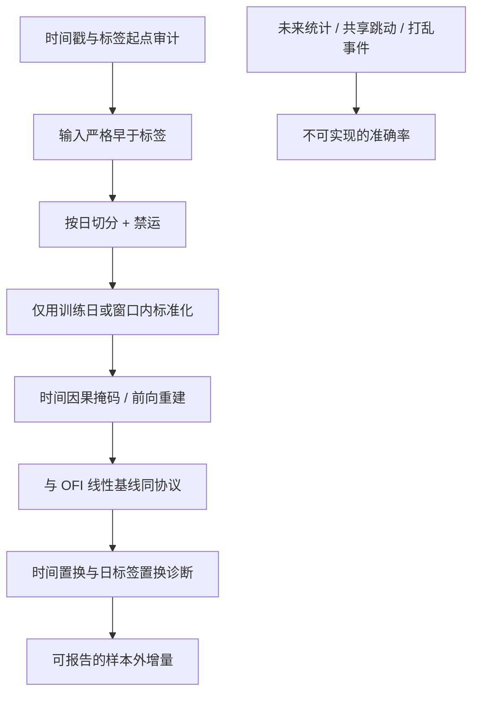

# 深度 LOB 模型的泄漏陷阱

    
限价簿模型的测试准确率一旦高到不像短时噪声该有的样子，应先当作信息集被污染的诊断，而不是当作可交易边际的发现。

    <footer>—— 对照 López de Prado 对金融机器学习泄漏的警告，以及微观结构研究里时间戳与标签对齐的纪律</footer>

[DeepLOB](/quant/deeplob-cnn-lstm) 与 [TransLOB](/quant/translob-axiallob) 在公开基准上可以把短时中点方向的准确率做到远高于随机。一部分增益来自簿里真实存在的短记忆；另一部分来自研究者在构造张量、标签和切分时，把 $t$ 之后才确定的信息写进了 $t$ 的输入或写进了标签定义。后者是泄漏。它不创造可执行的优势，只创造不可复现的论文数字，并诱使后续工作在同一套被污染的协议上「刷新 SOTA」。本篇把深度 LOB 的泄漏当成**给研究者的警告**：说明污染通常从哪几类信息集错误进来、如何用诊断把它揭出来、合法评估应满足什么。它不是一份「怎样把准确率做高」的清单，也不提供把未来消息写进特征的做法。

## 问题

合法预测要求：窗口 $X_t$ 只含截至 $t$ 已在该账户可见的簿与成交，标签 $y_t$ 的随机性来自 $t$ 之后的路径，且 $y_t$ 不是 $X_t$ 的代数恒等式。违约之后，网络变成一个昂贵的恒等函数或延迟对齐器。深度模型特别危险，不是因为卷积有魔法，而是因为容量足够记住「标准化用了未来均值」「标签与最后一档共享同一次跳动」这类伪规则，并在同一交易日的相邻窗口上重复它们，使验证集也中毒。

这与截面因子的[前视](/quant/look-ahead-bias)同类，但时钟更密：毫秒级时间戳、本地到达与撮合时间的差、快照与逐笔重建的差，都会在「看起来只是预处理」的步骤里注入未来。交叉验证若再打乱事件，泄漏从偶发变成系统性，见[金融 CV 泄漏](/quant/cv-leakage-finance)。

### 标签与输入共享同一次中点跳动

短时任务常预测「未来 $k$ 步中点相对现在」的符号。若输入窗口的最后一条消息已经是造成该中点变化的那笔主动成交，则 $X$ 与 $y$ 被同一跳连着：模型只需认出「最后一笔是主动买」，不必预测。合法对齐要求标签所使用的价格路径从**窗口结束之后的下一条消息**开始，并且研究者应在诊断中检查：把最后一条消息从输入里拿掉之后，准确率是否崩掉。崩掉并不自动等于泄漏，但若不崩而准确率仍接近确定性，更应怀疑标签定义本身是当前价差的重写。

另一类是阈值 $\theta$ 用了未来一段的波动或未来高低点来划分上/平/下，使类别边界含未来信息。$\theta$ 只能来自 $t$ 之前的规则。

「中点在下一毫秒的方向」在价差为两个 tick、且一方队列只剩残量时，几乎是簿的几何，不是预测。报告准确率而不报告当时价差与队列状态，是把几何当成 alpha。

## 方法

**时间戳审计。** 每一行样本列出：输入窗口的最后交易所时间、标签区间的起始交易所时间、该行进入训练集还是测试集的日期。二者必须满足最后输入时间严格早于标签起始，且测试日的全部窗口不得与训练日重叠。本地电脑时钟、供应商归一化时间、撮合时间混用时，跨市场或跨网关的样本会把延迟结构学成「领先」。审计应只用单一官方时间源，并删除迟到包，而不是靠模型去「利用」迟到。

**切分。** 按交易日（或按周）切，禁止按事件随机折。同一日内的滑动窗口高度重叠，随机折等于把几乎相同的张量同时放进两边。验证日与测试日之间按标签长度做禁运。超参（$k$、档位数、阈值、网络宽度）只在验证日选一次。测试日的准确率若用来选掩码类型或选是否双向注意力，测试日已经变成训练日。

### 标准化、重建与「干净快照」

全局 z-score、全样本分位数、用含测试日的主成分对档位降维，都会把测试日的深度水平写进训练输入。标准化应冻结在训练日上，或只用窗口内部当时可见的相对中点变换。簿重建若使用「向后填」——用后一条消息修正前一条快照的错序——则前一条快照已经含有后一条的信息。研究应接受实时可得的不完美簿，并把重建规则写成与生产一致的前向规则。这些是审计条目，不是提高分数的开关。

诊断不必构造任何额外的未来特征。最低限度的一组是：（1）时间置换：将标签区间相对输入整体后移到无法重叠的远期，合法信号应消失；（2）日切置换：打乱交易日标签但保持日内结构，若分数几乎不降，模型学的是日级体制而非短时簿；（3）恒预测基线与 OFI 线性基线：深度模型必须在同一无泄漏协议下比较增量。诊断的目的是揭穿不可信的数字，不是提供另一条可交易规则。

FI-2010 等公共基准的切分被反复调参后，本身会变成一种文献级过拟合。在自有数据上复现时，应预指定切分日历，而不是挑选让 DeepLOB「最像论文」的那一段。

## 机制

泄漏抬高准确率的机制很普通：训练损失可以沿伪相关降到接近零，而伪相关在重叠窗口的验证集上重复。深度网络的容量把这一过程自动化。注意力在无因果掩码时尤其直接：未来 token 的键已经含有标签所基于的跳动，softmax 会把质量分给它们，看起来像「学到了长程依赖」。CNN 则可能把窗口末尾几列当成未来的代理，因为滑动构造时末尾列与标签在时间上最近。

经济上，泄漏的「策略」无法在实盘实现：生产系统看不到测试协议里那些未来标准化常数，也看不到标签对齐时偷偷包含的那次成交。更糟的是，泄漏模型会在研究环境里战胜无泄漏的 OFI 基线，使真正可检验的微观结构事实被扔掉。科学损失大于交易损失——后续论文在同一污染协议上竞赛，领域的可预测性被高估，资金与审稿都被消耗。

### 和普通前视、和过拟合的关系

全样本标准化是前视；同一日窗口随机切分是泄漏式 CV；把测试日拿来选 $k$ 是过拟合。三者常一起出现。纠正前视不会自动纠正对基准年份的过拟合。流程应先冻结信息集与切分日历，再谈架构是 CNN 还是 Transformer。架构论文若只改网络、不改协议，其 SOTA 声明对科学无效。

自身订单出现在历史簿里、却在标签里被当成外生中点，是另一种污染：模型学到「我的单随后价格如何」，这在研究自己的历史时是循环。公共研究应使用不含自己账户的簿，或把自家消息标记为不可用输入。此处只指出循环定义会让开环准确率无意义，不讨论如何在盘中利用未公开信息。

## 边界与工程取舍

完全无泄漏的短时预测往往只略高于 OFI 与微观价格等线性摘要。这是可接受的科学结果。把深度模型当成「必须超过 70% 准确率才值得写」的发表压力，是泄漏的激励相容来源。审稿与内部评审应要求：时间线表格、掩码说明、与线性基线的同协议比较、以及诊断（1）（2）的结果。缺一项，准确率表可以视为未完成。

延迟研究（自己看到簿的时间晚于撮合）会降低合法可预测性，这是诚实的。用供应商的事后完整簿去训、用延迟馈源去测，若未在训练中模拟同一延迟，训练信息集仍比生产更干净，属于乐观偏差。应在训练中施加不优于生产的延迟，而不是在测试中「稍微」加点延迟当稳健性。

不要展示如何把未来消息、未来中点或未来成交量编码进通道「以验证模型能学会它们」——容量验证应用合成噪声标签，不应用真实未来市场状态。不要把无掩码、全局标准化、随机切分的分数当作上界以外的任何东西。上界的唯一用途是警告：你的协议最多能虚高到这里。

若一组预处理在关掉网络、改成对窗口最后一列做逻辑回归之后仍然极准，泄漏几乎已经发生在数据管道，而不是发生在深度架构。先修管道，再比较 CNN 与 Transformer。

## 小结

- 深度 LOB 的异常高准确率应首先当作泄漏诊断：标签与输入共享跳动、未来标准化、事件级随机切分、窗口内看未来快照，都会污染信息集。
- 合法协议要求交易所时间上输入严格早于标签、按日切分与禁运、前向重建、因果掩码，以及与 OFI 等线性基线的同协议比较。
- 诊断用时间置换与日标签置换揭穿虚高数字；不提供把未来写进特征的方法。泄漏策略在生产中不可实现，却会带偏整个文献。
- 先冻结信息集，再比较架构。管道已经极准时，问题不在 CNN 或注意力。
- 出处：López de Prado, *Advances in Financial Machine Learning*, 2018（泄漏、清洗与禁运）；时间对齐纪律与 DeepLOB 设定见 Zhang, Zohren and Roberts, *IEEE TSP*, 2019，以及 Sirignano, *Quantitative Finance*, 2019。本篇把后者的任务放进前者的审计框里。
