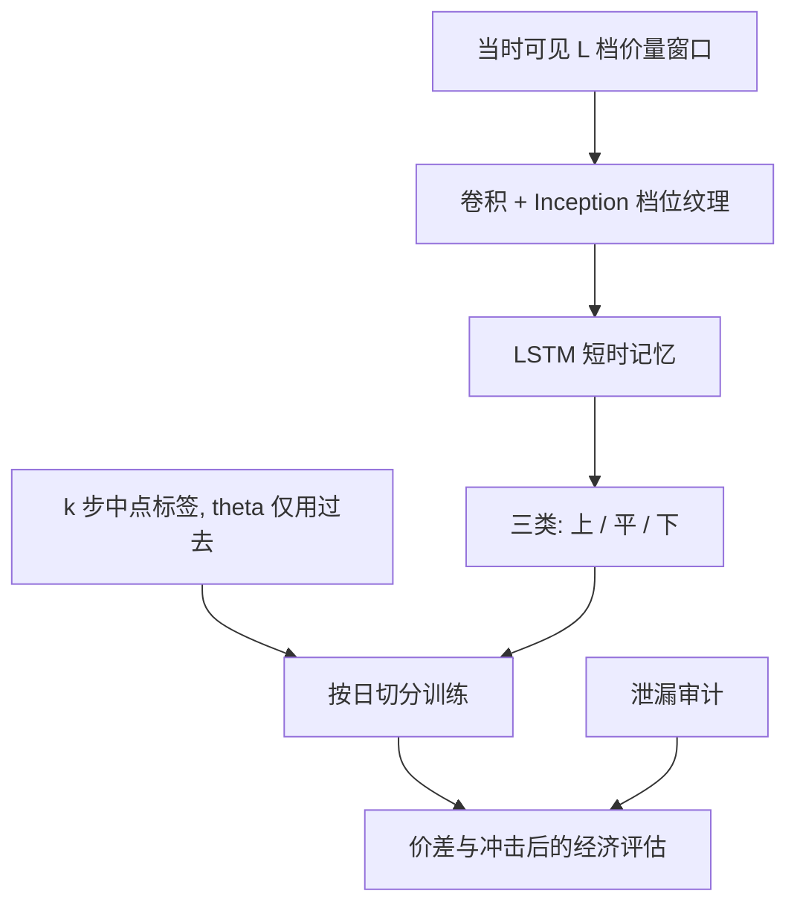

# DeepLOB

    
限价簿在价格档位上具有空间结构，在事件时间上具有局部依赖；用卷积提取档位纹理、再用循环层积累短历史，可以把下一短窗中点方向的预测写成对整本可见簿的函数。

    <footer>—— Zhang, Zohren and Roberts, DeepLOB: Deep Convolutional Neural Networks for Limit Order Books, IEEE Transactions on Signal Processing, 2019；空间网络的前身见 Sirignano, Deep Learning for Limit Order Books, Quantitative Finance, 2019</footer>

把十档买卖的价与量在每个事件（或每笔采样）上排成一张窄图，短时中点涨、平、跌就变成一个序列分类问题。Tsantekidis 等人已经用 CNN 读过盘口；Sirignano 用空间神经网络让每一档共享变换、再沿档位与时间传递。Zhang、Zohren 与 Roberts 的 DeepLOB 把这一路线收成可复现的架构：卷积加 Inception 抽档位局部模式，LSTM 抽短时动态，输出 $k$ 步之后中点相对现在的三类运动。它是研究限价簿可预测性的基准网络，不是一个可直接下单的 alpha。预测对象、标签门槛与样本切分一旦含泄漏，准确率会从「略高于随机」跳到「看起来能交易」，见[深度 LOB 泄漏](/quant/deep-lob-leakage)。本篇只写合法设定下的输入、架构与经济评估，执行层仍要回到冲击与自己的队列位置。

## 问题

最优档量、[OFI](/quant/ofi-cont)、[微观价格](/quant/microprice) 都是对簿的低维摘要。它们丢掉了更深档的形状、买卖不对称的纹理、以及这些纹理如何在几十到几百个事件里演变。若短时中点方向确实依赖这些被丢掉的部分，线性摘要会有一个天花板。深度学习的问题是：在**当时可见**的 L2 窗口上，是否存在比摘要更强的样本外预测，以及强多少还经得起成本。

Sirignano 强调空间结构：档位是有序的，远离最优档的量与近端量不是可交换的特征列。普通全连接会把第 1 档与第 10 档同等对待，参数浪费在无序组合上。CNN 的归纳偏置是：相邻档位的局部对比（陡坡、空洞、倒挂）可能重复出现。LSTM 的归纳偏置是：这些对比的短历史有记忆。二者叠加，是 DeepLOB 相对「把 40 维向量丢进 MLP」的主张。

### 标签是经济对象，不是准确率对象

常见标签是：未来 $k$ 个事件（或 $k$ 秒）的中点变化，相对一个阈值 $\theta$ 分成上、平、下。$\theta$ 若取零，绝大多数样本落在「平」，三类任务被不平衡主导。$\theta$ 若用未来波动来定，会把未来信息写进标签定义本身。合法做法是：$\theta$ 用决策时点之前的已实现波动或固定 tick 数，并在训练折内估计。$k$ 必须短到还有微观结构信号、长到不是对当前价差的代数重写——若「上」几乎等于「当前买一将被打穿」，模型只是在读现价，见泄漏篇。

评估应用三类的经济权重，而不是总体准确率。平稳类占多数时，恒预测「平」就有高准确率。应报告向上向下类的召回、以及按预测下虚拟成交的简单损益（含价差），再强调虚拟成交忽略自己的冲击。

Sirignano 的空间网络与 DeepLOB 的 CNN-LSTM 都在公开基准（如 FI-2010）上报告过显著高于线性的准确率。把基准准确率翻译成实盘夏普，需要同一套点-in-time 切分、同一套成本，以及不在测试日上调 $k$ 与 $\theta$。

## 方法

**输入张量。** 每个时间步取 $L$ 档买卖价与量，常标准化为相对中点的档位与相对深度。窗口长度 $T$（例如最近 100 个事件）构成 $T\times 4L$ 的矩阵。标准化必须用窗口内当时可得的统计量，或用训练折的常数；禁止用含测试事件的全局均值方差。数据来源与重建纪律见 [LOBSTER / ITCH](/quant/lobster-itch-feed)。采样可以是事件时钟或固定日历时钟；混用会让 LSTM 的「一步」没有统一的物理时间。

**架构。** DeepLOB：一维或二维卷积沿档位扫局部模式，Inception 用多核宽度捕获不同「陡峭程度」，随后时间维进入 LSTM，最后全连接输出三类。参数量相对现代网络并不大，过拟合主要来自同一交易日的高度相关窗口，而不是来自层数。正则应包括：按日或按周的时间切分、同一日窗口不得同时出现在训练与验证、早停看验证日的经济指标而非准确率。

### 时间切分与宇宙

按股票随机切分会泄漏：同一日的市场因子进入两边。应按日期切开，必要时按标的再分组，使测试日的全部窗口都未见。多标的训练时，应避免用未来才上市或未来才纳入指数的名字的「全历史」。跨市场直接加载权重是[迁移学习](/quant/cross-market-transfer-learning)问题，默认不成立。FI-2010 这类已发表基准有固定切分，复现应遵守；用自己的更长历史时，不要把基准上调过的 $k$ 原封搬来当测试超参。

输出若要进入交易，需要一层与 [meta-labeling](/quant/meta-labeling) 类似的过滤：方向由 DeepLOB 给，是否下单由成本、队列位置、自己的存货决定。网络本身不输出可执行的限价。把 softmax 当仓位，会在平稳类上反复付价差。

同一笔主动成交会同时改写输入簿和下一时刻的中点。若窗口与标签共享这一事件，特征和标签被同一跳连着。标签的起始事件应严格在输入窗口的最后事件之后，中间至少隔开造成中点跳动的那条消息。

## 机制

卷积层对相邻档位做局部差分与平滑，近似在学一组可学习的「斜率、缺口、厚薄」滤波器。Inception 让模型同时看窄核（只比相邻档）与宽核（看更深的形状）。LSTM 把这些空间特征的序列收成对短时压力的记忆：例如卖档持续被削薄但尚未跌破中点。这与 [Hawkes 簿强度](/quant/hawkes-lob) 的互激是不同语言：Hawkes 对事件类型的强度有显式核，DeepLOB 对原始张量做黑盒近似。二者可以对照：若 DeepLOB 的 [SHAP](/quant/shap-factor-attribution) 或通道重要性集中在最优档量变，它可能只是在重发现 OFI；若更深档也稳定贡献，才谈得上空间结构的增量。

Sirignano 的空间网络明确把每一档的更新写成共享参数沿档位传递，更接近「价格格点上的递归」。DeepLOB 用卷积替代这一传递，训练更常规。经验上，短 $k$ 时二者都容易显得很准，因为短时中点接近一个被当前簿局部决定的过程；这正是必须用经济评估与泄漏审计的原因，而不是架构竞赛的终点。

### 从统计可预测性到不可交易性

即使方向预测真实存在，可交易性还取决于：你看到这本簿的延迟、你的单是否已经在队列里、你的单会不会立刻改写你刚用来预测的纹理。开环准确率假设「世界在你下单后仍按测试集走」。做市与吃单都会让这一假设失败。因此 DeepLOB 更适合作为**短时状态估计器**（拥挤、单向压力、即将发生的中点跳的概率），再交给有冲击约束的执行层，而不是单独作为信号源加杠杆。

## 边界与工程取舍

公开基准的品种少、时段短，过拟合论文切分的风险高。换一个年份或换一个 tick 制度，准确率常掉回略高于随机。涨跌停板上 L2 失去连续价格，CNN 的空间假设坏掉，应把这些区间从训练与评估中单独标记。集合竞价没有连续簿，DeepLOB 不适用。自己的订单不应出现在训练输入里却从标签里消失——那是把执行后果当市场真相。

不要用测试日去选 $k$、$\theta$、档位数 $L$ 和网络宽度。不要把事件时钟的「$k$ 步」在报告里说成「$k$ 毫秒」，除非你同时报告了步长的日历时间分布。后续的 [TransLOB / AxialLOB](/quant/translob-axiallob) 改注意力机制，不改标签纪律；架构更新不能当作已经修好泄漏。

复现 DeepLOB 时，若准确率远高于原论文而你的成本模型几乎为零，应先怀疑标签对齐与标准化，而不是相信自己找到了更强的 alpha。

## 小结

- Sirignano 的空间网络与 Zhang–Zohren–Roberts 的 DeepLOB 把限价簿当作有空间结构的序列，用共享变换或 CNN+LSTM 预测短时中点方向。
- 标签门槛与标准化只能用当时可得信息；准确率不是合适的主指标，经济评估必须含价差，并承认开环忽略自身冲击。
- 时间切分按日，窗口不得跨训练与测试共享同一事件路径；输入最后事件与标签起点之间要隔开驱动中点的那条消息。
- 模型更接近短时状态估计，进入交易还需执行层。架构本身不保证无泄漏。
- 出处：Sirignano, *Quantitative Finance*, 2019；Zhang, Zohren and Roberts, *IEEE Transactions on Signal Processing*, 2019；CNN 读盘口的前作见 Tsantekidis 等。
