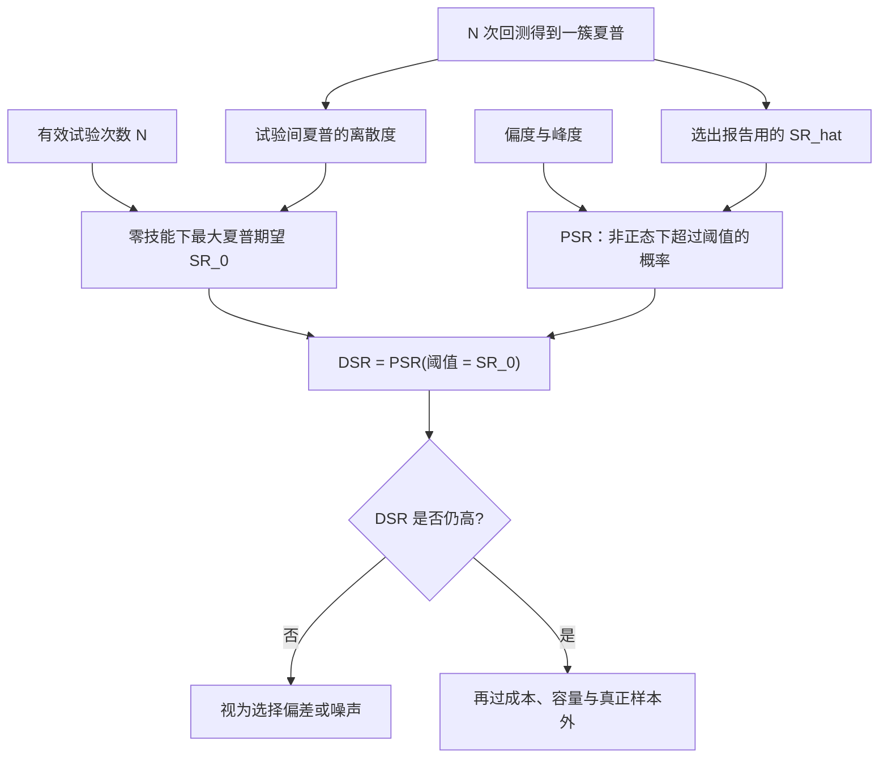

# Deflated Sharpe

在足够多次试验之后，即使真实技能为零，样本内最大夏普也会高到看起来像发现；需要把选择偏差、非正态与试验次数写进同一张夏普的统计量里。

<footer>—— Bailey and López de Prado, The Deflated Sharpe Ratio, Journal of Portfolio Management, 2014</footer>

[上一课](/quant/cv-leakage-finance)把金融交叉验证的泄漏钉住：随机打乱、$K$ 折共享未来路径、预处理在全样本上拟合，都会把评估器弄偏。缺口是评估器无偏之后，你报告的往往不是预先指定的那一个夏普，而是 $N$ 次试验里最大的那个。本课写 Deflated Sharpe：对**被选择过的夏普**做假设检验。不重讲 purge/embargo。后课 CPCV 默认已经读完：DSR 回答「这个点估计还剩多少技能」，不替代多条样本外路径。

## 问题

设策略超额收益的样本夏普为 $\widehat{\mathrm{SR}}$。若收益独立正态，对 $\mathrm{SR}=0$ 的检验大约看 $\widehat{\mathrm{SR}}\sqrt{T}$。真实收益有偏度 $\gamma_3$、超额峰度 $\gamma_4$，Mertens 给出 $\widehat{\mathrm{SR}}$ 的渐近方差还含 $1-\gamma_3\mathrm{SR}+(\gamma_4-1)\mathrm{SR}^2/4$ 一项。左偏、肥尾时，同样的点估计更不可信。Lo 的结论是：不要把夏普当无量纲的确定性标签，它是有抽样误差的估计量。

选择偏差把问题从「这一个估计量」变成「最大值的估计量」。$N$ 个互不相关的零技能策略，最大样本夏普大约按极值分布随 $\sqrt{\log N}$ 上升。Bailey、Borwein、López de Prado 与 Zhu（2014）在 AMS 通告里把这种现象称为回测过拟合：试验次数足够大时，漂亮回测几乎必然出现。Harvey、Liu 与 Zhu（2016）在因子发现上得到平行结论——$t=2$ 不够。DSR 的对象是交易策略的夏普，机制与多重检验相同：未申报的尝试次数是暗数，任何「显著夏普」都必须相对这个暗数来读。

### 概率夏普与被放气的阈值

Bailey–López de Prado 先定义概率夏普（PSR）：在估计了偏度与峰度之后，$\widehat{\mathrm{SR}}$ 超过某个阈值 $\mathrm{SR}^*$ 的概率（用正态 CDF 作渐近近似）。普通 PSR 仍假设你只试验了一次，$\mathrm{SR}^*$ 可以取 0 或取融资与风险厌恶要求的最低夏普。DSR 把 $\mathrm{SR}^*$ 换成**零技能下、$N$ 次试验最大夏普的期望**。观测夏普必须先超过这场选美的预期冠军，剩下来的部分才拿去对非正态做标准化。于是「放气」有两层：一层对分布形状，一层对多重试验。

$N$ 不是参数网格的格子数那么简单。换品种、换起止日期、换成本假设、换仓位规则、看过结果再改信号，都算试验。Git 与实验跟踪里的运行次数，往往比论文脚注里的 $N$ 更接近真相。

## 方法

记 $\hat\gamma_3,\hat\gamma_4$ 为样本偏度与峰度，$T$ 为观测数。在阈值 $\mathrm{SR}_0$ 处，

$$
\widehat{\mathrm{DSR}}=Z\left[\frac{(\widehat{\mathrm{SR}}-\mathrm{SR}_0)\sqrt{T-1}}{\sqrt{1-\hat\gamma_3\widehat{\mathrm{SR}}+\frac{\hat\gamma_4-1}{4}\widehat{\mathrm{SR}}^2}}\right],
$$

其中 $Z$ 为标准正态 CDF。$\mathrm{SR}_0$ 取零技能下最大夏普的期望。对 $N$ 次试验、试验间夏普的方差 $V[\{\widehat{\mathrm{SR}}_n\}]$，Bailey–López de Prado 用极值近似：

$$
\mathrm{SR}_0=\sqrt{V[\{\widehat{\mathrm{SR}}_n\}]}\left((1-\gamma)Z^{-1}\left(1-\tfrac{1}{N}\right)+\gamma Z^{-1}\left(1-\tfrac{1}{Ne}\right)\right),
$$

$\gamma$ 为欧拉常数。直观地说：$N$ 越大、试验间夏普越分散，$\mathrm{SR}_0$ 越高，同样的 $\widehat{\mathrm{SR}}$ 对应的 DSR 越低。若只有一次预注册试验，$N=1$，$\mathrm{SR}_0$ 退回你指定的最低可接受夏普，DSR 接近 PSR。

### 如何估计 $N$ 与 $V$

$N$ 应取实际上发生过的独立试验的有效个数。完全相关的两次网格点不应算两次；几乎独立的信号家族应分开累加。$V[\{\widehat{\mathrm{SR}}_n\}]$ 可用同一簇回测的夏普样本方差估计；若只有最终那一个夏普，就只能给 $V$ 一个保守假设（例如非技能策略夏普的经验离散度）。Harvey 与 Liu（2015）讨论回测中的多重检验时给出类似精神：与其假装 $N=1$，不如给 $N$ 一个有依据的下限，报告 DSR 对 $N$ 的敏感性。把 DSR 做成一张表：横轴 $N$，纵轴 DSR，比单独报一个 0.95 更难被操纵。

DSR 高并不授权加大杠杆。它只是说：在你承认的试验次数与非正态下，夏普不像是纯选择偏差。仓位仍受[扣费后边缘](/quant/net-edge)、[容量](/quant/capacity-participation) 与估计误差约束；满 Kelly 加上被选择过的夏普是常见的破产路径。

## 机制

选择偏差抬高的是 $\mathbb{E}[\max_n\widehat{\mathrm{SR}}_n]$，不抬高任何单个策略的真实 $\mathrm{SR}$。DSR 把检验的原假设从「这个夏普来自零技能的一次抽样」改成「这个夏普来自零技能的 $N$ 次抽样的最大值」。拒绝后者严格更难，这正是目的。非正态项则防止你用正态临界值去读一个左偏策略：同样的点估计，负偏会降低 DSR，因为均值对少数亏损更敏感、夏普的抽样方差更大。

与 White 的 Reality Check、Hansen 的 SPA 相比，DSR 是对**已经选出的那一个**夏普做修正的解析近似，而不是对整簇策略的最大统计量做自举。优点是只要 $T$、$N$、矩和夏普即可计算，适合写进每一张回测表的脚注；缺点是极值近似依赖试验近似独立、以及夏普近似正态——策略高度相关时有效 $N$ 更小，直接代入名义 $N$ 会过罚；试验结构复杂时，[CPCV](/quant/cpcv) 的路径分布更忠实。

### 与因子研究的 $t>3$ 门槛

Harvey–Liu–Zhu 的 $t\approx 3$ 是对因子动物园规模的校准；DSR 是对单个策略回测的校准。两者不要互相替代。因子论文应报多重检验后的 $t$ 或 FDR；交易系统应报 PSR/DSR，并声明 $N$。一个 DSR 很高的日内反转，仍可能在 HLZ 意义上只是被翻遍的异常表里的幸运者——若它来自同一张异常表，两种调整都要做。发表后衰减（McLean–Pontiff）提供第三种证据：统计量过关之后，仍要用未参与选择的样本看夏普是否还在。

## 边界与工程取舍

DSR 对 $N$ 的误报极度敏感。故意把 $N$ 说小，是最廉价的「显著」。相反，把所有历史实验、包括不相关市场的失败都算进 $N$，会过罚一个预注册策略。纪律是：预先定义搜索空间，按空间的有效维度计 $N$，搜索空间外的灵感要么预注册新的一次试验，要么承认 $N$ 增加。非正态修正是渐近的，$T$ 很小时正态 CDF 本身不可靠，应改用自举或更长样本。

不要用 DSR 替代成本与容量。把成本设为零会抬高 $\widehat{\mathrm{SR}}$，DSR 只是把这个被抬高的数字放气；放气后仍显著，只说明「零成本世界里的选择偏差不足以解释它」，不说明扣费后可交易。也不要把样本外拼接曲线的夏普再送进 DSR 却把 $N$ 设为 1——若样本外被用来在模型和窗口之间选择，见[滚动检验](/quant/walk-forward)，$N$ 仍然大于 1。

夏普对波动估计敏感。用已实现波动的某一变换、或去掉某个回撤年再算夏普，都是额外试验。DSR 公式里的 $\widehat{\mathrm{SR}}$ 必须与声明的收益定义一致，包括融资、分红与费用。

## 小结

- Deflated Sharpe 把非正态下夏普的抽样误差，与 $N$ 次试验中最大值的选择偏差，合成一个概率陈述。
- Lo（2002）说明夏普不是无误差的标签；Bailey–López de Prado（2014）说明被选择过的夏普必须相对极值阈值来读。
- $N$ 与试验间离散度是一等输入，应做敏感性表，而不是藏在「我们只试了几个参数」的句子里。
- DSR 通过不等于可交易；成本和未参与选择的样本外仍是关卡。
- 与 Reality Check、SPA、CPCV 互补：DSR 便宜且可进每一张表，复杂相关结构时用路径方法。
- 出处：Bailey and López de Prado, *Journal of Portfolio Management*, 2014；Lo, *Financial Analysts Journal*, 2002；Bailey, Borwein, López de Prado and Zhu, *Notices of the AMS*, 2014；Harvey, Liu and Zhu, *RFS*, 2016；Harvey and Liu, *Journal of Portfolio Management*, 2015。
