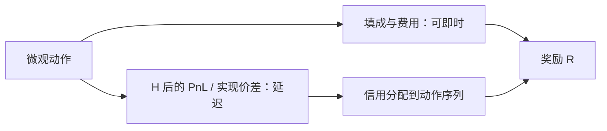

# 延迟奖励与信用分配

强化学习里的奖励若在动作当时不可观测，信用必须沿时间回传。交易的盈亏往往在持有期结束、成交完全填完或隔夜之后才清楚，逐步标记收益会把噪声当成即时强化。

<footer>—— 据 Sutton and Barto 对 delayed reward 与 credit assignment 的论述；对照执行问题里实施缺口在订单生命周期结束才结算</footer>

[执行 RL 与冲击](/quant/rl-execution)把奖励写成负的实施缺口加库存风险，并警告模拟器偏差。[交易作为 MDP](/quant/trading-mdp-pitfalls)已经指出奖励延迟致命。本课的缺口是专门处理**延迟奖励**：当 $R$ 不能在每个微观动作上诚实给出时，如何定义回合、如何分配信用、以及错误分配如何把冲击学成方向赌博。后课部分可观测成交与模拟器冲击，都默认奖励时钟已经选对。不重写 Almgren–Chriss 轨迹。

## 问题

做市或执行的动作是毫秒级的挂撤，经济结果是：若干秒后的填成、若干分钟后的中点移动、日终的 PnL、T+1 才可卖。若每步用中间价盯市当 $R_t$，等于把未实现估值当强化，智能体会为了瞬时标记去招手感盘，而不是为了可实现缺口。若只在回合结束给一个 $R_T$，信用要沿成百上千步反传，样本效率极差，且中间的风控动作（暂停、降仓）难以被学习。缺口是显式选择奖励时钟，使其与策略[持有期](/quant/holding-horizon)同阶，而不是同阶于神经网络的步长。

信用分配的错误模式：把随后因公开新闻导致的价跳归功于某次挂单；把因自己冲击造成的不利移动归咎于「随机」。前者过拟合公告，后者学不会永久冲击。

### 回合如何切

执行任务天然有回合：$Q$ 在 $T$ 内完成或放弃。方向性交易的回合更含糊。应按产品切：一次再平衡、一个交易日、一次拍卖。跨日且 T+1 时，买入动作的奖励不得在当日卖出权还不存在时结算「完成」。混频体制（信号日频、执行高频）应分层奖励：执行层只对缺口负责，信号层只对持有期收益负责，禁止一个网络吃两层。

折扣 $\gamma$ 不能代替回合定义。把 $\gamma$ 调到 0.99 去「让智能体看得远」，只是把未声明的 $H$ 藏进超参。先修 MDP 课已经警告过。

## 方法

先写可审计的即时分量：手续费、已实现缺口、明确的库存惩罚（与 Almgren 风险项对齐）。延迟分量：填成结束后的实现价差（选与 $H$ 匹配的 $\tau$）、未完成量的机会成本。用资格迹或 n-step 回报把延迟分量赋给导致该填成的动作序列，而不是赋给时间上最近的一个动作——最近动作常常只是偶然的最后一撤。

对照实验：同一政策，用逐步盯市训练 vs 用回合缺口训练，看实盘填成与缺口。若逐步盯市在模拟器里夏普更高、实盘更差，几乎一定是标记噪声。Nevmyvaka 等的执行 RL 实验对象是短地平线执行，奖励与任务对齐；把同一套用到隔夜方向，任务已经换了。

### 稀疏奖励与塑造

纯回合奖励稀疏。允许塑造（potential-based shaping）时，势能必须是状态的函数且不引入动态套利：例如剩余量下降给小奖励，但不得对中点朝有利方向移动给奖励——那是在奖励市场噪声。Gatheral 的无动态套利要求出现在奖励里：不能通过来回成交从自己的永久冲击领钱。违反时，延迟奖励会被智能体「提前实现」。

## 机制

延迟使归因矩阵病态：许多动作共享一个结果。市场非平稳又使同一动作的结果分布漂移。于是智能体把在样本里碰巧先于盈利的微观模式当成政策。这与回测过拟合同构，只是优化器换成了 RL。把奖励时钟对齐 $H$，等于减少需要归因的步数，病态减轻。把执行与方向分开，等于不让执行网络去抢本属于信号的延迟收益。

实现价差曲线提供了一种延迟度量：$\mathrm{RS}(\tau)$ 正是「转手之后还剩多少」。执行 RL 的延迟分量应读这条曲线的 $\tau$，而不是读一个任意的 bootstrap 步数。

### 资格迹应对准导致填成的动作序列

把延迟缺口赋给时间上最后一次撤单，会训练出无意义的结束动作。信用应沿仍挂着的订单链回传。订单状态机是归因的骨架，不是装饰。

## 边界

组合层 RL（直接优化夏普）把延迟拉到整段回测，信用分配几乎不可能诚实，过拟合课已覆盖。本课对象是执行与做市这类短回合。下一课：即使奖励时钟对了，你也看不见填成与队列的真状态。

组合层直接优化夏普，延迟拉到整段回测，信用分配几乎不可识别。那是过拟合课的对象，不要当成本课的 RL 成功。

## 小结

- 奖励时钟必须与持有期同阶，不能与神经网络步长同阶。
- 逐步盯市把噪声当强化；纯终局奖励使归因病态。
- 执行与方向分层，禁止一个网络领取两层延迟收益。
- 塑造不得奖励中点的随机有利移动，也不得创造冲击套利。
- 实现价差的 $\tau$ 是执行延迟分量的自然尺度。
- 出处：Sutton and Barto, *Reinforcement Learning*；Nevmyvaka, Feng and Kearns, 2006；Almgren and Chriss；Gatheral 对冲击无动态套利；实现价差见 Huang–Stoll 会计。
