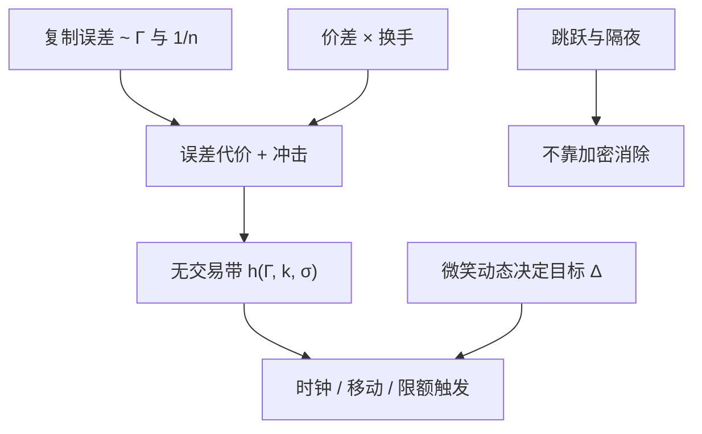

# Delta 对冲频率

    
有交易成本时，连续再平衡不再是最优：对冲带的宽度应由 Gamma、价差与波动尺度共同决定，而不是把时钟无限加密。

    <footer>—— Leland, Option Pricing and Replication with Transaction Costs, Journal of Finance, 1985；渐近对冲带见 Whalley and Wilmott 等后续工作</footer>

[Delta / Gamma / Vega 对冲](/quant/greeks-hedge) 给出每次再平衡时要交易的标的数量；[离散对冲误差](/quant/discrete-hedge-error) 给出两次平衡之间误差的渐近形状。还缺一问：隔多久、或 Delta 偏多远，才再交易一次。Black–Scholes 的连续复制在价差为正时期望成本发散——无限次穿越买卖价。Hayne Leland 1985 年把成本写进复制，得到对波动率的修正；后来的效用与渐近方法给出「无交易带」：只有 Delta 走出带宽才调仓。频率因此是决策变量，不是把日内网格调到一分钟就更接近理论。本篇写如何选规则，不重复误差公式的推导。

## 问题

交易台同时面对：复制误差（空头 Gamma 在大动时亏）、交易成本、以及未对冲的 Vega / 跳跃。只优化前两项，会在跳日显得「对冲不够」；把跳跃也用 Delta 去追，会在跳之后的噪声里超调。问题是把频率设计成对扩散段最优，并把跳跃留给限额与期权对冲，而不是用同一规则覆盖所有风险源。隔夜强制把频率降到一天一步，不能用日内最优 $n$ 外推，见 [隔夜跳空对冲](/quant/overnight-gap-hedge)。

另一个混淆是模型 Delta 的选择。Sticky strike、sticky delta、[SABR](/quant/sabr) 动态给出不同的 $\Delta_{\mathrm{target}}$，带宽是绕目标的。目标错了，频率再优化也只是更勤地追一条错的切线。[Heston](/quant/heston) 下应对现货与方差状态都考虑；只对冲 $S$、把 $v$ 的移动留给离散误差，频率再高也消不掉随机方差项。

### 成本、效用与渐近带

无成本时加密再平衡使均方误差按 $1/n$ 下降；价差为正时连续复制的期望成本发散。Leland 针对复制一个期权的期望平方误差加线性成本，给出有效波动。Hodges–Neuberger 一类效用框架把问题写成带摩擦的奇异控制：最优是在 Delta 空间的无交易区与交易区之间反射。Whalley–Wilmott 对小成本做渐近，带宽 $h\propto (k\Gamma^2)^{1/3}$ 一类标度（具体幂次随目标函数变）：成本 $k$ 降，带变窄，但不是线性。这解释了为何价差收一半、对冲次数不会翻倍——最优反应是次线性的。生产上很少真解效用 PDE，而是用这些标度去设限额：$\Gamma$ 升则限额收，价差升则限额放。

## 方法

有成本时，第 $n$ 次再平衡支付大约与 $|\Delta_{t_n}-\Delta_{t_{n-1}}|$ 成正比的价差。最优 $n$ 使误差方差的代价与冲击之和最小。Leland 的启发式是：把 Black–Scholes 波动率改成

$$
\hat\sigma^2=\sigma^2\left(1+k\sqrt{\frac{2}{\pi\Delta t}}\right)
$$

一类修正（$k$ 为相对价差，$\Delta t$ 为再平衡步长），再用修正后的 Delta。步长进入「有效波动」，过频等于人为抬高 $\sigma$，期权更贵，对冲更积极——成本被资本化进价格，而不是在 P&L 里另列。

阈值规则：设无交易带 $|\delta-\Delta_{\mathrm{target}}|\le h$，带宽 $h$ 随 $\Gamma$、价差、$S$ 与剩余期限变。Gamma 大（平值、短到期）时同样的 $\Delta S$ 造成更大的误差，带应更窄、更勤对冲；价差宽则带应更宽。这把「每天一次」改成「按风险预算」。指数期权常按日历再平衡加 Delta 限额双触发；个股还要叠加开盘拍卖与停牌。

### 时钟、移动与 Gamma 缩放

三种实务时钟。日历时钟：每 $m$ 分钟或每 $N$ 笔报价。移动时钟：标的走过 $\lambda\sigma S\sqrt{\Delta t_{\mathrm{ref}}}$ 再对冲，使每次误差的 $\frac12\Gamma(\Delta S)^2$ 量级可比。Gamma 缩放：把限额写成 $|\Gamma|S^2(\Delta S/S)^2$ 的预算，平值到期日自动加密。后两种更接近误差理论，第一种更接近运营。微观结构噪声下，过密的日历时钟会把买卖弹跳当成 Delta 漂移，来回成交，有效价差被吃满，见离散误差文中的噪声讨论。

把「对冲频率」理解成「希腊字母计算频率」会混两件事。曲面与 Delta 可以每秒重算，下单仍按带宽。计算可以密，成交必须稀。二者用同一时钟，是把 CPU 预算写成了冲击。

## 机制

连续极限里，Gamma 与 Theta 在 Black–Scholes 方程中对消，复制误差消失。离散加成本之后，对冲者主动放弃一部分对消：允许小的 Delta 残差，以免为消灭残差而付价差。残差的期望代价由 $\Gamma$ 与已实现方差相对隐含方差的差给出，与离散误差文同一项；成本的期望代价由局部时间或带宽穿越率给出。最优频率是两条曲线的交点。

微笑存在时，每次再平衡还在交易 Vega 与 Vanna：标的一动，若 sticky 规则使 $\sigma_{\mathrm{imp}}$ 跟着动，Delta 里已经含一部分波动率对冲。频繁按 Black Delta 再平衡、却按市场 sticky delta 计价，会产生系统性的「对冲 P&L」——其实是动态假设不一致，不是频率选错。应先锁微笑动态，再锁频率。

### 与 Vega 对冲、隔夜的衔接

日内把 Delta 对冲到很紧，隔夜仍可能被跳空打穿 Gamma。把资源从第 16 次日内微调，转到收盘前的 Gamma / Vega 结构（减短到期空头、买廉价蝶式），对总误差往往更有效。频率优化若只在连续竞价段做回测，会高估加密的价值。到期日 [Pin risk](/quant/pin-risk) 附近 Gamma 爆炸，带宽公式给出接近连续交易；若再叠加借券与行权截止，最优可能是提前平掉 Gamma，而不是更勤对冲。

回测对冲频率时必须用当时可成交的价差与可成交的期货深度，而不是用中点无穷流动性。中点回测会得出「越频越好」，因为误差降、成本几乎为零——这是数据口径制造的假最优。

## 边界与工程取舍

Leland 修正假设再平衡步长固定、成本与 $|\Delta n|$ 成正比、无跳跃。真实成本有固定费用、冲击非线性、期货换月。渐近带宽在 $\Gamma\to\infty$（到期日平值）时建议几乎连续交易，但那时流动性与钉住风险使公式失效。多资产交叉 Gamma 使「一个带宽」变成椭圆域，实现复杂，实务常对主成分或对期货腿分别设限额。

Heston / 局部波动下，即使连续 Delta 对冲也不完整，最优频率问题应在剩余风险（方差、跳跃）给定后再做。不要把 Bertsimas–Kogan–Lo 的 $1/n$ 阶数当成有成本世界的最优 $n$。Hull 的教科书给出希腊字母语言；频率是摩擦市场里对这一语言的补充，必须用本市场的价差估计，而不是引用 1985 年的 $k$ 数值。

「我们每五分钟对冲一次」若没有对应的 Gamma 限额与隔夜政策，只是运营口令。同一五分钟，对短到期平值与对长到期虚值，误差尺度差一个数量级。

## 小结

- 有交易成本时连续对冲次优；频率或无交易带由 Gamma、价差与波动共同决定。
- Leland 把成本资本化进有效波动；渐近方法给出带宽随成本的次线性收缩。
- 应先固定微笑动态下的目标 Delta，再优化绕目标的触发规则。
- 跳跃与隔夜不随日内加密消失；到期日钉住使带宽公式失效。
- 中点无穷流动性的回测会伪造成「越频越好」。
- 出处：Leland, *Journal of Finance*, 1985；离散误差见 Boyle–Emanuel，1980 与 Bertsimas, Kogan and Lo，2000；操作语言见 Hull；微笑动态见 Hagan et al.，2002。
