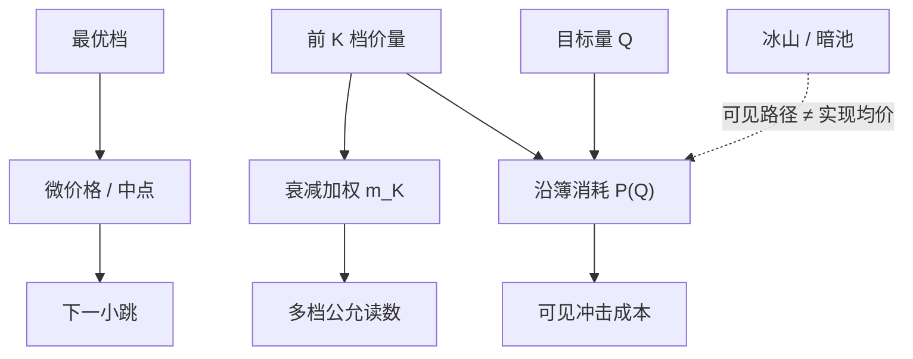

# 深度加权中间价

最优档只决定立刻成交一笔小单的价格；把若干档量加权之后，读数才开始接近「再往里走」时市场愿意给出的平均价。

<footer>—— 据 Harris 对深度、冲击与可成交量的论述，以及 Cont 等人对限价簿事件的经验研究整理</footer>

[微观价格](/quant/microprice) 用最优档量修正中点，回答的是下一小步往哪边偏。[限价订单簿](/quant/lob-structure) 的更深层问题是：若要买 $Q$ 股，沿卖档消耗会得到什么样的成交均价。深度加权中间价（depth-weighted mid）把多档价量收成一个公允读数，或显式按目标量走一遍簿，得到冲击调整后的价格。它与微价格同族——都是可见簿的函数——但信息集从 BBO 扩到前 $K$ 档，因此对大单、对 ETF 成分冲击、对指数套利更有用，对下一毫秒的 tick 方向往往更钝。Harris 把深度当作价格压力的原材料；Cont 等人指出大的价格变动不再服从单一线性 OFI，而要沿深度积分。本篇写加权方式、目标量、以及它和 Kyle 冲击系数的接口。

## 问题

中点与微价格对「无穷小」的下一笔有意义。执行与风控常问另一句：当前可见流动性下，完成规模 $Q$ 的期望成交价是什么。只看 $a_1$ 会过度乐观，因为 $Q$ 可能打穿若干档；只看最深一档又会过度悲观，把远离市场的挂单当成可成交。需要把各档剩余量按与 BBO 的距离加权，或按真实撮合顺序做量加权均价（VWAP along the book）。

隐藏量与多市场使可见深度不是可成交深度。深度加权中间价永远是**可见**对象：它高估或低估真实冲击，取决于冰山与暗池。问题不是消灭这一误差，而是声明加权所用的层级，并在研究里把「可见冲击」与「事后实现冲击」分开。

### 多档加权与冲击路径

一种构造不指定 $Q$，只把前 $K$ 档做对称加权：

$$
m_K=\frac{\sum_{k=1}^{K}w_k(b_k q^b_k+a_k q^a_k)}{\sum_{k=1}^{K}w_k(q^b_k+q^a_k)},
$$

$w_k$ 可以是常数，或随档位指数衰减 $e^{-\kappa(k-1)}$。$K=1$ 且 $w_1=1$ 时，若再按微价格那样对买卖交叉加权，就回到最优档读数；一般的 $m_K$ 更接近「两侧深度的重心」。另一种构造指定方向与数量：买 $Q$ 的可成交价 $P^{\mathrm{buy}}(Q)$ 是沿卖档累计消耗直到 $Q$ 的量加权均价，卖同理，然后

$$
m(Q)=\frac{P^{\mathrm{buy}}(Q)+P^{\mathrm{sell}}(Q)}{2}
$$

或直接把 $P^{\mathrm{buy}}(Q)$ 当标记。后者对执行更诚实：买卖冲击不必对称。簿在一侧极薄时，$P^{\mathrm{buy}}(Q)$ 可能不存在（深度不足），这本身就是流动性状态，应记为缺失而不是用中点填。

衰减权重 $\kappa$ 把远档当成不太可成交的意向，这与经验一致：远档取消率高、信息量低。$\kappa$ 不是结构参数，应与你关心的 $Q$ 匹配：关心的量越大，$\kappa$ 应越小、或改用显式 $P(Q)$。

## 方法

L2 上前 $K$ 档价量即可算 $m_K$ 与 $P(Q)$。$K$ 的选择应报告累积深度分位数：例如覆盖过去中位主动单的两倍。权重与 $K$ 在样本外锁定。预测下一跳方向时，$m_K$ 通常弱于微价格；预测「接下来较大的中点移动」或解释大单冲击时，$m_K$ 与 $P(Q)-m$ 更相关。回归冲击

$$
\Delta m=\lambda Q+\varepsilon
$$

若 $Q$ 已大到打穿多档，线性会坏；改用 $P(Q)-m$ 作为自变量，等于把簿几何当成已知的瞬时冲击函数，残差才是意外信息或隐藏流动性。

与 OFI 分工：OFI 是流量，深度加权价是状态。可以用深度加权价的变化作为因变量，看 OFI 是否仍线性——Cont 的结果在小变动上成立，大变动应改因变量。与 [Kyle lambda](/quant/kyle-lambda) 对照：$\lambda$ 是把深度压成一个斜率；$P(Q)$ 是把深度留成一条曲线。短窗、单标的，曲线更对；截面、日频，斜率更方便。

### 衰减权重与目标成交量

指数衰减是在「不知道 $Q$」时的折中：近档权重大，避免一张远离市场的幽灵单把 $m_K$ 拉走。目标量方法更干净，但 $Q$ 必须来自策略：做市商的典型存货、ETF 篮子里该股的份额、或回测里的订单规模。用「当日成交量的 1%」当 $Q$ 会让 $P(Q)$ 在清淡时段打穿整张可见簿，读数变成最差档价格，因子全是流动性空洞而不是方向。

多市场应先合成全国最优深度再加权，否则本地 $m_K$ 忽略他处可成交量。合成需要可比较的时间戳与费用调整，否则「更优」的远市场并不可执行。这与信息份额问题相关：价格发现可以发生在另一市场，而本地深度加权价仍只反映本地可执行性。

## 机制

瞬时冲击的机制是沿队列消耗：价格走多少取决于各档剩余量，不取决于事后才知道的「信息含量」。$P(Q)-m$ 是这条路径的摘要。若随后深度重建、价格部分回抽，差额里有暂时成分；若中点留在新水平，差额里有信息或持久需求。这与价差分解的暂时/永久相同，只是冲击规模从「一笔」换成「给定 $Q$」。Kyle 的线性 $p=\mu+\lambda y$ 相当于假设深度曲线是一条斜线；真实 LOB 是阶梯，小 $Q$ 落在第一档（接近半价差加一点），大 $Q$ 沿阶梯走，边际冲击上升。深度加权中间价保留阶梯，lambda 则把阶梯拟合成斜率。

冰山使可见 $P(Q)$ 高估冲击：隐藏余量会在同一价位再切出来，实际均价优于可见路径。暗池使部分 $Q$ 根本不走明簿。研究可用事后成交均价减可见 $P(Q)$ 来估计隐藏流动性的贡献；负值表示可见簿悲观。同样，这是市场质量度量，不是把订单拆进隐藏字段以改变他人所见深度的操作说明。

### 与微观价格、OFI 的分工

三套读数对应三种 $Q$。微价格：$Q$ 约一档之内的下一笔。深度加权：$Q$ 为若干档或指定规模。OFI：不问 $Q$，问刚刚发生的净事件如何移动中点。短窗 alpha 常用前两者的差 $m^\ast-m$ 或 $m_K-m$；冲击成本常用 $P(Q)$；毒性与做市报价常用 OFI。把三者同时放进一个「因子厨房」而不做共线诊断，系数无法解释。

用深度加权价当标记会让存货盈亏对远档挂单敏感。一张远离市场的大单进出，不改变可立即成交价，却能拉动 $m_K$。风控标记应限制 $K$ 或使用 $P(Q)$ 并给 $Q$ 上限。

## 边界

可见档位数随交易所产品而变，十档与四十档的 $m_K$ 不可比。涨跌停、集合竞价、盘后没有同一套连续深度。tick 很大时前 $K$ 档可能在经济上已经离市场很远。没有 L2 就没有本对象；用成交 VWAP 去冒充 $P(Q)$ 会混入你自己的成交与时间上的延迟。

不要把 $m_K$ 序列送进 Hasbrouck 信息份额：它不是另一个市场的成交价，与中点共享同一张簿、同一噪声源，共同趋势分解没有识别。不要用 $P(Q)$ 的日内变化当低频非流动性因子——那是 [Amihud](/quant/amihud-illiquidity) 与日度 $\lambda$ 的工作；$P(Q)$ 的水平随盘口秒级变化，加总方式必须另写。

A 股行情档位、对敲与涨跌停使可见深度的尾部难以解释。加权若包含远离涨跌停板的「深度」，会把无法成交的意向写进公允价。应先按可成交性截断档位。

## 小结

- 深度加权中间价把多档可见量收成读数，或按目标量 $Q$ 沿簿给出 $P(Q)$；最优档微价格是 $K=1$ 的极限。
- 小单看微价格，大单看 $P(Q)$；线性 Kyle $\lambda$ 是把阶梯拟合成斜率。
- 与 OFI 分工：一个是深度状态，一个是事件流量。
- 隐藏流动性使可见 $P(Q)$ 有偏，事后均价对照是质量研究。
- 档位、衰减、目标量与可成交性截断必须预先锁定。
- 出处：Harris, *Trading and Exchanges*；大冲击与簿事件见 Cont, Kukanov and Stoikov, 2014；线性冲击基准见 Kyle, 1985。
