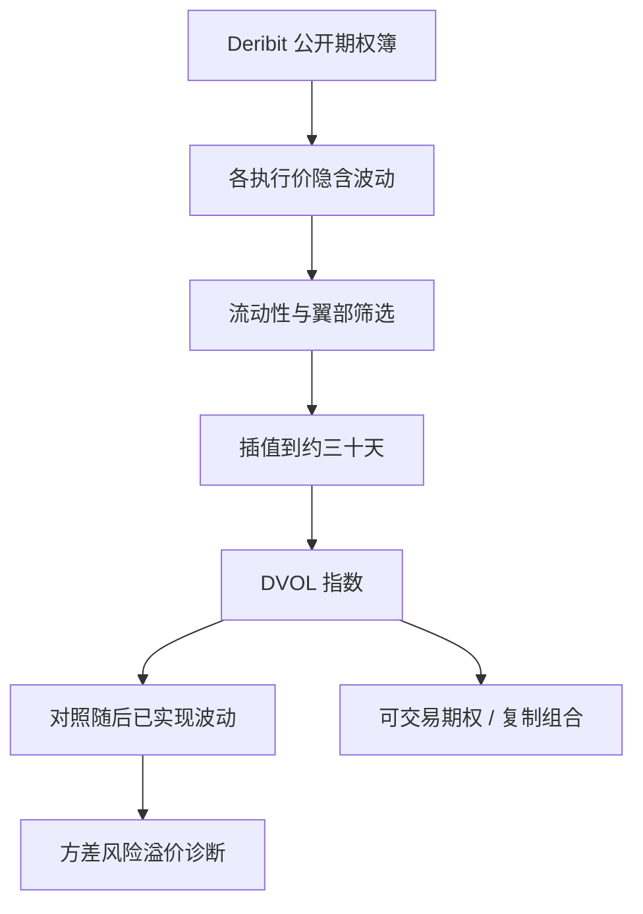

# Deribit DVOL 隐含波动

DVOL 把 Deribit 上比特币或以太坊期权的报价压成一条大约三十天的隐含波动指数；它是该场所微笑的公开摘要，不是已实现波动，也不是全球所有期权场所的统一「币圈 VIX」。

<footer>—— 据 Deribit 对 DVOL 的公开方法说明整理；指数结构对照 CBOE VIX 条带与 Grünbichler–Longstaff 对波动期货的讨论</footer>

Deribit 是比特币与以太坊期权的主要公开场所之一。DVOL（Deribit Implied Volatility Index）用该场所的期权隐含波动构造近三十天的指数，分 BTC 与 ETH 等标的，常被当作加密的「VIX」。本篇写它测的是哪一套期权、如何接到方差风险，以及与 [VIX 期货](/quant/vix-futures)、[方差互换复制](/quant/var-swap-replication) 的同构与裂缝。对象是公开指数方法与公开期权簿，不是如何冲击标记价格。

## 问题

隐含波动是把期权价格倒进某个定价公式得到的 $\sigma$。场所指数还要再做一步：在许多执行价与到期上加权，插值到固定期限（DVOL 为三十天量级），再发布一个数。VIX 的经济学内核是虚值香草的 $1/K^2$ 条带，近似方差互换；DVOL 的公开方法以 Deribit 期权的隐含波动为原料做期限与执行价的综合，细节以当时说明书为准，**不必**与 CBOE 条带逐项相同。把 DVOL 直接叫做「比特币方差互换公平值」会跨过：公式是否模型无关、是否用中点还是标记、哪些执行价被剔除、以及 BTC 期权是币本位还是稳定币本位。

第二句话是场所基差。同一 BTC 波动，Deribit、其他期权所、场外与传统上市产品（若有）可以不一致。DVOL 只压缩 Deribit 的微笑。用它去对冲在别的场所持有的期权，剩下的是场所与合约规格基差，类似 [ETF 对期货](/quant/btc-etf-basis) 而不是无风险。

### 标的是隐含，不是已实现

已实现波动是路径上的二次变差（或近端高频估计）。DVOL 是风险中性世界里对未来波动的定价摘要。二者之差是方差风险溢价在加密期权上的投影，见 [偏度风险溢价](/quant/skew-risk-premium)。DVOL 上升可以来自：期权需求（保护买入）、现货跳跃预期、或做市商加价。它不告诉你下一根 K 线的方向。把 DVOL 日变化当 BTC 空头信号，是把波动指数当成了现货观点，除非另有经检验的预测关系——而那关系应样本外、并控制已实现波动滞后。

币本位期权的 Grek 与稳定币计价的 VIX 式指数，单位不同。PnL 归因若把 DVOL 点当成「与 VIX 同样的方差点」，会把报价惯例写进 alpha。先对说明书：指数是波动率点还是方差点，乘数如何换美元或换币。

## 方法

**复制口径。** 读 Deribit 当时有效的 DVOL 方法：纳入的到期、执行价筛选、买卖中点还是标记 IV、如何插值到三十天、假期与结算日如何处理。用公开期权簿按同一规则重算，检查与官方 DVOL 的跟踪误差。误差大时，先查是否用了标记而非中点、是否纳入了低流动性翼部。翼部虚值在加密上极宽，一条远虚值的 IV 尖刺可以污染指数；方法若已剔除深度虚值或要求最小 vega，应在复制里同样剔除。

**期限结构。** 近月与次近月 IV 的插值给出三十天；更长到期提供曲线。加密期权常在事件（升级、ETF 决定、宏观）前把近端抬起。DVOL 是曲线上的一个点，事件交易要看整条期限，而不是只看指数。与 [SVI/SSVI](/quant/svi-ssvi) 校准衔接时，DVOL 可当 ATM 附近的锚，但不能替代无套利表面。

**风险溢价诊断。** 比较 DVOL 与随后三十天已实现波动：平均而言隐含高于已实现的部分，是卖波动的毛溢价，须扣对冲误差、跳跃与费用。加密跳跃比 SPX 更频繁，卖 DVOL「carry」的左尾厚。回测卖波动若用指数点而不用可交易期权组合，会漏掉微笑变形与保证金。

### 与 VIX 方法的同构不要过度引申

VIX 期货有独立的期货曲线与结算；DVOL 若无可交易期货，现货指数本身不可持有。交易 DVOL 观点必须落到 Deribit 期权（跨式、方差复制、日历）或其它波动产品。Grünbichler–Longstaff 的波动期货直觉——均值回复加凸性——可以借用，但比特币现货带跳、周末不停，Heston 式校准会系统性低估尾部，见 [Heston](/quant/heston) 与跳跃模型。指数只是把微笑平均成一个数，平均会掩盖偏度：同样的 DVOL，认沽翼可以完全不同。

## 机制

做市商用隐含波动对冲库存：现货上冲时认购被行权风险增加，IV 与偏度都会动。DVOL 作为加权平均，对 ATM 与近端更敏感（具体权重以方法为准）。现货周末继续交易，期权保证金与标记在 Deribit 上仍更新，于是「周末已实现」可以在周一同时推高已实现估计与隐含。这与股票 VIX 的周末效应同族但更强。ETF 上市、宏观数据、稳定币事件会把需求从现货赶到期权，DVOL 可以在现货尚未完成趋势时先动。

与链上库存的关系是弱的。[交易所流出](/quant/onchain-exchange-flows) 改变现货可售量，DVOL 改变的是期权供给与尾部价格。二者同向恶化描述压力体制，没有会计恒等式把储备映射到 DVOL 点。

### 标记、中点与循环引用

若指数使用标记 IV，而标记又参考指数或同一套平滑表面，可能出现轻度循环。复制与交易应以可成交中点为主诊断，标记仅用于风险。薄翼部的标记可以远离任何可执行报价，把 DVOL 当成可对冲的方差会高估翼部贡献。稳健做法是报告：官方 DVOL、中点重算 DVOL、以及 ATM 二十五 delta 风险逆转，三者一起看。

DVOL 不是波动率目标组合的权重。把它当择时信号去加减 BTC 现货，引入的是波动风险溢价与方向的混合物。若目标是卖波动，应持有期权组合并做现货对冲；若目标是方向，应直接说明，不要借 DVOL 的名字。

## 边界与工程取舍

不要把 DVOL 与已实现波动的差当年化无风险。不要用单一指数替代微笑交易。不要假设 ETH DVOL 与 BTC DVOL 可互相复制——到期、跳跃与用户结构不同。Deribit 保证金、保险基金与指数成分（标记用的现货指数）变化会改变 IV 本身，应当成制度修订。其他场所的「隐含波动指数」若方法不同，禁止拼接成一条超长历史。

作为风险：DVOL 分位数是加密期权体制的公开仪表，对杠杆现货账簿的压力测试有用。作为产品：没有期货曲线时，carry 必须从期权表面赚，成本是跳跃与翼部。公开方法说明书是第一输入，研报里的「币圈 VIX」口号不是。

出处：Deribit DVOL 公开方法说明（以当时版本为准）。VIX 条带见 CBOE 说明书与本站方差互换 / VIX 期货条目。波动期货早期理论见 Grünbichler and Longstaff, 1996。不要用 DVOL 替代 CBOE VIX 的监管或结算定义。

## 小结

- DVOL 是 Deribit 期权隐含波动的约三十天公开摘要，场所与规格特定，不是全球统一方差互换。
- 它是隐含而非已实现；与随后已实现之差是溢价诊断，须扣跳跃与对冲误差。
- 复制要对齐筛选、中点/标记与插值；翼部噪声可以污染指数。
- 无可交易 DVOL 期货时，观点必须落到期权组合；指数本身不可持有。
- 与 VIX 同构可借鉴均值回复与凸性，不可假设方法逐项相同。
- 出处：Deribit 说明书；CBOE VIX 方法；Grünbichler and Longstaff, 1996。
