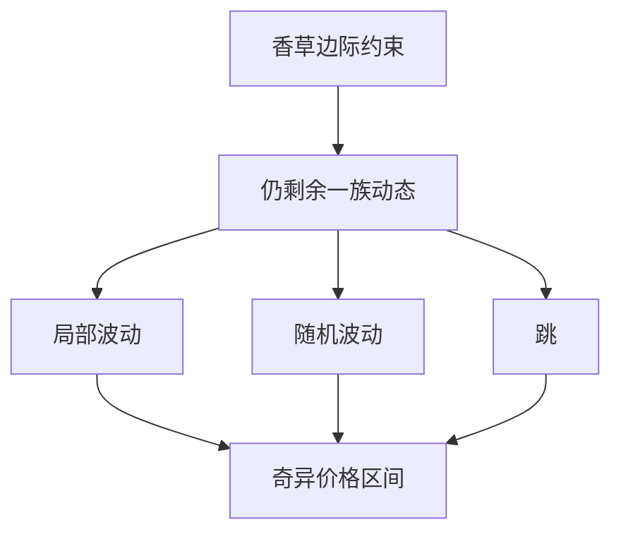

# 衍生品模型风险

模型是对冲与报价的坐标系；模型风险是换坐标系时价格与希腊值移动了多少，不是「校准残差的 t 统计量」。

<footer>—— Cont, Model Uncertainty and its Impact on the Pricing of Derivative Instruments, Mathematical Finance, 2006</footer>

[上一课](/quant/gamma-theta-tradeoff)在一个模型里分解日 PnL。本课的缺口是：**换模型。** Cont（2006）把模型不确定写成一族风险中性测度，价格区间由最坏与最好测度给出，而不是由参数标准误给出。后课校准正则化是在这一族里选一个稳定点；这里先把「香草校准完了仍有模型风险」说清。

## 问题

香草可以由 Dupire 局部波动完全重现，但亚式、障碍、cliquet 的价格在局部波动、随机波动、跳模型之间仍可差若干波动点。原因是香草只钉住 $S_T$ 的边际，路径泛函还依赖动态。问题是报告：不要只报「校准 RMSE 很小」，要报**同一香草约束下**奇异价格的模型带，以及希腊值的模型带。Cont 的区间是对冲者真正面对的不确定：明天市场仍报同一张香草曲面，你的障碍价格却因模型选择而变。

参数不确定（Heston 的 $\kappa$ 估不准）是另一层，通常更小；动态设定错误才是主项。把 Heston 参数 bump 当模型风险，会低估从局部波动换成带跳的那一跳。

### 香草不是充分统计量

一族模型若都重现今日欧式价格，它们在欧式上无法互相拒绝。奇异价格的差是识别不足，不是校准没做好。要缩小区间，只能加入新的可交易约束：方差互换、障碍报价、cliquet 市价——每加一个，测度族缩小。没有这些，区间就应保留，而不是人为选一个「官方模型」把区间藏起来。

模型风险与市场风险在会计上常分列。经济上，模型选择改变的是对冲工具和残差；残差在压力里会变成市场 PnL。分列不等于可以忽略。

## 方法

维护至少两套能校准香草的动态（局部波动 + 随机波动，或再加跳）。对每个奇异簿报价格差、主桶差、对冲比差。用 Cont 式的最坏情况：在校准约束的容差内对动态加罚。新交易若把模型带扩得过大，应视为缺乏对冲工具，而不是提高内部 vol 一点点了事。

回测模型风险：看对冲残差在模型假设破裂时（如 2018 年 vol 短涨）是否可由第二模型事先标出方向。

## 机制

欧式约束是无限维流形上的一个切片。局部波动选了切片上一条特定路径（确定性 $\sigma(S,t)$）；Heston 选了另一条。路径泛函在切片上不常数，故有区间。PCA 曲面动态若与定价模型的远期微笑不一致，日 PnL 的 Vega 项会表现为「模型风险实现」。这把 Cont 的静态区间接到上一课的因子。

## 边界

区间依赖你允许的模型类。类太窄（只 Heston vs 另一组 Heston 参数），区间假小。类太宽（任意半鞅），区间无用。实务选「市场用来对冲的那几类」。流动性：模型带再宽，若没有工具去对冲路径风险，就应减名义，而不是把模型带折成一项准备金然后继续加仓。

不要发明一篇不存在的 arXiv 来「证明」某模型优于另一模型。比较应落在可复现的校准约束与样本外对冲残差上。

## 小结

- 香草校准不能识别路径动态；奇异价格应报模型带。
- 参数 bump 代替不了换模型类。
- 加入方差互换等新约束才能缩小测度族。
- 出处：Cont, *Mathematical Finance*, 2006。
