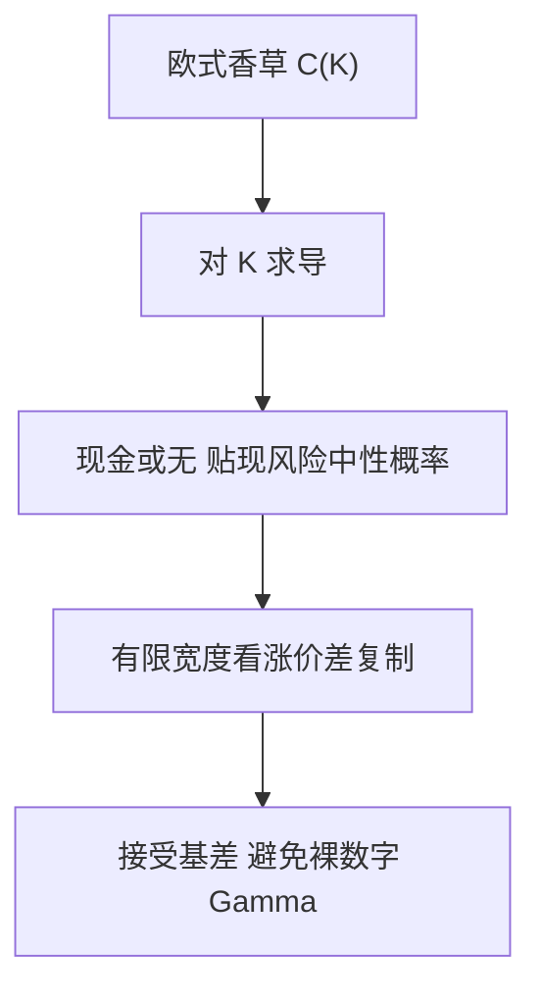

# 数字与二元

现金或无的二元是执行价处的 Dirac；它的价格是风险中性概率的贴现，希腊值在 K 附近像密度而不是像累积分布。

<footer>—— Reiner and Rubinstein, Unscrambling the Binary Code, Risk, 1991</footer>

[上一课](/quant/lookback-options)的支付随极值连续变化。本课把支付收成**示性函数**：到期 $S_T\gt K$ 则付一笔固定现金（现金或无），或付一单位标的（资产或无）。缺口是：香草是积分，数字是密度；对冲与报价惯例都因此断裂。后课障碍解析解会把「触碰」再写进路径；这里先把欧式二元与香草的平价写清。

## 问题

现金或无看涨价格是 $e^{-rT}N_c\,\mathbb{Q}(S_T\gt K)$（$N_c$ 为现金名义）。在 [BSM](/quant/bsm) 下这就是贴现的 $N(d_2)$，不是 $N(d_1)$。资产或无是 $e^{-qT}S_0 N(d_1)$。香草看涨 $= $ 资产或无 $-K\times$ 现金或无。这组平价在模型无关的层面也近似成立（欧式、同一 $K$）。问题不是再推 $d_1,d_2$，而是：**数字的 Delta 是密度，在 $K$ 附近爆炸，离散对冲会系统性漏掉针状 Gamma。**

二元在结构票据、障碍的「返现」、以及外汇触碰里大量出现。卖方若按香草簿的 Vega 桶去套，会发现数字对偏斜的敏感是香草对 $K$ 求导——也就是对微笑的局部斜率，而不是对 ATM 水平。

### 数字是香草对执行价的导数

在利率确定等正则条件下，

$$
\frac{\partial C}{\partial K}=-e^{-rT}\mathbb{Q}(S_T\gt K)
$$

（看涨、现金或无名义为 1）。因此市场若给出密的香草报价，数字价格可以由相邻执行价的价差逼近，不必另校准一个「数字隐波」。实现时买卖价差与离散 $K$ 网格会让这个导数很吵，这是报价问题，不是模型没选对。

二元不等于障碍。欧式二元只看 $S_T$ 与 $K$；一触即付（one-touch）看路径是否触及 $H$，对象在后课障碍与 FX 触碰。不要把 $N(d_2)$ 当成触碰概率。

## 方法

欧式现金或无：用香草蝶式/价差的极限，或在已校准的 [Dupire](/quant/dupire) 密度上积分示性。资产或无：用远期测度下的概率。对冲：理论上用紧邻的看涨价差复制数字，宽度 $\Delta K$ 越小复制越真、Gamma 越尖。实务用有限宽度价差，接受基差，避免在 $K$ 上挂无限大的裸数字 Gamma。

美式二元、日内触碰、以及「到期前任意时刻」都不是本课的 $N(d_2)$。那些要路径，接到 [障碍解析解](/quant/barrier-analytics)。有跳过程时 $S_T$ 密度在 $K$ 处不必连续，数字价格对跳强度一阶敏感，局部波动未必够。

## 机制

香草把密度积分成平滑的价值；数字把密度本身当成支付的核。于是 Vega、Vanna 都通过密度对参数的导数进来，而不是通过累积分布。微笑上，数字报价常被说成「数字隐波」或「风险反转的斜率」：本质是 Breeden–Litzenberger 密度在 $K$ 的一块。把数字当「便宜的香草」卖，是在卖针状对冲误差，不是在卖波动水平。

## 边界

BSM 的 $N(d_2)$ 只在对数正态下等于数字价格除以贴现名义。有微笑时必须用曲面密度。[离散对冲误差](/quant/discrete-hedge-error) 对数字特别狠：对冲间隔内只要 $S$ 扫过 $K$，复制组合会整段错位。涨跌停、最小跳动使「恰好在 $K$」的事件有正原子质量，连续密度公式失效。

本课不讨论如何把二元嵌进赌大小的零售产品去规避适当性。对象是支付定义、平价与对冲结构。

## 小结

- 欧式现金或无是贴现的 $\mathbb{Q}(S_T\gt K)$，对应香草对 $K$ 的导数，不是 $N(d_1)$。
- 复制用有限宽度价差；裸数字的 Gamma 是针，离散对冲会漏。
- 一触即付是路径事件，不要用到期数字公式去冒充。
- 出处：Reiner and Rubinstein, *Risk*, 1991；密度与香草条带见 Breeden and Litzenberger, *Journal of Business*, 1978。
