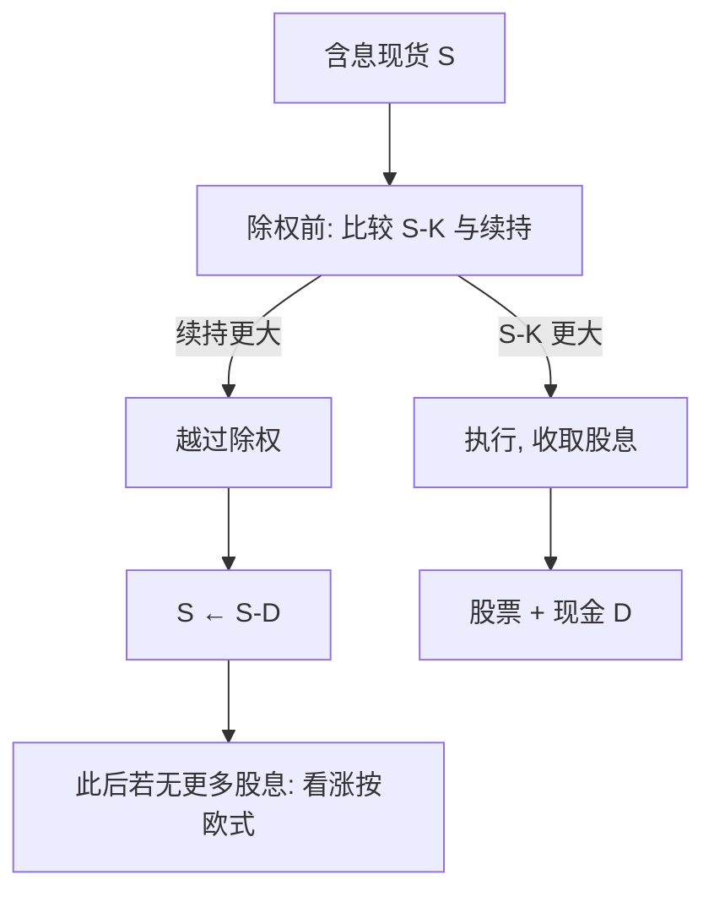

# 离散股息对美式期权

单笔已知现金股息下，美式看涨的提前行权几乎只会发生在除权前夕：持有人比较的是「锁定股息」与「丢掉剩余保险」这两件事，而不是把连续红利率再积分一遍。

<footer>—— 据 Merton 对股利与提前行权的论述，以及 Roll–Geske–Whaley 对单笔离散股息美式看涨的处理整理</footer>

连续红利率 $q$ 把股利写成与股价成比例的漏出，适合指数与宽基 ETF；个股的现金股息是日历上的跳跃：除权日开盘，现货少一笔已宣告的现金 $D$，期权的交割标的随之跳下。欧式合约只关心终端分布，可用托管模型或分段几何布朗对付；[美式提前行权](/quant/american-exercise) 则把决策钉在除权前的那一个时点上——Merton（1973）已经指出无股利美式看涨不应执行，有离散股息时这个结论不再自动成立。本篇写现金股息如何改写自由边界，以及为什么把 $q$ 当成「平均股息率」塞进 Black-Scholes，对美式个股期权会系统性错价。连续红利率下的欧式公式仍见 [Black-Scholes-Merton](/quant/bsm)，网格倒推见 [二叉树](/quant/binomial-tree)。

## 问题

持有美式看涨、标的即将派发现金股息时，续持意味着除权后股价下跳、内在价值可能立刻变差；立即执行则拿到股票并收到股息，但永远失去把执行价再推迟支付的利息，以及股价继续上涨的凸性。问题是：这个权衡是否只在除权瞬间有意义，还是在两个除权日之间的整个区间里都可能执行。对于现金股息（金额已知、除权日已知），答案几乎总是：看涨的执行区域贴在除权前夕，其余时间更接近欧式。看跌则相反，利息动机在整个生命期内都可能触发执行，股息只是修正边界位置。

把离散股息误写成常数 $q$，会把「除权前一次集中的执行动机」抹成「每天漏一点」。对欧式，这种平均有时还能当工程近似；对美式，自由边界的形状被改写，提前行权溢价的期限结构会错。工程问题因此是：状态变量在除权日如何跳跃、续持价值在跳跃两侧如何匹配、以及多笔股息时组合爆炸还能否闭式处理。

### 除权跳跃与托管模型

记除权日 $t_d$，现金股息 $D$（已宣告，视为无风险）。除权瞬间现货满足 $S_{t_d+}=S_{t_d-}-D$（忽略税收与借券调整）。风险中性下，除权日之间 $S$ 仍是几何布朗；到了 $t_d$ 发生一次确定的下跳。托管（escrowed）模型把股息现值从现价里抠掉，令 $S^\ast=S-\mathrm{PV}(D)$，再对 $S^\ast$ 跑无股利公式。欧式看涨可以这样把终端支付写成只依赖除权后过程；美式不行：执行发生在除权前，持有人拿到的是含息现货 $S$，不是 $S^\ast$，托管把执行决策的标的改错了。

托管模型不是「把股息忘了」，而是把股息当成独立的现金券从股价里剥离。欧式终端只看见除权后的 $S^\ast$ 路径，剥离合法；美式在除权前比较 $S-K$ 与续持，剥离会系统性压低提前行权溢价。

## 方法

单笔股息的美式看涨，经典闭式路线是 Roll（1977）、Geske（1979）、Whaley（1981）：除权前是否执行，等价于把「除权后的欧式看涨」当成标的的复合期权，临界现货 $S^\ast$ 由价值匹配给出。临界条件的直觉是：$D$ 必须大到超过剩余时间价值，否则即使除权也不执行。多笔股息时复合期权的层数随除权次数增加，Haug、Haug 与 Lewis（2003）给出可计算的近似与数值方案，工程上更常直接上树或 PDE。

数值上，[二叉树](/quant/binomial-tree) 或三叉必须把除权日对齐到时间层：该层每个节点先比较执行，再减去 $D$，再向后继贴现。不对齐就会把一次跳跃摊到两步里，执行区域被稀释。有限差分同样要把网格点钉在 $t_d$，跳跃用插值接到 $S-D$ 处的续持价值。LSMC 把除权后的价格写进路径，回归的状态在除权前应包含「距下一次除权的时间」以及预期 $D$，否则基函数看不见集中在 $t_d$ 的执行动机。

### Roll–Geske–Whaley 与多笔股息

单笔已知 $D$ 时，除权后的合约是无股利美式看涨，因而等于欧式，Black-Scholes 可用。除权前的问题是：若执行，得 $S-K$；若不执行，得一张以除权后现货为标的的欧式看涨。使二者相等的 $S$ 就是临时自由边界。$D/S$ 很小或剩余期限很长时，这个根可能不存在，即除权前也不执行。多笔股息把「除权后的欧式」变成「仍可能在后续除权前执行的美式」，闭式链条断开。实践中两到三笔已宣告股息用树最干净；更多笔或不确定股息政策，应把 $D$ 当成带公告风险的状态，而不是常数。

不确定股息（政策未宣告、或与盈利挂钩）会重新引入连续 $q$ 的影子：市场用隐含的预期漏出给远期定价。此时美式个股期权的执行动机不再钉死在已知的 $t_d$，自由边界又散回整个区间。方法上应先声明股息是已宣告现金还是隐含红利率，再选公式。

## 机制

经济机制是保险对股息。看涨的时间价值来自凸性与延迟支付 $K$ 的利息；现金股息是把一部分价值确定地从股价里搬走，持有期权的人拿不到这笔现金（除非合约有特殊分红保护）。当 $D$ 大于剩余时间价值，提前执行等于用保险去换股息。除权日之间没有新的现金漏出，Merton 的无股利论证恢复，看涨不应执行。这就是「几乎只在除权前夕」这句话的来源：不是数值巧合，而是现金流日历。

看跌的机制不对称。执行看跌立刻拿到 $K$ 去吃利息，股息会压低现货、增加看跌的续持价值，因此离散股息通常推迟看跌的执行、压低提前行权溢价。把看涨与看跌的美式溢价用同一套 $q$ 去调，会把两个相反的日历效应拧成一个参数。

对冲层面，除权附近 $\Delta$ 与 $\Gamma$ 剧烈：自由边界若被碰到，持有人成批执行，做市商从期权空头变成现货多头，还要处理借券与股息税收。离散对冲误差在这一天会远大于普通交易日，不能用平均 $\Gamma$ 去估。

### 连续红利率不是离散股息的极限捷径

形式上，把一年内的现金股息摊成 $q\approx D/S$ 再送进 Merton 的连续股利公式，只能匹配远期，不能匹配美式自由边界。极限成立的条件是股息连续漏出；一年一次的现金 $D$ 无论多小，执行动机仍是脉冲，不是密度。短期限、深实值、高股息率的个股看涨，这种摊销会低估除权前执行概率、高估除权后仍应付的时间价值。指数期权用 $q$ 是因为成分股除权被平滑；个股美式用 $q$ 是图省事。

分红保护条款（执行价下调、或现金补偿）会取消「用执行去抢股息」的动机，美式看涨重新接近欧式。读合约比选模型更先：同一标的、不同交易所的条款不必相同。

## 边界

已宣告、确定金额、确定除权日、无税收摩擦，是闭式与标准树的舒适区。特殊股息、股票股息、可选现金/股票、以及除权日与期权到期日过近（来不及再对冲），都会破坏 $S\to S-D$ 的简单跳跃。美式期货期权的「股息」是持有成本，不是现金 $D$，不要把个股公式搬过去。

数值边界：股息大于节点上的 $S$ 时要截断，否则出现负现货；深度实值看涨在除权前几乎必然执行，树的早期层应检查 $S-K$ 是否已压过续持，避免舍入把执行点推后一步。LSMC 在除权日附近样本路径的执行标签对基函数极度敏感，一维香草没有理由不用对齐除权日的树。

不要用本篇去替代 [提前行权](/quant/american-exercise) 里的停时理论：那里处理的是一般美式；这里只把离散现金股息这一条制度写清楚。也不要把托管 $S^\ast$ 的隐含波动率与含息现货的隐含波动率当成同一曲面。

A 股现金分红、送转与除权除息在价格与持仓上同时调整，期权合约的调整规则以交易所通知为准。把美股 $S-D$ 直接套到沪深 300 个股期权，先读调整公告，再谈自由边界。

## 小结

- 个股现金股息是除权日的确定下跳，不是连续红利率 $q$；美式看涨的执行动机集中在除权前夕。
- 托管模型对欧式合法，对美式会改错执行标的，系统性压低提前行权溢价。
- 单笔已知股息的美式看涨可用 Roll–Geske–Whaley 型复合期权；多笔股息优先对齐除权日的树或 PDE。
- 看跌的利息动机贯穿存续期，股息通常推迟而非触发执行，不能与看涨共用一个 $q$ 故事。
- 分红保护、特殊股息与合约调整规则会取消或改写这一机制。
- 一维香草应对齐除权日做倒推；LSMC 的状态必须看见下一次除权。
- 出处：Merton, *Bell Journal*, 1973；Roll, *Journal of Financial Economics*, 1977；Geske, 1979；Whaley, 1981；多笔股息的计算见 Haug, Haug and Lewis, 2003。
