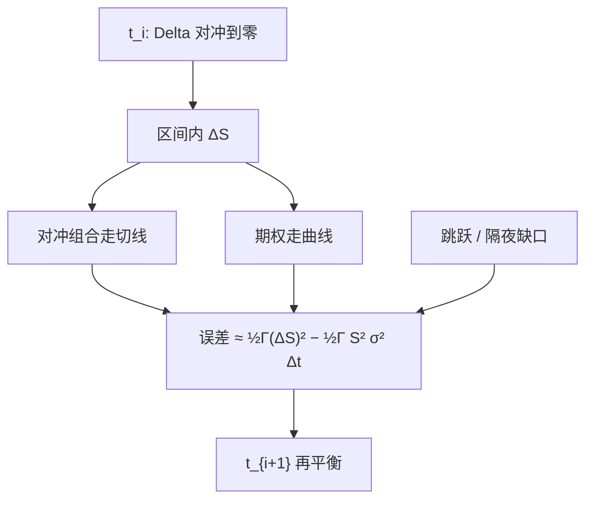

# 离散对冲误差

    
连续复制在两次再平衡之间并不成立；误差的领先项由 Gamma 与已实现方差相对隐含方差的差额决定。

    <footer>—— 连续极限见 Black and Scholes, 1973；离散再平衡见 Boyle and Emanuel, Journal of Financial Economics, 1980；Bertsimas, Kogan and Lo, Journal of Financial Economics, 2000</footer>

Black–Scholes 的复制在连续交易下把期权变成标的与债券的动态组合。真实市场只能在离散时点调仓：按日、按报价更新、或按 Delta 偏离限额再平衡。Phelim Boyle 与 David Emanuel 1980 年分析了离散调整的期权对冲，指出误差并不随步长简单消失成白噪声，而与 Gamma 及平方收益的分布有关。Dimitris Bertsimas、Leonid Kogan 与 Andrew Lo 2000 年问「时间何时可视为连续」，把离散对冲误差的渐近写成可计算的对象。Hull 的希腊字母章节把同一现象说成：Delta 中性之后，P&L 仍随 Gamma 与已实现波动变动。它是 [Delta / Gamma / Vega 对冲](/quant/greeks-hedge) 的误差理论，不是另一套希腊字母。

## 问题

设在 $t_i$ 把组合 Delta 对冲到零，持有到 $t_{i+1}$ 再调。区间内标的走了 $\Delta S$，期权价值走的是曲线，对冲组合走的是切线。差的主项是 $\frac12\Gamma(\Delta S)^2$，再减去为持有 Gamma 所支付的 Theta（在模型里对应 $\frac12\Gamma S^2\sigma^2\Delta t$）。若已实现 $(\Delta S/S)^2$ 大于隐含方差所「预收」的量，空头 Gamma 亏损；反之盈利。连续极限把这些局部误差平均掉；有限步数留下随机累积，可能还有偏差。

问题是定量的：误差如何依赖再平衡频率 $n$、路径的方差与跳跃、以及是否按离散再平衡的最优规则（固定时刻还是触及阈值）。若只把步长减半就期望误差减半，可能猜错阶数：均方误差往往按 $1/n$ 下降，但厚尾与跳跃会留下不随 $n$ 消失的项。

### 局部 P&L 分解

在两次再平衡之间，忽略高阶与利率，卖出一份已 Delta 对冲的期权的 P&L 近似

$$
\Delta\Pi \approx -\frac12\Gamma S^2\left(\left(\frac{\Delta S}{S}\right)^2-\sigma^2\Delta t\right)+\nu\Delta\sigma+\cdots.
$$

第一项是离散 Gamma 误差：已实现二次变差对上隐含方差。第二项是波动率移动，连续 Delta 对冲本来就不覆盖 Vega。若波动率不变且 $\Delta S$ 来自与定价相同的扩散，期望上第一项接近零，但仍有方差。Boyle–Emanuel 在正态框架下计算了这种残差的分布特征；路径依赖与离散采样使分布偏斜——大动日对空头 Gamma 特别痛，因为平方项只在一侧猛烈。

「每天对冲一次」的误差方差，不能用连续公式的 Theta 去代表。Theta 是期望补偿；离散误差是围绕该补偿的随机项，频率与 Gamma 轮廓决定其尺度。

## 方法

把 $[0,T]$ 分成 $n$ 步，每步用当时模型 Delta。累积对冲误差 $E_n$ 在扩散、无跳跃、波动率常数且按正确 $\sigma$ 定价时，通常满足 $\sqrt{n}\,E_n$ 弱收敛到某个随机积分，均方 $\mathbb{E}[E_n^2]=\mathcal{O}(1/n)$。Bertsimas–Kogan–Lo 把「时间连续」理解成：何种条件下离散策略的结果逼近连续复制。结论对标的过程的路径性质敏感：布朗运动下加密再平衡有效；若价格有跳跃，两次报价之间的跳无法用中间的 Delta 捕捉，$E_n$ 不趋于零。

实务算法包括：日历再平衡、Delta 偏离超过 $\delta$ 再平衡、在 Gamma 大的区域加密。后者承认误差尺度是 $\Gamma S^2$ 乘以平方收益的波动，在到期附近的平值，Gamma 峰值使同样的 $\Delta t$ 更危险。成本方面，每次再平衡付价差与费用，最优频率在误差方差与冲击之间权衡，而不是 $n\to\infty$。

### 已实现方差与隐含方差

把离散 Gamma 误差对时间求和，形状像方差互换的结算：对 $-\Gamma S^2/2$ 加权的已实现方差，减去定价用的 $\sigma^2$。若 $\Gamma$ 近似常数，卖出期权加 Delta 对冲就接近做空已实现方差。这正是 [方差互换](/quant/variance-swap-vix) 与香草卖出之间的直观桥梁，也说明为何对冲误差在波动率飙升日与空头方差仓同步爆掉。$\Gamma$ 随 $S,t$ 变，权重不是 $1/K^2$ 的完美条带，故香草离散对冲 $\neq$ 纯方差互换。

## 机制

连续复制依赖「在每一瞬时都位于切线上」。离散时你在弦上。弦与弧的差距由曲率 Gamma 决定。加密再平衡缩短弦，误差降；但报价噪声会让 Delta 本身抖动，过频对冲会把微观结构噪声当成信号，来回成交，见微观结构与买卖价差的讨论。正确频率是信号（真实 Delta 漂移）对噪声（弹跳）的权衡，不是越快越好。

模型错误与离散是两层。即使用连续对冲，错的 $\sigma$ 或错的微笑动态仍留 Vega/Vanna。离散在正确模型上仍留 Gamma 项。压力测试应分开：提高再平衡频率，看误差是否按预期下降；若几乎不降，主导的是跳跃或隔夜缺口。隔夜是强制的离散步，[隔夜与日历](/quant/calendar-overnight) 效应会进入对冲误差，不能用日内 5 分钟频率假装消除。

### 与希腊字母限额的关系

台子常规定「Delta 不超过某数再平衡」。这是把 $E_n$ 的增量控制在 $\frac12\Gamma(\Delta S)^2$ 的预算内。Gamma 限额则限制即使立刻再平衡之前，一次跳空能造成的损失。二者一起，才近似 Boyle–Emanuel 所分析的对象。只限 Delta 而不限 Gamma，等于允许在到期日平值堆积无限曲率，一次跳空摧毁复制。Hull 把 Gamma 与 Theta 并列，正是提醒：收 Theta 的人在卖出这种离散风险。

蒙特卡洛若用粗时间步给期权定价，再在更粗的步上对冲，会把数值偏差写成「对冲误差」。定价步长、对冲步长、市场真实再平衡，三者必须分开声明。

## 边界

渐近结果依赖半鞅结构。停牌、涨跌停、拍卖机制使 $\Delta S$ 不是自由扩散增量。美式提前行权、障碍触及在离散监控下另有误差。多资产用交叉 Gamma，再平衡要在相关矩阵估计误差下进行。随机波动率下，即使连续 Delta 对冲也不完整，还需对方差状态对冲；离散则两者都有采样误差。

Boyle–Emanuel（1980）与 Bertsimas–Kogan–Lo（2000）给出离散相对连续的理论尺度；Black–Scholes（1973）给出被逼近的理想对象。它们不规定你的台子应该五分钟还是按 Delta 阈值交易。那是成本、流动性和限额的工程，必须用自己的成交数据估计，而不是引用渐近阶数交差。

把对冲误差的样本方差直接当「模型质量」，会与离散频率混杂。比较模型应固定同一再平衡规则，或把频率推到成本允许的极限再比残差。

## 小结

- 连续 Delta 复制在离散再平衡下留下以 Gamma 为核心的误差，领先项是已实现方差减隐含方差。
- 扩散情形均方误差通常随再平衡次数 $n$ 以 $1/n$ 下降；跳跃与隔夜缺口不随 $n$ 消失。
- 过频对冲会放大价差与微观结构噪声；最优频率权衡误差与冲击。
- 空头 Gamma 加 Delta 对冲在路径上接近做空已实现方差，但权重随 $\Gamma(S,t)$ 变化。
- Delta 限额与 Gamma 限额控制的是同一误差的不同侧面。
- 出处：Black and Scholes, 1973；Boyle and Emanuel, *JFE*, 1980；Bertsimas, Kogan and Lo, *JFE*, 2000；操作语言见 Hull。
