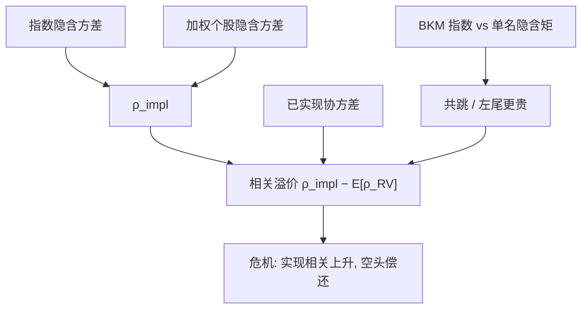

# Dispersion 相关溢价

    
指数期权所隐含的成分相关，平均高于随后已实现的相关；投资者为「分散化在危机失效」预付保险，这笔价格不能从单名波动溢价线性加总得到。

    <footer>—— Driessen, Maenhout and Vilkov, The Price of Correlation Risk, Journal of Finance, 2009；指数相对单名的定价见 Bakshi, Kapadia and Madan, Review of Financial Studies, 2003</footer>

[Dispersion 交易](/quant/dispersion-trade) 写腿的构造：短指数波动、长个股波动篮子，目标是对冲平均 vol、留下 $\rho$。本篇写**被定价的那一项**——相关风险溢价本身：它如何从方差恒等式里分离、Bakshi–Kapadia–Madan 对单名与指数隐含矩的不对称、以及溢价与 [偏度风险溢价](/quant/skew-risk-premium)、[波动率风险溢价](/quant/variance-risk-premium) 如何分担崩盘补偿。不把权重截断与借券操作再讲一遍。

## 问题

指数收益是成分的加权和。方差恒等式

$$
\sigma_I^2=\sum_i w_i^2\sigma_i^2+\sum_{i\neq j}w_i w_j\rho_{ij}\sigma_i\sigma_j
$$

把指数方差拆成特质块与相关块。期权同时给 $\sigma_I$ 与 $\sigma_i$，可反解隐含相关 $\rho_{\mathrm{impl}}$。若单名与指数的波动风险溢价「同类」，$\rho_{\mathrm{impl}}$ 应接近预期已实现相关。Driessen–Maenhout–Vilkov（DMV）表明不是：指数侧更贵，差额落在相关。Bakshi–Kapadia–Madan（BKM）从另一头进入：个股风险中性偏度往往不如指数那么负，个股期权相对自己的历史矩也更「便宜」——指数提供的是共跳保险，单名提供的是特质跳保险，二者不可加。问题是把相关溢价写成可估计的测度差，而不是把「指数 IV 高于平均个股 IV」误当成相关。

后一句恰好可能相反：个股 IV 通常高于指数 IV，因为特质方差为正。溢价不在水平比较，而在 $\rho_{\mathrm{impl}}-\mathbb{E}^{\mathbb{P}}[\rho_{\mathrm{RV}}]$。

### 隐含相关不是等权 pairwise 平均

恒等式里的 $\rho$ 以 $w_i\sigma_i$ 为权重。对所有股票对做等权平均，会夸大小盘股，与指数期权对不上。CBOE 一类隐含相关指数用上市期权与官方权重的离散版，期限、方差对波动、微笑翼都会移动点估计。对象须尽量用条带方差而不是 ATM，否则指数更陡的偏斜被读成更高的 $\rho$。

全体个股 IV 平行乘一个因子时，$\rho_{\mathrm{impl}}$ 会变（分母变大）。相关溢价的时间序列应同时报告 $\sigma_I$ 与 $\sum w_i\sigma_i$ 的水平，以免把个股做市商集体抬翼写成「相关在降」。

## 方法

**隐含腿。** 期限对齐的指数与成分欧式，按方差（条带或公平 $K_{\mathrm{var}}$）进入恒等式，反解 $\rho_{\mathrm{impl}}$ 或直接看指数方差减加权单名方差——后者才是可交易的相关块。翼截断在指数与个股上通常不对称（个股翼更稀），会使 $\rho$ 有系统性偏差，须报告最低 $K/F$。

**实现腿。** 用同一权重、同一期限的已实现协方差矩阵估计 $\rho_{\mathrm{RV}}$。Forbes–Rigobon：波动上升时样本相关变高，即使依赖结构不变。溢价检验应在已实现侧用适当的异方差修正，或直接用 dispersion 组合的 PnL，而不是只比较两个 $\rho$ 数字。

**溢价。** $\mathrm{CRP}_t=\rho_{\mathrm{impl},t}-\mathbb{E}^{\mathbb{P}}_t[\rho_{\mathrm{RV}}]$。DMV 用期权收益与复制组合检验其均值、以及能否被市场因子解释。控制指数 VRP 之后若仍显著，才说明相关是独立的风险价格，而不是「又在卖指数方差」。BKM 的隐含偏度、峰度公式（见 [模型无关隐含矩](/quant/model-free-moments)）用于对比指数与个股的三阶：指数左尾更贵，与相关溢价同向——共跳既抬方差里的 $\rho$ 项，也抬偏度。

### 与单名 vol arb、指数 VRP 的正交化

单名 vol arb 赌 $\mathrm{IV}_i-\mathrm{RV}_i$；指数 VRP 赌 $\mathrm{IV}_I-\mathrm{RV}_I$；相关溢价赌二者之差是否超过特质方差所能解释的部分。回归 dispersion PnL 到指数 RV、平均个股 RV、实现相关三块，第三项才是 CRP 的实现。若第一项主导，策略只是指数 vol arb 加上昂贵的个股腿。Bakshi–Kapadia 对指数 Delta 对冲收益为负、对单名较弱，是同一不对称在香草 PnL 上的投影。

## 机制

指数虚值看跌覆盖「许多股票一起跌」。一篮子个股看跌覆盖各名字自己的跳，对共跳的对冲效率低：要复制指数尾，需要的个股名义远大于市值权重，因为特质噪声对冲不掉共跳。投资者愿意为指数式保险付费，使 $\rho_{\mathrm{impl}}$ 偏高。危机里杠杆与流动性把股票赶进同一卖出通道，实现相关上升，空相关的一方偿还——与相关性崩溃是同一事件在期权账上的结算。

这与「个股波动也升了所以多头该赚钱」不矛盾：两边都升，但相关项使指数方差升得更多。溢价的符号因此是：平静期收保险费，相关崩溃日一次性支付。把它当成预测误差去择时，会把保险费写成 alpha。

### 偏度溢价与相关溢价的重叠

共跳同时产生更负的风险中性偏度与更高的隐含相关。Kozhan–Neuberger–Schneider 的偏度溢价与 DMV 的相关溢价在指数上高度相关，但交易腿不同：前者是风险反转或偏度互换，后者是 dispersion。归因上应允许重叠，不要把同一笔崩盘 PnL 同时报成两个策略的全部收益。BKM 指出个股微笑更浅，单名 RR 卖出赚的主要是特质偏度，不是指数式共跳。

等权 dispersion 与市值加权 dispersion 定价的不是同一个 $\rho$。指数期权对应市值加权；用等权篮子去「增强」溢价，暴露的是小盘相关，危机流动性更差。

## 边界与工程取舍

恒等式是方差的。用 ATM IV 代替 $\sigma$ 会留下 Jensen 与微笑误差，相关溢价被污染。美式个股对欧式指数，早行权溢价进入 $\sigma_i$。成分调整使 $w_i$ 与期权上市不同步。A 股若个股期权深度不够，多头腿无法建立，CRP 不可交易，只是一个不能对冲的诊断指标。

不要把 DMV 写成 Dupire 的应用，也不要写成统计套利。不要用现货滚动相关去择时而不看隐含腿——隐含已经含溢价。容量上，危机里个股期权价差先于指数爆炸，dispersion 退化为裸空指数波动，风控应接这一极限情形，而不是电子表上的 $\rho$ 缺口。

Bakshi–Kapadia（2003）的 Delta 对冲收益是指数波动溢价的香草证据；BKM（2003）把矩分解推到单名与指数的差异。相关溢价是这一差异在方差恒等式里的名字，不是第三篇无关的论文。

净 Vega 为零不保证对 vol-of-vol 与偏斜为零。指数与个股的 Vanna 不同，现货跳后净暴露会从「纯相关」变成「净空指数尾」。溢价检验必须在跳日后重算希腊字母。

## 小结

- 相关溢价是 $\rho_{\mathrm{impl}}-\mathbb{E}^{\mathbb{P}}[\rho_{\mathrm{RV}}]$，指数侧平均为正（DMV），在共跳日偿还。
- 水平比较「指数 IV 对个股 IV」不是相关；特质方差使个股 IV 通常更高。
- BKM 的指数–单名隐含矩不对称，与相关溢价同一经济：共跳保险在指数期权里更贵。
- 归因须正交化指数 VRP、单名 VRP 与实现相关，避免把 vol arb 误报成 dispersion。
- 偏度溢价与相关溢价重叠于崩盘，交易腿不同，PnL 不要双重计算。
- 出处：Driessen, Maenhout and Vilkov, *Journal of Finance*, 2009；Bakshi, Kapadia and Madan, *Review of Financial Studies*, 2003；Bakshi and Kapadia, 2003；恒等式见指数期权标准分解。
