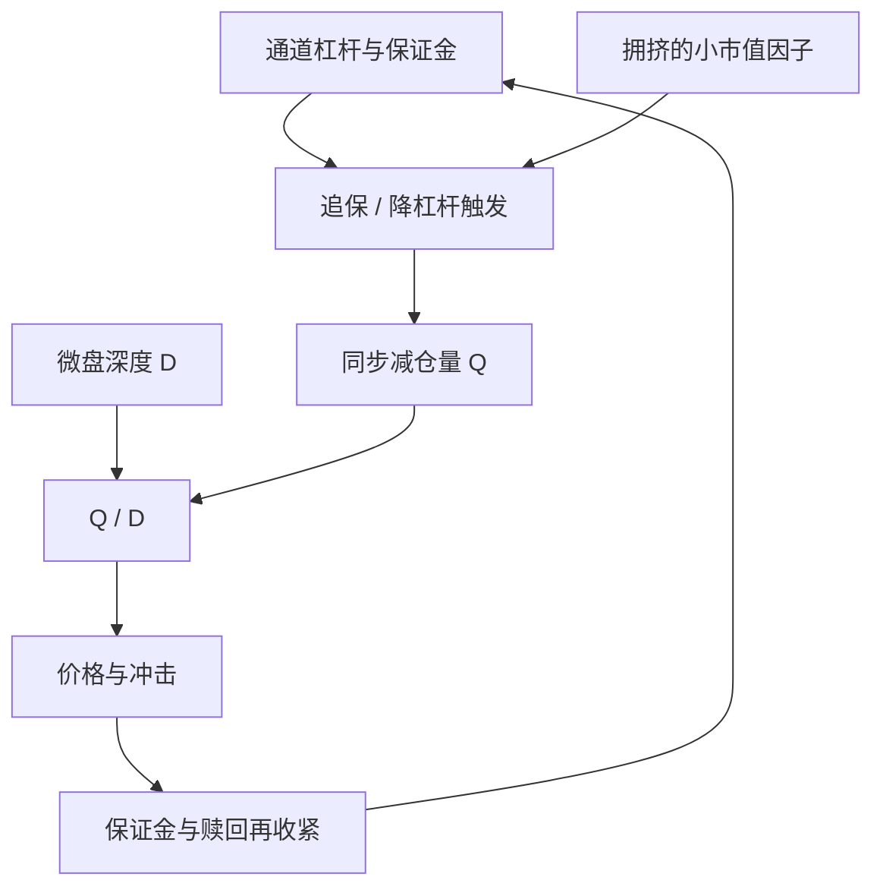

# DMA 杠杆与微盘流动性危机

市场流动性与融资流动性互相喂养：价格下跌削弱抵押品，融资条件收紧迫使变现，变现再打压价格。当变现集中在深度最差的那一层名字上，螺旋不再需要宏观新闻来点火。

<footer>—— Brunnermeier and Pedersen, Market Liquidity and Funding Liquidity, Review of Financial Studies, 2009</footer>

直接市场接入（DMA）及相关收益互换、场外加杠杆通道，让策略账户用较小的保证金去交易一揽子股票。微盘与中证 2000 一层的名字，日成交薄、冲击大、停牌与涨跌停更频繁。把高杠杆叠在这一层上，单笔看来是「提高资金效率」，加总后是可同步的减仓量相对深度的比。2024 年 2 月前后，A 股小微盘出现公开可观测的剧烈调整，同期市场对量化产品、DMA 与程序化交易的讨论进入监管与媒体的公开文本。本篇把这次调整当作**杠杆 × 非流动性 × 拥挤规则**的压力样本，对象是风险架构，不是如何设计或加大 DMA 杠杆。制度背景见[融资融券](/quant/cn-margin-trading)与[杠杆强平](/quant/leverage-liquidation)。

## 问题

无杠杆时，微盘的损失以权益为限，卖出节奏可以由管理人选择。有杠杆时，名义 $N$ 远大于权益 $E$，价格反向 $r$ 使维持担保或互换保证金迅速逼近阈值，见杠杆篇的 $r_{\mathrm{liq}}=m-1/\lambda$。微盘的 [Amihud 非流动性](/quant/amihud-illiquidity) 高，同一 $N$ 的变现在价格上留下更大的 $\Delta P$，而 $\Delta P$ 立刻改写下一期保证金。问题是把 DMA 当成普通股票多头回测时漏掉的三项：**通道的保证金规则、标的层的深度、以及同类策略在因子上的同步。**

第二句话是可见性。DMA 不是交易所的公开持仓统计，规模只能从券商衍生品、收益互换与产品杠杆的公开讨论中作上界估计。因此「DMA 有多少」不宜写成精确的市场份额；可写的是机制：若一批账户共享小市值因子、共享波动目标、共享同一批可交易微盘名单，则保证金通知会在同一周变成同一方向的卖单。这与 2007 年 8 月统计套利拥挤（Khandani–Lo）同构，只是标的从美股中盘换成了 A 股流动性最差的一层。

### 微盘的深度不是指数的深度

中证 2000 或更小的微盘指数，成分的 ADV 分布极度右偏。指数点位的百分之一，并不均匀摊在两百只股票上：减仓会先打在最拥挤、名单重叠最多的名字，再通过因子相关传到其余。用指数期货对冲的是 beta，不是这些名字的特异冲击；期货升贴水可以正常，而现货一层已经没有买方。涨跌停把一天的可交易量截断，见[涨跌停](/quant/cn-limit-auction)；停牌把担保品定价冻结，见[停牌复牌](/quant/cn-halt-resume)。杠杆账户若把停牌市值按满额计入保证金，复牌缺口会一次性打穿。

把 2024 年 2 月的微盘调整归因于「有人用 DMA 攻击流动性」，超出了公开证据，也把风险管理换成了对手方叙事。公开事实是：小市值一层发生了与杠杆、赎回、程序化交易讨论同时出现的流动性枯竭。风险系统要问的是 $Q/D$ 与保证金时钟，不是虚构交易对手。

## 方法

风险度量应在三个层次上同时做，而不是只报组合波动。

**通道层。** 列出每条融资路径的初始、维持、追保窗口与处分权：两融、收益互换、DMA 保证金、期货。Adrian–Shin 的主动杠杆与 Brunnermeier–Pedersen 的 haircut 上调，在压力里会同时发生。回测若只在收盘价上乘一个固定杠杆倍数，等于假设通道在最需要时仍然按平静期条款展期。

**标的层。** 对持仓名字估计冲击：Amihud、[Kyle λ](/quant/kyle-lambda)、[平方根冲击](/quant/square-root-impact-law)。容量用策略真正会买卖的那一截 ADV，见[容量与参与率](/quant/capacity-participation)。微盘的 $D$ 在压力日不是平静期 ADV 的常数倍，往往更差；应准备「深度减半」情景，而不是把历史平均深度当下限。

**策略层。** 测量同类产品收益的截面相关、对小市值与换手因子的载荷、以及波动目标是否会在已实现波动上升时同步降杠杆。Stein 所说的套利同质化，在指增与微盘量化上表现为：各自的风控都「合理」，加总的卖单不合理。点火规则写成状态机：微盘冲击指标上升 → 估计同步减仓 $Q$ → 与 $D$ 比较 → 降杠杆、拉长[变现时间](/quant/liquidity-horizon)、或触发[闸门](/quant/trading-kill-switch)。这是减风险，不是开新的反向投机。

### 2024 年 2 月作为压力校准，不是因子信号

公开行情显示，那一段小微盘的回撤速度与成交萎缩同时出现，随后程序化交易报告与监管沟通进入公开文本。对风险模型，这段样本的价值是校准 $Q/D$ 与保证金上调的联合分布：哪些因子载荷在压力里变成了清算清单，历史协方差用平静期估会差多远。不要把它拟合成「微盘反转可交易」的新因子——样本只有一次，且含有赎回与通道收缩的制度项，外推是叙事。McLean–Pontiff 式的发表后衰减在这里变成「危机叙事后的拥挤反向」，同样不可当作无条件期望。

## 机制

螺旋的会计与拥挤篇相同：价格跌削弱权益（亏损螺旋），波动升提高保证金与风险预算（保证金 / vol targeting 螺旋），相关升使「分散」失效。微盘特有的第四项是**交易制度截断**：涨跌停与 T+1 让当日买入的股票不能当日卖出，见[T+1](/quant/cn-tplus1)，于是想降杠杆的账户只能卖旧库存；旧库存若正是跌停的微盘，名义降不下来，保证金却继续恶化。DMA 通道若按组合市值盯保，市值用的是可成交价还是理论中间价，会决定螺旋有多快——中间价在跌停板上没有对手。

资金流动性与市场流动性在这一层比蓝筹更紧耦合。做市与量化提供的那部分微盘流动性，本身可能来自同一批 DMA 账户；他们离场时，买卖价差与冲击同时跳。Amihud 指标在压力周会爆炸，但这是结果不是先行指标。更早的可监测变量是：因子拥挤（同类产品相关）、通道保证金通知的行业传闻与公开衍生品规模、以及微盘相对大盘的已实现波动比。

监管后来对程序化交易报告、异常交易与量化监管的公开安排，改变的是通道与报备成本，从而改变杠杆供给。把政策当作价格的外生冲击即可；本篇不讨论如何在规则边缘设计接入。

### 与两融、期货杠杆的差别

两融有标的名单、集中度与平价申报，见融资融券篇；股指期货有中央对手方与日内盯市。DMA / 收益互换的条款在券商之间不同，压力期可以整条通道上调保证金或限制开仓，相当于对某一策略风格的供给突然消失。风险加总若只盯期货 SPAN 与两融维持担保，会漏掉场外乘数。正确做法是把场外通道当成另一套 $m(t)$，并假设它在微盘波动上升时与公开保证金同向移动。

## 边界与工程取舍

不要用平静期微盘的夏普去标定 DMA 杠杆上限。不要把指数增强的纸面超额直接乘杠杆：超额在拥挤与冲击下先消失，杠杆放大的是残余噪声与清算。不要为了「解释 2024 年 2 月」去拟合一条只在那一周有效的微观结构规则。可做的是：降低小市值一层的杠杆上限、把深度情景写入日内限额、把同类产品相关当作拥挤状态变量。

Brunnermeier–Pedersen 的螺旋不依赖 DMA 这个名字。换一种加杠杆的法律形式，只要保证金与减仓规则同步、标的深度差，几何相同。名字会变，风险单位仍是 $Q/D$ 与 $m$。

## 小结

- DMA 及类似场外杠杆把微盘上的名义放大；危机是杠杆、非流动性与拥挤规则的乘积，不是单一「量化风格」标签。
- 2024 年 2 月的小微盘调整是公开压力样本，用于校准 $Q/D$ 与保证金时钟，而不是用于发明可交易的危机因子。
- 涨跌停、T+1 与停牌截断变现，使微盘螺旋比期货式盯市更快、更不连续。
- 风险要同时覆盖通道条款、标的冲击与策略同步；只报组合波动会漏掉真正的死亡方式。
- 出处：Brunnermeier and Pedersen, *RFS*, 2009；Adrian and Shin, *JFE* / *AER* 杠杆周期文献；Amihud, *Journal of Financial Markets*, 2002；Khandani and Lo 对 2007 年量化拥挤的记录。
