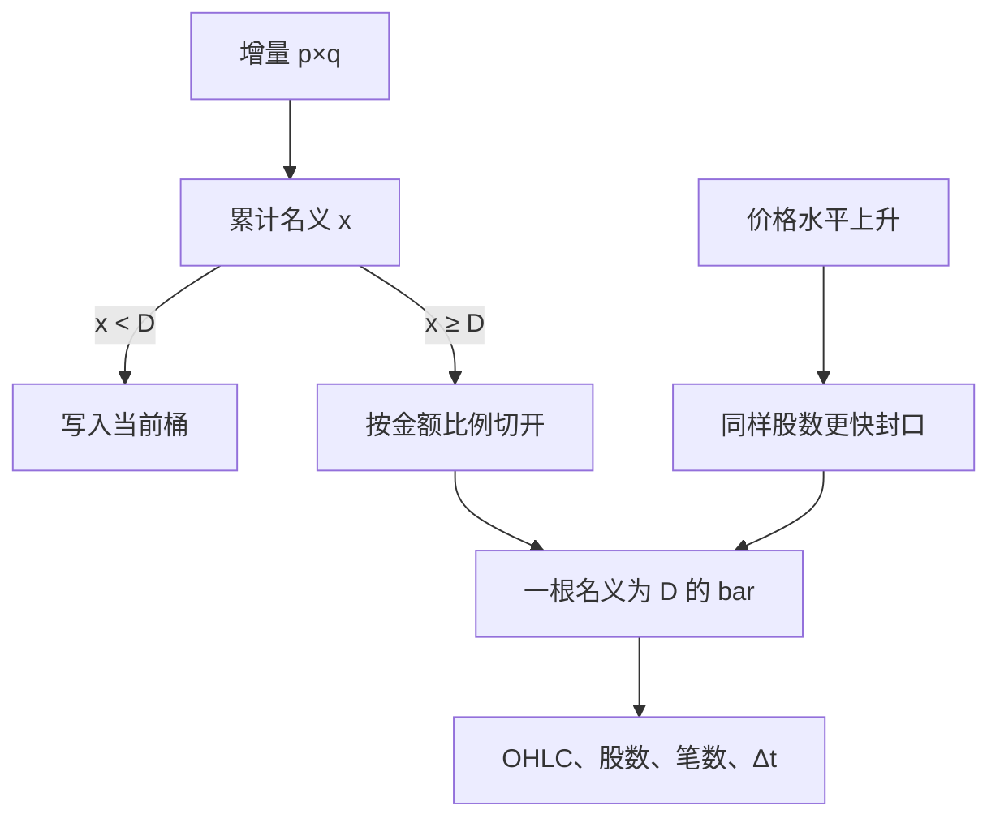

# Dollar bars

价格涨了十倍，同样股数代表的美元风险也涨了十倍。让每一根 bar 含有相同的名义成交额，采样才在价格水平变化之后仍然按钱对齐。

<footer>—— López de Prado, Advances in Financial Machine Learning 对 dollar bars 相对 tick、volume bars 的比较</footer>

[Tick bars](/quant/tick-bars) 平权每一笔打印，[volume bars](/quant/volume-bars) 平权每一股。长期样本里价格可以走一个数量级：2010 年的 100 万股与 2021 年的 100 万股不是同一风险预算。**Dollar bars**（金额 bars）把累计器换成 $\sum p_i q_i$，每达到阈值 $D$ 封一根。López de Prado 指出，在价格趋势明显的品种上，dollar bars 的收益统计往往比前两者更齐次。本篇写名义累计的细节、外汇与期货里「dollar」该换成哪种记账单位，以及它并不自动给出更好的 alpha。

## 问题

活动同步采样要选一个可加的活跃度。笔数对拆单过敏，股数对价格水平过敏。名义金额 $p\cdot q$ 是把一笔成交换成记账货币后的规模，近似「有多少钱换了手」。冲击成本、容量、做市存货的资本占用，都更接近钱而不是股。问题是：用哪一个价格乘数量——成交价、当时中点、还是复权价？用哪一种货币——交易货币、美元、还是本币？跨品种比较时，$D$ 是全局一个数还是按品种流动性设？

第二个问题是与收益的循环。价格上涨时，同样股数更快把累计器推到 $D$，dollar bars 在牛市自动加密。这是特性：名义活动确实在增加。但它也意味着采样频率与价格水平正相关，于是 bar 密度本身含有趋势信息。若下游用 bar 计数当特征去预测收益，会有一部分是用价格水平预测价格变化。必须把采样频率与收益分开诊断。

### 累计名义并切开

对成交 $(p_i,q_i)$，增量 $d_i=p_i q_i$。累计 $x\leftarrow x+d_i$，跨过 $D$ 时按比例切开数量（从而切开金额），封旧开新，与 volume bars 同一套切分逻辑。开高低收仍是价格，不是金额；金额只决定边界。一根 dollar bar 内的股数 $Q_j=\sum q$ 随价格反变：价格高则同样 $D$ 对应更少股数。这与 volume bars 恰好对偶。

$$
\text{封口当且仅当}\quad \sum_{i\in\text{桶}} p_i q_i = D.
$$

$D$ 可用过去 $n$ 日日均成交额的分数。滚动更新 $D$ 时只能用已完成日，否则把当天已经走完的放量写进阈值。拆股：若价格突然腰斩而累计器用未复权价，封口会立刻变慢；应在公司行动处切断并换阈值，或全程用同一复权约定。

名字里的 dollar 是名义金额，不一定是美元。A 股用人民币成交额，欧洲股票用欧元，外汇用基准货币的名义。跨市场研究要先换成单一记账货币，否则 $D$ 不可比。

## 方法

单一合约、单一场所累计，避免双计。期货用合约乘数后的名义：$\text{乘数}\times p\times$ 手数，否则 $D$ 的量纲是「点×手」，不是钱。外汇用基准货币金额或美元等值，须固定报价惯例（EURUSD 的 dollar bar 与 USDJPY 的单位不同）。输出每根 bar 的股数、笔数、墙钟长度，作为质量字段：若笔数经常等于 1，说明 $D$ 小于典型一笔的名义，采样退化成「大单就是一根 bar」。

齐次性：比较 tick / volume / dollar 三种 bars 上收益的方差稳定性、偏度、以及 bar 长度的变异。López de Prado 的经验主张是 dollar 常更稳，但这是样本性质，不是定理。在价格横盘、成交量剧烈变化的品种上，volume 可能更稳；在成交量稳定、价格漂移的品种上，dollar 更稳。应在你的品种上做三列对照，而不是引用书中某张图当结论。

### 价格进入累计器，高低价仍是路径

封口依赖 $p_i$，一根 bar 的收盘价又是最后一个 $p_i$，边界与标签共享价格。这与 volume bars 不同：体积累计不看价格，价格只出现在 OHLC。dollar bars 因此对错价更敏感——一笔离谱的高价会立刻封掉许多根 bar，并留下荒谬的高低。必须先做 [tick 清洗](/quant/tick-cleaning)，否则采样网格被错价主导。

## 机制

机制上 dollar bars 对齐的是资本周转。做市商的风险限额、基金的容量、冲击的平方根定律，自变量往往是名义。把一步定义成「转手了 $D$ 块钱」，后续特征更像在同一风险单位上取值。相对 volume，它自动完成一项粗浅的价格调整，免去手动按复权因子去改 $V$——但公司行动仍要切断。

循环机制：趋势市里价格与封口频率一起上升，成交量时钟若同时因趋势放量而加密，dollar 会双重加密。这不一定坏，闪崩里你确实希望更密的样本。坏的是把「今日 bar 数」不加变换地当作预测变量。应使用相对自身历史的 bar 密度分位，或把密度对价格水平回归后的残差当活跃度。

### 跨品种的 D 不是通用深度

大盘股日成交额是小盘的几十倍。全局同一个 $D$ 会让小盘一天只有几根 bar、大盘每秒一根。截面研究应按各股日均成交额设 $D$，使每日 bar 数大致同阶，再比较收益统计。否则「dollar bars 上小盘更肥尾」可能只是小盘每根 bar 跨了半个交易日。这与 volume bars 按各股均量设 $V$ 是同一纪律。

通货膨胀与汇率会改写长期样本里的 $D$。1980 年代与 2020 年代的「一百万美元成交额」不是同一购买力。跨数十年的美元 bars 应考虑实际金额或滚动分位阈值，而不是 1980 年定下一个名义 $D$ 用到今天。

## 边界与工程取舍

不要用复权后的价格乘未复权的数量。不要在指数上用「点×成交量」却叫做 dollar——指数乘数与合约规格必须进入。不要把 dollar bars 的策略收益和分钟线比夏普而不换算持有期的墙钟分布。多资产协方差仍要对齐时间戳；金额时钟各走各的。A 股成交额含过户费之前的名义，与净成交额差异通常可忽略，但大宗与盘后固定价格交易应排除在连续 dollar bars 之外。

Tick / volume / dollar 是菜单，不是进化阶梯。毒性与 PIN 类流量指标常留在 volume 上，以便与 VPIN 文献对齐；机器学习特征在长期、跨价格水平的股票样本上更常选 dollar。执行算法按 dollar bars 切片时，仍要有墙钟与笔数的上限，防止在极高价、极薄的打印上把一根 bar 拖过公告。

出处：López de Prado, *Advances in Financial Machine Learning*。成交量时钟见 Easley, López de Prado & O'Hara。金额作为活跃度单位在容量与冲击文献中更早出现，dollar bars 是把该单位写成采样网格。

## 小结

- Dollar bars 每累积固定名义成交额 $D$ 封一根，切分逻辑与 volume bars 相同，累计器换成 $p q$。
- 等金额对齐资本周转，并在价格水平变化后仍可比；封口频率会随价格趋势变化。
- 期货与外汇必须先把乘数和报价惯例写成真正的记账货币。
- 错价会同时破坏网格与 OHLC，清洗是前置条件。
- $D$ 应按品种流动性设，使每日 bar 数同阶。
- 不是比 volume 更「高级」的默认，而是另一维齐次。
- 出处：López de Prado, *Advances in Financial Machine Learning*。
