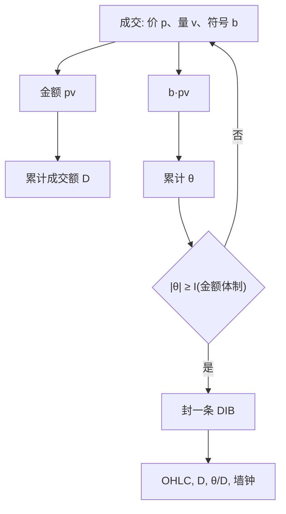

# 金额不平衡条

一股十元与一股两百元不是同一单位的经济活跃；用金额加权的不平衡来切条，采样才会在资金流而不是在股数流上对齐。

<footer>—— 据 López de Prado 对 dollar bars / dollar imbalance bars 的构造，以及 Easley, López de Prado, O'Hara 把时钟从日历换成市场活跃度的思路</footer>

[成交量不平衡条](/quant/volume-imbalance-bars) 用带符号股数累积 $|\sum b_i v_i|$ 触发封条。金额不平衡条（dollar imbalance bars, DIB）把同一套逻辑换成带符号成交额：$\theta_t=\sum b_i p_i v_i$。对单一合约、价格缓慢游走的样本，两者几乎平行；一旦出现拆细、分红除权、低价股与高价股同处一个截面、或价格在样本期内翻了数倍，股数时钟会系统性地在便宜的时候切得更碎、在昂贵的时候切得更疏——尽管资金周转未必如此。本篇写金额加权之后阈值、截面可比性与执行研究里该用哪一种条，并与等金额条、[VPIN](/quant/vpin) 的等体积桶分开。它仍然只是采样装置。

## 问题

股数是合约乘数与历史拆细的产物。同一公司在拆细前后，「成交一万股」对应的资本量可以差一个数量级；不同股票之间，单价二十与单价两百的「一手」更不可比。等体积条和 VIB 都把 $v_i$ 当活跃度的原子。若研究问题是资金流、冲击相对 ADV 金额、或把许多标的拉到同一套特征尺度上，原子应是 $p_i v_i$。

金额条（dollar bars）每累积固定金额封一条，已能让条的「经济体积」更齐。金额不平衡条进一步要求净买入额（或净卖出额）够大才封条：资金在两侧对冲时，即使换手很大也不切；资金持续流向一侧时加密。问题是：价格本身在条内变动，$p_i$ 用成交价还是用开盘中点、阈值用哪一种货币单位、以及汇率与乘数如何进入国内期货与 ADR。

### 价格进入累加器之后的两种偏差

$\theta$ 用逐笔成交价加权，大价股票的一笔普通成交就能推动 $\theta$，低价股要许多笔才够。这正是金额时钟想要的。偏差有两条。第一，价格趋势会让同一方向的股数在后期自动获得更大权重：上涨趋势里买入额比卖出额更容易积累，阈值若不含价格水平，条会在牛市一侧更密。第二，最小报价单位使低价股的 $b_i$ 更吵（tick 规则在一档价差里来回跳），金额加权并不能消除分类噪声，只是给噪声乘上了价格。

「dollar」在这里是计价单位，不是必须用美元。A 股用人民币成交额，期货用合约价值（价格乘乘数再乘手数）。写进数据字典的应是货币与乘数，而不是英文单词 dollar。

## 方法

从上一根结束后维护

$$
\theta_t=\sum_{i=t_0}^{t} b_i\,p_i v_i,\qquad D_t=\sum_{i=t_0}^{t} p_i v_i.
$$

$|\theta_t|\ge I_t$ 时封条。$I_t$ 的自适应与 VIB 同构：平滑期望笔数或期望金额、以及买入金额占比。输出字段除 OHLC 外应包括 $D_t$、$|\theta_t|/D_t$ 和墙钟区间，否则后验无法把「密」解释成金额失衡还是价格台阶。除权日把 $p$ 与 $v$ 同时调整到同一口径，否则一条会横跨两个不可比的价格网格。

与等金额条对照：等金额条在 $D_t=D^\ast$ 时切开，适合容量与 [平方根冲击](/quant/sqrt-impact) 那种按资金规模校准的对象；DIB 在净额触发时切开，适合信息到达的时钟。同一母单的执行研究里，用等金额条对齐短fall 更自然，因为母单预算是钱；用 DIB 对齐则可能在单边冲击阶段切出许多短条、在恢复阶段切出长条，把衰减核的时间轴扭曲。传播核应在事件时间或日历时间上估，见 [Bouchaud 传播核](/quant/bouchaud-propagator)，不要让采样规则悄悄重参数化 $G(\tau)$。

### 截面上的统一阈值与分层阈值

多股票若共用一个金额阈值，大盘股永远先封条，小盘股一条可以跨半天。这会在截面因子里把大盘的高频结构与小盘的低频结构拼在一张表上。分层是最低要求：按滚动成交额分位设定 $I$，或把阈值写成 ADV 金额的某一比例。VIB 按 ADV 股数分层是同一思想的股数版。不要把「全市场一个 $I$」当成可复现的研究设定。

期货与 ETF 还有乘数与篮子。股指期货的成交额应使用合约价值，否则点数差会被当成金额差。ETF 申赎附近的成交额可能反映创建赎回而非方向信息，DIB 会加密，但经济对象已经变了；这些时段应标记，而不是删掉后假装阈值仍可比。

## 机制

金额加权把「知情者带了多少资本」而不是「带了多少股」写进时钟。Kyle 的净需求 $y$ 是数量，但出清价对信息的敏感与美元净需求更接近机构订单的语言：母单用钱计，冲击曲线的横轴常用 $Q$ 对 ADV 或对金额 ADV。DIB 试图让每一条代表一笔「足够大的美元不平衡」，从而在不同价格水平上比较条内收益、波动与 OFI。这与 Tóth 等人讨论的潜在流动性有关：挖流动性的深度由资金规模决定，不是由手数决定——细节见 [平方根冲击律](/quant/square-root-impact-law)。

机制上它仍不是毒性的充分统计。大额同向可以是指数再平衡、可以是被动基金调仓，也可以是知情。开盘集合竞价之后连续撮合的第一波金额往往单边，DIB 会切得很碎，其中大部分是机制与隔夜信息释放，而不是盘中逐笔知情。把条密度当因子，先要按时段分层。

### 与成交量不平衡条何时会分道

价格稳定时，DIB 与 VIB 的边界几乎重合，研究结论可互换。分道发生在：价格在样本内趋势很大；组合里同时有低价高换手与高价低换手；发生拆细或大比例分红；标的是价格水平差异巨大的期货月份。若你只做一只未拆细的股票、样本两周，选 VIB 往往足够，不必同时维护两套时钟还声称正交。若你做多年、多标的的特征库，DIB 更可能让「一步」的经济体积对齐。

美元条（不看不平衡、只看累计金额）已经能改善许多机器学习特征的平稳性。不平衡版额外对方向敏感，因此更脆：分类错误与一笔错价会直接切出假条。先把等金额条做稳，再决定是否上 DIB。

## 边界

计价货币、乘数、汇率（若有 ADR 或跨境标的）必须冻结在数据规范里。用收盘价去重放盘中 $p_i v_i$ 是前视。涨跌停板上连续同向成交会让 $\theta$ 直线上升、条异常密，但价格不能动，条内收益接近零——这不是信号失效的神秘，而是约束改变了价格对金额的弹性。停牌期间不应让累加器跨过空洞。

不要用 DIB 去「证明」知情交易频率上升：你改阈值就能改变条数。不要把 DIB 与 [成交量不平衡条](/quant/volume-imbalance-bars) 同时放进回归当两个因子，它们共享同一套符号序列。执行仿真若在 DIB 时钟上做，还要把每条映射回墙钟，才能与交易所的连续撮合对齐。

金额不平衡是流量的采样。盘口存量不平衡 $I_1$ 仍是快照。用 DIB 收盘时的 $I_1$ 当特征可以，但封条条件里没有用到簿，深度变化不会提前触发下一条。

## 小结

- 金额不平衡条用带符号成交额越过阈值来封条，使一步对齐资金流而非股数。
- 价格趋势、拆细与截面单价差异，是它相对 VIB 有意义的主要区域。
- 阈值应按金额 ADV 分层；全市场单一 $I$ 会让大盘股垄断条数。
- 等金额条更适合容量与冲击校准；DIB 更适合方向信息到达的时钟。
- 涨跌停、拍卖、申赎与分类噪声会扭曲条密度，密度本身不是毒性。
- 出处：López de Prado, *Advances in Financial Machine Learning*；成交量时钟的经济动机见 Easley, López de Prado, O'Hara。
