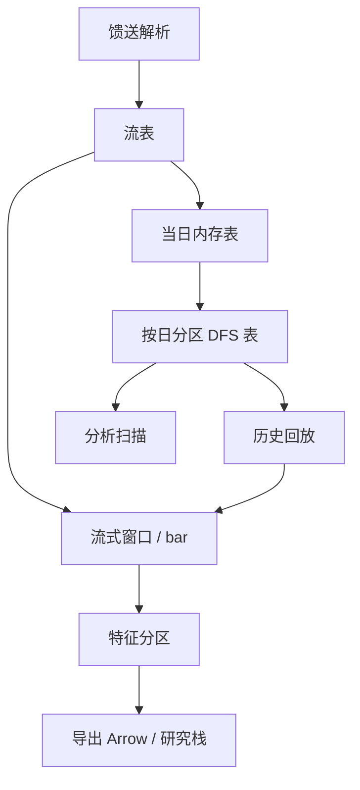

# DolphinDB

    
把分布式分区、内存表、流式发布与库内向量计算放在同一套脚本里，目的是让行情从写入到特征之间少几次序列化——而不是再发明一种通用的事务数据库。

    <footer>—— 据 DolphinDB 技术文档对其时序库、分布式文件系统与流计算引擎的说明</footer>

国内量化与经纪商技术栈里，DolphinDB 常被拿来和 [kdb+ / q](/quant/kdb-plus) 对照：两者都面向追加型金融时序，都提供列存与库内向量语言，都把「当天热数据」和「按日分区历史」当作一等公民。差别在产品形态。DolphinDB 把分布式文件系统、分区策略、流引擎与 SQL 风格查询做进同一运行时，降低了从单机脚本到多节点集群的台阶；代价是必须把分区键、压缩、流图拓扑当成数据模型的一部分来设计，而不能事后靠外表补。本篇写它作为研究与近生产的数据架构：表与分区如何工作、批流如何交接、以及库内计算与外部机器学习如何划界。不涉及未授权的行情接入，也不把厂商基准当作策略收益。

## 问题

金融时序有三种同时存在的访问：盘中追加与订阅、盘后按日期扫描、以及把同一批数据变成特征再交给 Python 或回测。若这三件事落在三个系统里，对齐成本会高于计算本身——时间戳精度、符号主数据、复权与更正各做一套，[时点](/quant/point-in-time) 口径必然裂开。DolphinDB 试图在一个集群里同时提供：分区磁盘表、内存表、流表与发布订阅。问题是如何选择分区维，使「某日某品种」的查询落在少数分区上，同时让流式作业在写入路径上做有界计算，而不把历史全表扫描嵌进订阅回调。

第二个问题是语言与生态。脚本同时长得像 SQL 又像命令式向量语言，对熟悉 SQL 的团队更友好；但窗口函数、上下文连接与流引擎的语义仍是产品自己的。架构文档必须写清：哪些计算保证在库内完成，哪些必须导出到 [Apache Arrow](/quant/apache-arrow) 再交给研究栈。

### 分区键不是索引的别名

时序库的分区决定物理布局。按日期分区是下限：交易日历上的一天对应一组文件。再按标的哈希或按品种范围切，是为了避免单日单分区过大。分区过粗，并行度不够；过细，小文件与元数据会反超。分区键应来自查询的过滤条件，而不是来自「感觉上会均衡」。盘中内存表可以不分区，但要有明确的日终落盘路径，否则重启即丢当天。这与 kdb+ 的 RDB/HDB 是同一逻辑，只是 DolphinDB 用数据库对象与分区方案把拓扑说成 schema。

压缩与精度是分区方案的一部分。报价与成交的价量用合适的整数或短浮点，能显著减少扫描；但若下游要做价差的精确加减，过早的量化会把微观结构噪声变成舍入。声明存储类型，并在导出到研究栈时核对 checksum。

## 方法

写入路径建议拆成两层。第一层：上游馈送进入流表，只做解析、时钟与主键去重，持久化到当日分区或内存表。第二层：订阅该流表的引擎做 bar 聚合、简单清洗、告警。历史回放应走同一套流图，用历史分区作为回放源，这样才能让回测看到与盘中相同的特征定义，见 [研究/模拟/生产隔离](/quant/research-sim-prod)。不要为回测另写一套 SQL「等价」特征——窗口边界、是否包含当前条、午休是否断开，几乎总会写歪。

查询路径：分析型扫描用分区磁盘表，投影只取需要的列，过滤先写分区列。需要与参考数据连接时，让小表广播或事先按同一分区键对齐。导出到 Python 时优先批量、列式，而不是逐行。DolphinDB 与 Arrow/Parquet 的桥是减少拷贝的关键；若每次交互都变成 CSV，列存的意义在边界上被丢光。

### 批流同构与时间窗口

流引擎的窗口（滚动、滑动、会话）必须与批查询的窗口函数使用同一闭开区间约定。金融里「一分钟 bar」有至少三种：按墙钟对齐、按第一笔成交对齐、按成交量阈值。库内若提供 `bar` 工具，应把它的边界写成规范，并在批模式用同一函数回放。午休、夜盘、竞价段要作为日历对象进入引擎，而不是靠 `interval` 把 11:30 与 13:00 连成三十分钟。A 股与期货的日历不同，集群里应允许按市场挂不同的流图，而不是一个全局 `1m`。

迟到与更正：流表若只追加，更正应作为带类型的新事件，而不是原地 `update` 某一格。批侧用 [迟到对账](/quant/late-data-recon) 的规则生成「修订后的分区」。混用原地更新与追加，会让流订阅者与历史扫描看到不同的真值。

## 机制

机制上，DolphinDB 把分布式文件系统当作表的底层：分区是可调度的计算单位，查询被切到节点上本地扫描再聚合。这与把所有历史 mmap 到单机的 HDB 不同——单机 kdb+ 靠内存与盘的局部性；DolphinDB 集群靠把分区放到数据附近。因此网络 shuffle 成为新的成本中心：按错误键分区，跨节点拉 tick 会比单机全扫还慢。架构评审应看执行计划里的数据移动，而不是只看脚本能否跑通。

流计算是把有界状态挂在订阅上：聚合状态、会话状态、连接状态。状态必须可快照，否则进程重启会与 RDB 日终切换一样出现空洞。把无界的机器学习推理塞进流图，会把模型发布周期与行情库绑定，失败域变大。更稳的切法是：库内产生特征分区，模型在外部读 Arrow；只有延迟预算以内的、版本冻结的小模型才考虑库内调用。

### 与 kdb+、ClickHouse 的职责划分

同一机构可能三者都有。一种清楚的划分是：kdb+ 承担超低延迟的当日簿与内部定制 q 逻辑；DolphinDB 承担研究集群上的中文生态、多品种分区与流式特征；ClickHouse 承担跨业务的分析型扫描与共享数仓。重叠时以数据契约为准：同一成交的时间戳、成交编号与更正标志必须能对上。不要让三个库各自「清洗」出三套真值。

库内回测很诱人，因为它快。若撮合假设仍是「下一根 bar 的开盘无条件成交」，快只是把错误算得更快。事件驱动的成交路径应在专门引擎里，库只提供点位与特征，见事件驱动回测一文。

## 边界

分布式时序库不自动给你因果。`now()`、墙上时钟与交易所时钟不是同一个列。流引擎若用到达时间做窗口，回放历史会与盘中不一致。许可、内存表上限、分区数目与小文件，都是运维边界。SQL 外观不意味着标准 SQL 的隔离级别；不要把金融更正当成银行转账那种行级事务来设计。

不要在没有主键与去重策略的流表上做资金计算。不要把未版本化的脚本直接改生产流图。不要用厂商提供的「因子库」数字当论文结果——特征定义必须能在你自己的分区上复现。跨市场拼接时，时区与交易日历要显式，DolphinDB 不会替你理解夜盘属于哪一个交易日。

把 DolphinDB 写成「中国版 kdb+」只对了一半。相似的是追加型列存与向量计算；不同的是分布式分区、流引擎产品化，以及与国内研究栈的接口形状。选型应写工作负载，而不是写国籍。

## 小结

- DolphinDB 把分区磁盘表、内存表与流引擎放在同一运行时，目标是减少行情到特征的序列化次数。
- 分区键决定物理布局与 shuffle；流批窗口必须同构，日历与午休是一等对象。
- 更正走追加事件，不与原地更新混用；与 kdb+、ClickHouse 共存时以数据契约对齐真值。
- 库内适合有界聚合，不适合把未隔离的回测撮合或大模型训练塞进流图。
- 导出应走列式批次，以保留列存的意义。
- 出处：DolphinDB 官方对时序库、分布式文件系统与流计算的技术文档。
