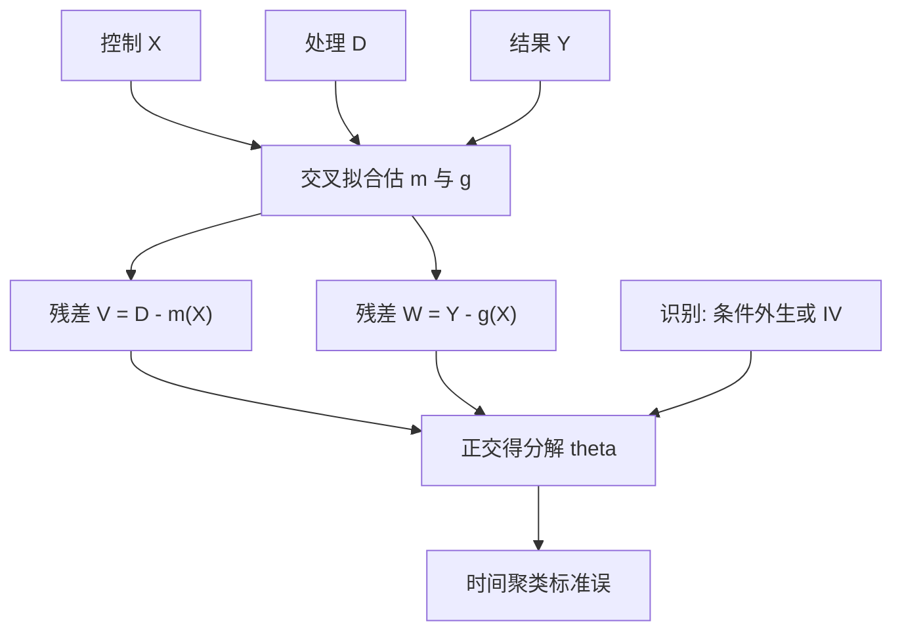

# 双重机器学习 DML

    
目标参数可以在讨厌参数用灵活机器学习估计时仍以根号 n 速率推断，前提是得分对讨厌参数的扰动正交，并且交叉拟合切断了过拟合路径。

    <footer>—— Chernozhukov, Chetverikov, Demirer, Duflo, Hansen, Newey and Robins, Double/Debiased Machine Learning for Treatment and Structural Parameters, The Econometrics Journal, 2018</footer>

资产定价和事件研究经常要估一个低维对象：某个处理的平均效应、某个制度变量的结构系数、在灵活控制了一大堆特征之后「还剩多少」。普通做法是把处理 $D$ 和特征 $X$ 一起丢进正则回归或树，再读 $D$ 的系数。正则、早停和过拟合会把这一系数拉向零或拉向噪声，常规标准误也不再成立。Chernozhukov 等人把半参数计量里的 Neyman 正交与样本分割写成一套可操作的双重机器学习（Double/Debiased Machine Learning, DML）：先用任意好的机器学习估讨厌函数，再在正交得分上对目标参数做低维估计。它回答的是识别与推断，不是又一条截面 alpha。与 [Fama–MacBeth](/quant/fama-macbeth) 的风险溢价、[正则线性](/quant/regularized-linear-alpha) 的预测系数，对象不同。

## 问题

部分线性模型写

$$
Y = D\theta_0 + g_0(X) + U, \qquad D = m_0(X) + V,
$$

其中 $\mathbb{E}[U\mid D,X]=0$，$\mathbb{E}[V\mid X]=0$。$\theta_0$ 是目标，$g_0$ 与 $m_0$ 是讨厌函数。若 $g_0$ 用 LASSO、随机森林或神经网络估计，再把 $Y-\hat g(X)$ 对 $D$ 回归，会留下两块偏差：正则化把 $g$ 估偏，过拟合让 $\hat g$ 吃进一部分 $D$ 的变异。Chernozhukov 等人强调，朴素「ML 控制再读系数」一般达不到 $\sqrt{n}$ 推断。金融截面里 $X$ 动辄上百列、信噪比低，这个问题比教科书回归更尖锐。

处理效应的交互模型同样适用：潜在结果 $Y(d)$，在无混杂 $\mathbb{E}[Y(d)\mid X]=g(d,X)$ 与重叠下，平均处理效应是 $g(1,X)-g(0,X)$ 的期望。讨厌函数变成两个回归和一个倾向得分。DML 的主张不是「用了机器学习所以因果」，而是：在识别假设已经写清楚之后，把讨厌函数的估计误差从目标得分里正交掉。

### 正交得分在防什么

Neyman 正交要求得分 $\psi$ 在讨厌参数的真值处，对讨厌参数的 Gateaux 导数期望为零。直观上，讨厌函数估错一点点，不在一阶改变目标方程。部分线性模型的正交实现是残差对残差：令 $\hat V=D-\hat m(X)$，$\hat W=Y-\hat g(X)$，用 $\hat W$ 对 $\hat V$ 的回归（或相应矩条件）去估 $\theta$。$\hat m$ 把 $D$ 中可由 $X$ 预测的部分拿掉，于是正则化造成的 $g$ 偏差不再通过 $D$ 与 $X$ 的相关泄漏进 $\theta$。这与 Frisch–Waugh–Lovell 是同一几何，只是投影改成了机器学习。

正交不是识别。若 $D$ 在给定 $X$ 后仍与 $U$ 相关——自我选择、反向因果、用同期收益当处理——DML 会给出一个很精确的错误答案。机器学习放大的是控制的灵活性，不是工具变量。

## 方法

**交叉拟合。** 把样本分成 $K$ 折。在第 $k$ 折上，用其余折训练 $\hat g^{(-k)}$、$\hat m^{(-k)}$，只在第 $k$ 折上计算残差与得分，最后把各折的得分堆起来解 $\theta$。这样 $\hat g$ 不曾看见用来构造得分的那一行 $Y$，过拟合路径被切断。Chernozhukov 等人证明：若讨厌函数的均方误差以快于 $n^{-1/4}$ 的速率消失，且得分正交，则 $\hat\theta$ 仍是 $\sqrt{n}$ 正态。树与浅层网络在表格特征上常常可以满足这一速率；深层网络在小样本金融里则不一定。

**金融时间切分。** 独立同分布交叉拟合会把未来日子的 $X$ 模式泄漏给讨厌函数。合法做法是按时间块做交叉拟合，并在标签重叠处 [清洗与禁运](/quant/purge-embargo)，与 [交叉验证泄漏](/quant/cv-leakage-finance) 同一纪律。截面上同一天的股票高度相关，推断应在时间维聚类，而不是把 $N\times T$ 当成独立观测。这与 Fama–MacBeth 用时间序列标准差，精神一致。

### 三种常见得分

1. **部分线性。** 残差对残差，适合「在灵活控制特征后，连续处理的结构系数」。量化里可对应：某项制度持仓、某项已滞后的公司行为，在控制了大量可交易特征后的条件关联——仍须论证条件外生。
2. **交互 ATE。** 分别估 $\hat g(1,X)$、$\hat g(0,X)$ 与倾向 $\hat\pi(X)$，用增广逆概率加权（AIPW）得分。对指数调入、涨跌停制度、融券标的变更这类离散处理更自然，见与[因果树](/quant/causal-tree-heterogeneity)的分工。
3. **工具变量。** 第一阶段与结果方程的讨厌函数都可以 ML 化，正交得分对应去偏的 2SLS。弱工具问题不会因为换了森林而消失。

讨厌函数的算法可以与 [GBDT](/quant/gbdt-alpha) 相同，但验证目标是 $g$ 与 $m$ 的拟合，不是组合夏普。不要用同一验证集去挑能让 $\hat\theta$ 最大的超参。

交叉拟合的折数在 Chernozhukov 等人的推荐里通常是 2 到 5。金融样本短，折太多会让每一折的讨厌函数更噪；折太少则浪费。应预指定 $K$ 与时间块，而不是看 $\theta$ 的 $t$ 值再改。

## 机制

偏差分解可以写成：目标估计量的误差 $\approx$ 正交得分的均值 $+$ 讨厌误差的二阶项 $+$ 过拟合交叉项。正交把第一阶讨厌误差清掉；交叉拟合把「用 $Y_i$ 估 $g$ 再拿 $Y_i$ 算得分」的交叉项清掉。剩下的二阶项由 $n^{-1/4}$ 速率压住。这就是「双重」：去偏一次（正交），再去过拟合一次（交叉拟合）。

与样本分割的朴素版本相比，交叉拟合不浪费一半数据做最终 $\theta$。与双重稳健（Robins 派）的联系是：ATE 的 AIPW 得分在倾向或结果回归有一个正确时仍一致；DML 把其中的函数估计换成 ML，并补上正交与速率条件。量化研究里「双重稳健」常被误写成「两个模型都用了所以稳」——机制是得分的乘积结构，不是模型个数。

### 和预测模型、风险模型不是同一张表

预测模型最小化 $\mathbb{E}[(Y-\hat y(X))^2]$，系数不必有结构含义。[因子归因](/quant/factor-attribution) 把已实现收益拆到载荷乘因子上，也不声称因果。DML 的 $\theta$ 只有在你声明的条件独立或工具有效时才是效应。把 DML 的 $t$ 统计量拿去排因子库，会重新掉进 [多重检验](/quant/harvey-liu-zhu)。正确用法是：预先指定一个处理、一套控制、一个识别故事，然后报告去偏点估计与聚类标准误，并做重叠与指定检验。

重叠失败时倾向接近 0 或 1，正交得分方差爆炸。金融处理（成为某个指数成份、进入融资标的）往往高度可由市值与行业预测，正是重叠最差的区域。应报告倾向分布，而不是只报告一个 $\hat\theta$。

## 边界与工程取舍

DML 不赦免前视。控制变量必须是决策或处理发生时的 [点-in-time](/quant/point-in-time) 版本；用全样本主成分当 $X$，讨厌函数本身已经前视，正交无法补救。标签若是重叠的未来收益，得分的时间相关必须进入推断，简单的「正交所以 $t$ 值可当 $z$」是错的。

不要把所有公司特征都叫做控制。若某一列是处理的下游（处理之后才实现的盈利、处理之后的分析师修正），控制它会挡住一部分效应，估计的是直接效应或被挡掉的偏差。控制集应在识别阶段写死。计算上，每折重训 GBDT 或网络代价高，但那是获得合法标准误的成本；用全样本 $\hat g$ 再对同一行算残差，回到论文明确警告的过拟合路径。

A 股的涨跌停与停牌使 $Y$ 在部分日子不可实现，应把这些观测从结果方程拿掉或单独建模，否则 $g$ 会去拟合不可交易的价格路径。处理若在这些日子无法发生，倾向模型也要反映制度，而不是假装随机指定。

在因子 zoo 上对每一个特征跑一遍「它当 $D$、其余当 $X$ 的 DML」，得到的是一张去偏的相关表，不是一张因果发现表。预先指定处理，否则多重检验会把正交得分的渐近正态吃掉。

## 小结

- Chernozhukov 等人的 DML 用 Neyman 正交得分加交叉拟合，使灵活机器学习估计讨厌函数时，低维目标仍可 $\sqrt{n}$ 推断。
- 部分线性模型的实现是残差对残差；ATE 用增广逆概率加权得分。正交防正则偏差，交叉拟合防过拟合交叉项。
- 识别不由算法提供。无条件外生或无有效工具时，精确的 $\hat\theta$ 仍是关联。
- 金融须按时间块交叉拟合、处理标签重叠与截面相关；控制必须点-in-time，且不能包含处理的下游。
- 出处：Chernozhukov, Chetverikov, Demirer, Duflo, Hansen, Newey and Robins, *The Econometrics Journal*, 2018；正交与双重稳健的前身见 Neyman、Robins 及相关半参数文献。
