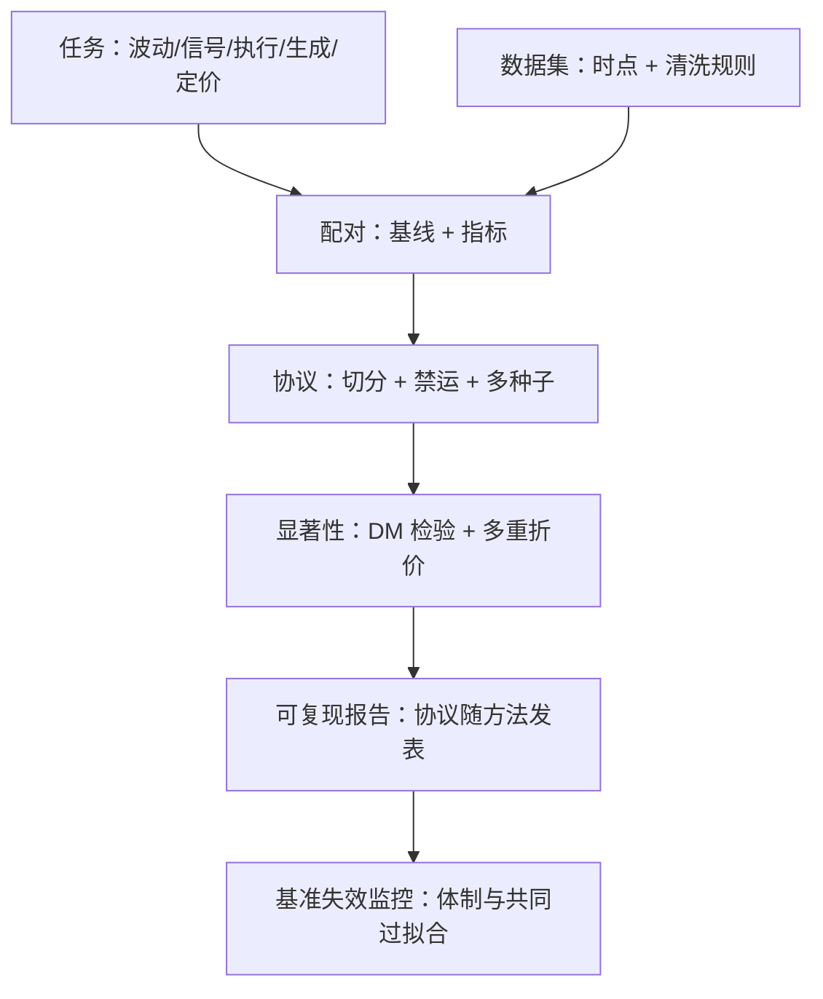

# 基准与数据集

一个方向的成熟度，看它用什么防止自己骗自己：任务钉在预指定的基线上，数据钉在时点上，分数钉在多种子与显著性上——金融深度学习缺的从来不是架构，是这三枚钉子。

<footer>—— 据 Diebold and Mariano, 1995；Bailey, Borwein, López de Prado and Zhu, 2014 整理</footer>

[上一课](/quant/dp-model-risk)把深度管线的模型风险收进治理与台账；治理要有可比的底座，本课给底座：任务基线、数据集与评估协议。没有底座的领域会重复同一个故事：公共基准被反复调参，分数的抬升来自对切分的过拟合而不是方法——[深度 LOB 泄漏](/quant/deep-lob-leakage)课把这条教训点过名，本课把它制度化：每个子领域配一张「任务 × 基线 × 指标」的配对表与一份时点清楚的数据。

## 问题

漂移发生在三个层次。基线漂移：论文只与弱基线比，深度模型打赢随机初始化没有信息量——骨架课的要求是与 BS delta 比，波动率课的要求是与 HAR 比。数据漂移：供应商修订、公司行动与时点错误，让两篇论文用的「同名数据」不是同一分布；回测与实盘的差距常从数据层就拉开。协议漂移：切分方式、损失函数、种子与早停不报告，结果不可复现，跨论文比较退化为口口相传。金融的特殊困难在于：历史只有一条且不可重复，市场体制漂移让任何冻结协议都有保质期，数据昂贵且带许可约束——公开基准因此稀少而珍贵，也因此在被滥用后失真。

### 数据集的三层

公开数据集按层次分：逐档簿数据（FI-2010、LOBSTER 类学术许可）、逐笔行情与报价（TAQ 类、交易所 ITCH 样例）、竞赛数据集（已实现波动预测、市场排序类竞赛赛题）。自建数据的关键不在规模而在时点纪律：[时点数据](/quant/point-in-time)与[无未来函数](/quant/no-future-function)的规则写进数据版本，清洗规则随数据发布——不然同名数据集在不同仓库里是不同动物。

## 方法

配对表逐任务立：波动率预测配 HAR 基线与 QLIKE（[评估协议](/quant/qlike-vol-forecast-eval)）；微观信号配 OFI 线性与经济价值指标；执行配 TWAP/VWAP/AC 与短缺分布；生成模型配签名距离加下游任务（[生成式回测评估](/quant/generative-backtest-eval)）；定价校准配原模型价格差与无套利检查。协议件固定：按日或按期切分加禁运（[禁运与清洗](/quant/purge-embargo)），多种子报分布而非单点，预测比较用 Diebold–Mariano 一类显著性检验，策略层结论加多重检验折价（[deflated Sharpe](/quant/deflated-sharpe)、[SPA](/quant/hansen-spa)）。报告规范：协议与方法一起发表——切分日历、预处理冻结点、随机种子属于方法，不是附录。

## 机制

基准失效的机制与模型过拟合同构：固定基准被社区反复优化，等于把验证集暴露给了整个领域的选择压力——FI-2010 的切分被调过太多次，其上的分数抬升已无法全部归因于方法。对策不是弃用基准而是轮换与分层：留出从未参与竞赛的时段与品种做最终确认，报告里区分「在共同基准上的相对位置」与「在新数据上的绝对表现」。公开数据集是双刃的机制也在此：它把社区的计算统一到一个点上，也把过拟合的能力统一到一个点上。

FI-2010 的教训在深度 LOB 课已点名：公共基准被反复调参后，分数抬升来自对切分的过拟合。任何基准的第一次使用就要预指定切分与基线，把协议与方法一起发表——迟到的纪律救不回已被污染的分数。

## 边界

基准不覆盖容量与成本：基点级的改进在基准上显著、在实盘可能不覆盖冲击——经济价值指标必须与统计指标并列。数据集的代表性是硬边界：美股簿数据上的结论外推到其他市场结构要重新验证，机制可能普适、参数几乎必然不普适。评测结果的有效期与数据窗口绑定：跨期引用旧分数没有意义，体制变更后基线与挑战者要同台重跑。

## 小结

- 三个漂移层：基线、数据、协议；对策分别是配对表、时点纪律、协议随方法发表。
- 每个任务先立基线与指标，再谈架构：HAR、OFI、TWAP/AC、BS delta 各归各位。
- 公共基准会被共同过拟合：留出时段与品种做最终确认，区分相对位置与绝对表现。
- 统计显著与经济价值并列报告；基点级改进过不了成本折价就不算数。
- 出处：Diebold and Mariano, 1995；Bailey, Borwein, López de Prado and Zhu, 2014（deflated Sharpe）；Zhang, Zohren and Roberts, *IEEE TSP*, 2019（FI-2010）。
