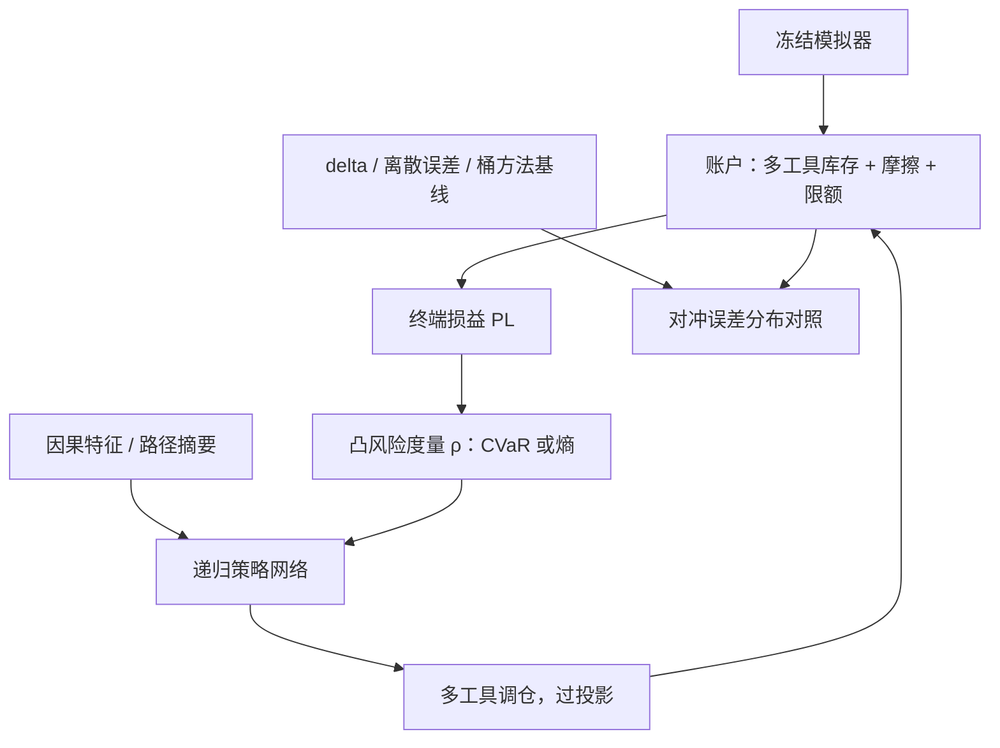

# 深度对冲的深化

骨架课把对冲写成风险度量下的策略学习；深化回答的是账本问题：对冲整本奇异用哪些工具、风险度量是谁的产品、模拟器的小数据降维丢了什么——每一问都把模拟器重新推到台前。

<footer>—— 据 Buehler, Gonon, Teichmann and Wood, Quantitative Finance, 2019；Buehler, Horvath, Lyons, Perez Arribas and Wood, 2020 整理</footer>

[上一课](/quant/dp-generative-calibration)把生成模型收成可冻结交付的模拟器，末尾留了一句警告：下游网络会把伪影当 alpha。本课就是那个下游。[Deep Hedging](/quant/deep-hedging-buehler) 已立好骨架：凸风险度量下训练策略网络、库存进状态、摩擦进环境，与解倒向方程的 [Deep BSDE](/quant/deep-bsde) 分工。本课做深化：从单一支付走到整本账，从单一工具走到对冲工具集的选择，从「给定 $\rho$」走到「$\rho$ 是产品参数」，以及模拟器本身的小数据问题。

## 问题

柜台的现实不是「对冲一个看涨」：一本账里有自动赎回、障碍、亚式，对冲工具是有限的香草与期货。经典做法把账拆进[希腊](/quant/greeks-hedge)桶——vega 分档、vanna 与 charm 单列（[vanna-volga](/quant/vanna-volga) 的启发式）、黏性 delta 换算（[黏性 delta](/quant/sticky-delta-strike)）——再把每桶分给交易台。深度对冲的深化问题不是推翻这套，而是问它切断了哪些耦合：一篮子障碍在同一波动跳动下的联合暴露，桶加和覆盖不了；对冲工具集的选择——用哪些期限的香草、要不要用期货替代——本来是离散决策，桶方法里被默认固化。策略网络把这些重新连起来，代价是全部压在模拟器与 $\rho$ 的选择上。

### 风险度量是产品参数

CVaR 的 $\alpha$ 与熵风险的 $\eta$ 决定网络在尾部情景付多少成本去救：CVaR 只看最差层的平均，网络会放弃躯干去保尾部；熵风险平滑但重罚极端路径。它们不是优化器超参，是销售与资本口径的产品定义——同一个网络结构、不同 $\rho$，就是不同的产品，历史残差不可比。

Buehler 等人 2020 年的「小数据市场模拟器」用签名把有限历史映成情景族，动机正是对冲训练需要的状态空间覆盖。生成器的降维选择直接决定对冲网络能学到什么——丢掉的维度，恰好可能是对冲要用的维度。

## 方法

账本级策略：共享权重的递归网络，每步输入因果特征——各工具库存、已实现波动、[路径摘要](/quant/path-signature-features)、离关键位障碍的距离；输出是对每个对冲工具的调仓，过投影执行限额。对照基线按层排：BS delta 与[离散对冲误差](/quant/discrete-hedge-error)的量化、[对冲频率](/quant/delta-hedge-freq)的效应、桶方法的实际历史残差——深度对冲必须在这些之上按对冲误差的分布（分位数与尾部）交卷，均值改进没有说服力。模拟器来自上一课的冻结交付；训练前再做一轮检查：模拟器覆盖的机制——波动聚集、跳跃、基差联动——是否包含账本的真实风险源，缺哪一项，策略就会在那一项上开出虚假的便宜。

## 机制

多工具下的机制性风险：网络把对冲搬到模拟器里最便宜的工具上，若那份便宜来自错误校准的基差，真实账上就会爆——工具的模拟必须与现货联合校准，这是骨架课的警告在账本级的放大。无交易区从单一工具扩展成逐工具的带状结构，带与带之间通过库存耦合：一只工具的再平衡改变其余工具的状态，网络吃全状态就能表达，吃部分状态就学不出。数据驱动模拟器的小数据问题在此变成对冲问题：降维要按对冲任务的残差验收，不按生成质量验收——生成得像，不等于残差里没有漏掉的风险。

## 边界

报告与训练分层：监管与限额仍说希腊的语言，报告层单独算希腊并接受它不满足经典 PDE 恒等式；训练层不把报告公式写回损失。$\rho$ 在上线前与销售、资本口径一起钉死，训后调整 $\rho$ 等于换产品。再训练与漂移是下一课的治理对象；本课的边界是：整本账的深度对冲不消灭桶方法——桶仍是最好的挑战者与对照语言。

## 小结

- 深化三问：整本账、对冲工具集、$\rho$ 的产品属性；桶方法降级为挑战者与对照。
- CVaR 的 $\alpha$、熵的 $\eta$ 是产品定义，调整即换产品，残差不可比。
- 对冲误差按分布交卷；工具变便宜先查基差校准，再信策略。
- 模拟器的降维按对冲任务验收：生成得像不等于对冲可用。
- 出处：Buehler, Gonon, Teichmann and Wood, *QF*, 2019；Buehler, Horvath, Lyons, Perez Arribas and Wood, 2020；Kolm and Ritter, *Quantitative Finance*, 2019。
