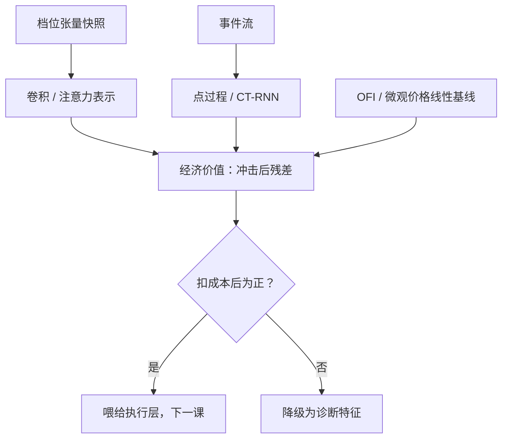

# 深度微观结构信号

微观结构信号不按准确率结算，按扣掉冲击与成本后剩下的分币结算；深度网络的正当性是把 OFI 没写进方程的非线性与跨档结构学出来——前提是它们在样本外还存在。

<footer>—— 据 Cont, Kukanov and Stoikov, Review of Financial Studies, 2014；Sirignano and Cont, Quantitative Finance, 2019 整理</footer>

[上一课](/quant/dp-deep-vol)把深度波动率的口径钉在基线上：与 HAR 同协议、用 QLIKE 交卷。本课把时钟从日频拨到毫秒，对象换成订单流与簿状态本身。[订单流冲击](/quant/ofi-cont)（OFI）与[微观价格](/quant/microprice)是线性时代的答案：几列加权和就能解释短时中点变动的一大块。[DeepLOB](/quant/deeplob-cnn-lstm) 一线把整个档位张量交给卷积与注意力，[Neural Hawkes](/quant/neural-hawkes-orderflow) 把事件流交给连续时间循环网络。本课不重讲这些架构，而是问它们的共同考题：学到的表示在扣掉线性基线、延迟与冲击之后，还剩多少可实现的信号。

## 问题

线性摘要已经拿走了大头：OFI 把最优档的挂、撤、成交合成一个流量，微观价格按队列权重移动中点，[队列失衡](/quant/queue-imbalance-alpha)直接预测短窗方向。深度模型的候选增量有三类：跨档结构（第二档的挂撤如何预示第一档的耗尽）、非线性状态切换（价差从一个 tick 变宽时，同样的流量含义翻转）、事件流的时间记忆（超出状态能解释的自激）。每类都要与状态依赖做嵌套检验——[Neural Hawkes 课](/quant/neural-hawkes-orderflow)的口径原样适用：加入队列与价差状态后增益消失，说明学到的是状态不是记忆。更大的缺口在目标定义：中点方向准确率的天花板由价差几何决定（[深度 LOB 泄漏](/quant/deep-lob-leakage)的警告），诚实的评测要落到经济价值——这个信号若喂给执行层，能省下多少成本。

### 经济价值的算法

信号的价值不是准确率乘波动，而是：给定同一执行任务，用信号与不用信号各付多少[实现短缺](/quant/implementation-shortfall)，差值再扣模型本身的成本。短窗信号的用途天然在执行侧而非持仓侧：毫秒到秒级的预测衰减太快，装不进日频组合。

Sirignano 与 Cont 用同一架构跨多只股票训练，发现簿的局部特征相当「普适」。但普适的是条件结构，不是超额：跨券可迁移，不等于扣完成本还是正的。

## 方法

表示分两条流水线：快照流（档位张量）走卷积或注意力，事件流（限价、撤、成交）走点过程或连续时间 RNN，两者可拼接。标签按用途倒推：喂执行层就标「未来数笔内中点相对最优价的改进」，并按价差与深度状态分层报告——薄档与厚档、窄价差与宽价差分开交卷，混在一起的平均值掩盖的正是深度的条件结构。基线三件套必须同协议在场：OFI 线性回归、微观价格增量、恒预测。特征工程不因有网络而豁免：成交签名先按 [Lee–Ready](/quant/lee-ready) 或[批量体积分类](/quant/bulk-volume-classification)对齐，异常单与心跳剔除的规则写进数据管道——这些脏活的疏漏比架构选择更常决定成败。

## 机制

为什么非线性可能真实存在：簿是状态机，价差与队列深度决定同样的订单流被解读成「耗尽前的补量」还是「知情撤退」，线性模型给不出这个切换；跨档替代与恢复也有真实的阈值结构。为什么它常常是假的：短窗信号与冲击同源——主动单既推动中点也搬走价格，模型在中点上赢的，正是要在执行里付出去的；回放数据里学到的「可预测性」还建立在自己不在场的假设上，自己参与后开环统计立即失效，这是[交易 MDP 陷阱](/quant/trading-mdp-pitfalls)的第一条。所以评测的最后一步必须过冲击模型，而不是停在信息系数。

## 边界

本课不写执行策略本身——信号到动作的转换是下一课的对象；也不做生成式仿真——拟合簿的测度交给定价单元。延迟是硬边界：馈源延迟几十毫秒，信号的全部增量可能恰好是延迟的镜像，[深度 LOB 泄漏](/quant/deep-lob-leakage)的时间戳审计在此强制执行。开环评估的有效性以「自己不参与」为前提；任何把信号装进策略的说法，都要等执行课的闭环口径。

## 小结

- 深度微观信号的增量候选：跨档结构、价差状态切换、事件流记忆；逐项与线性基线嵌套比较。
- 评测终点是经济价值：同任务下执行成本的节省，不是中点方向准确率。
- 信号与冲击同源，信息层赢下的常常就是执行层要付的。
- 表示分快照流与事件流两条；数据清洗与签名对齐先于架构。
- 出处：Cont, Kukanov and Stoikov, *RFS*, 2014（OFI）；Sirignano and Cont, *Quantitative Finance*, 2019；Zhang, Zohren and Roberts, *IEEE TSP*, 2019（DeepLOB）。
