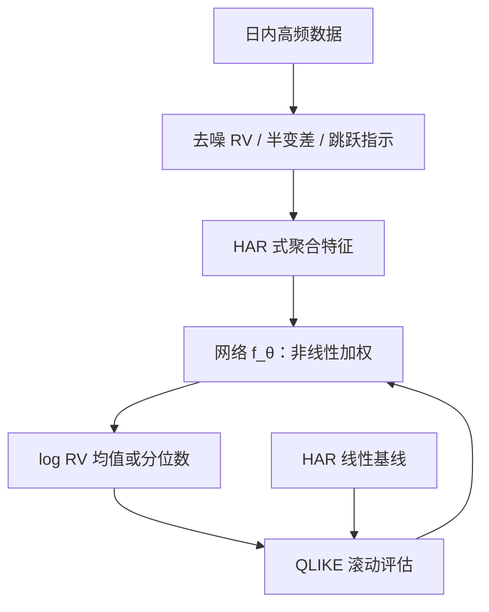
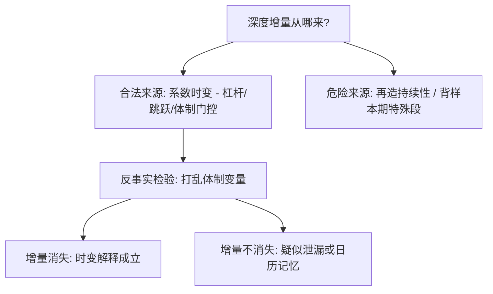

# 深度波动率模型

波动率是深度学习在金融里最诚实的第一站：对象持久、连续、可测的代理一大把——难处从来不是让网络输出一个数，而是证明这个数比一条线性回归多学了什么。

<footer>—— 据 Corsi, Journal of Financial Econometrics, 2009；Hansen and Lunde, Journal of Business and Economic Statistics, 2005 整理</footer>

[上一课](/quant/fml-map)把金融机器学习的失败模式收成十份对账单：特征哈希、标签四元组、$N$ 台账，每站一份契约，失败的共同根是「局部看起来在进步」，训练与实盘必须读同一个真相——深度模型在定价与信号上的延伸留给下一门课程。本课是「深度学习与定价深化」的第一课，把这套管线纪律搬到金融里最持久的对象——波动率。[GARCH](/quant/garch) 与 [HAR](/quant/har-rv) 已经把容易的分拿走：波动率高自相关，一条「日、周、月平均已实现波动」的线性回归，样本外水平就很难大幅超越。本课程从信号走到定价与验证，第一单元三课都在问同一件事：深度模型的增量扣掉基线与成本还剩什么。本课先钉波动率信号的建模口径。后课默认已经读完本课。

## 问题

目标写清楚才谈得上增量：给定截至 $t$ 的信息，预测下一期已实现波动的条件期望或条件分布。已实现波动用日内高频数据估计，本身带微观结构噪声，[已实现核](/quant/realized-kernel)先去噪再聚合；对数变换把它拉回近似高斯，网络学 $\log \mathrm{RV}$。缺口有两个。其一，非线性增量藏在哪：线性 HAR 的系数是常数，而杠杆效应（负收益抬波动）、跳跃、价差体制都让系数随时段与状态漂移——网络要学的正是时变加权，不是再造持续性。其二，损失选错全盘错：$\mathrm{RV}$ 上的均方误差被高波动期主导，而波动率预测的真实用途——期权定价、目标波动组合——看重的是低波动处的相对误差，QLIKE 一类稳健损失才对齐下游，见[波动率预测评估](/quant/qlike-vol-forecast-eval)。

术语翻译：HAR（异质自回归）就是用「昨天、上周平均、上个月平均」三个已实现波动做一条线性回归来预测明天；它是波动率预测的及格线，深度模型先赢它再说话。

### 基线纪律

任何深度波动率模型的第一张成绩单是它与 HAR 的差。[HAR 预测](/quant/har-rv-forecast)的滚动评估协议原样搬用：按时间滚动、预测期不重叠、超参只在验证段选一次。深度模型的增量若只有几个百分点且过不了显著性检验，结论是「线性已够」——这不是失败，是记对了账本。

数字实例：QLIKE 上 2% 的「提升」，可能还抵不过 7 年滚动样本自带的估计噪声；过不了 Diebold–Mariano 一类显著性检验时，该记下的结论是「线性已够」，而不是「回去再调调参」。

Hansen 与 Lunde 2005 比较了三百多个波动率模型，几乎没有能在样本外稳定胜过 GARCH(1,1) 的。这条老结论是深度波动率研究的定价基准：你的对手先是一条线性回归，然后才是 Transformer。

## 方法

输入用已实现测度族而非原始价格：去噪 RV、上下[半变差](/quant/realized-semivariance)（把涨跌不对称交给特征而不是指望网络自己发现）、[跳跃检验](/quant/bn-jump-test)的指示量、价差与成交量摘要。结构上，HAR 特征过一个小网络（非线性 HAR）往往比端到端序列模型更稳；时序深度模型的优势要在多资产联合训练、体制条件化上才兑现。目标按用途选：目标波动组合吃条件均值，期权做市吃分布——分位数输出让网络直接交波动率分布，不必从均值方差硬凑。[粗糙波动](/quant/rough-vol)的尺度律——对数波动增量的标度指数在 $0.1$ 附近——可以当先验或预训练任务：模拟路径上预训练、真实数据上微调合法，但模拟器的测度与频率要写明。

## 机制

深度增量之所以可能存在，机制在系数的时变性：线性模型把杠杆、跳跃、流动性枯竭摊成常数斜率，网络用门控与注意力把它们拆开——高波体制下昨日权重占先、平静期上周均值占先。这套解释要经得起反事实：把体制变量打乱，增量应当消失；消失不了，增量多半来自泄漏或对日历的记忆。危险机制同样清楚：持续性让朴素外推已接近最优，多出的容量最先去背样本期的特殊段——这正是同协议评估要拦住的事。

深度增量「从哪来、怎么验」可以画成一张对照：

常见误区：容易以为「模型更大就学得更多」。在波动率上，朴素外推（明天约等于今天）已经接近最优，多出的网络容量最先去背样本期的特殊段——过拟合的方向不是「学不动」，而是「学过头」。

## 边界

本课在 $\mathbb{P}$ 测度上做信号：预测的是未来将实现的波动，不是风险中性测度下的隐含波动曲面——后者是定价问题，交给生成校准课；[隐含与已实现](/quant/iv-vs-rv)之差是研究对象，不是同一物。增量要过两道折价才可上策略：统计显著性与经济价值——预测好一档不等于策略多赚；只报 QLIKE 提升不报策略意义，是停在信号层。数据窗口本身是模型决策，体制变更会让冻结的模型整体失效。

## 小结

- 深度波动率模型的对象是 $\log\mathrm{RV}$ 的条件均值或分布，输入是去噪后的已实现测度族。
- 基线纪律第一：与 HAR 同协议、QLIKE 交卷、滚动加禁运；增量先过显著性再谈用途。
- 非线性增量的合法来源是系数的时变：杠杆、跳跃与体制，不是再造持续性。
- 本课是 $\mathbb{P}$ 测度信号；隐含波动曲面属定价单元，两种波动不可混算。
- 出处：Corsi, *Journal of Financial Econometrics*, 2009（HAR）；Hansen and Lunde, *JBES*, 2005；Patton, 2011（QLIKE）。
