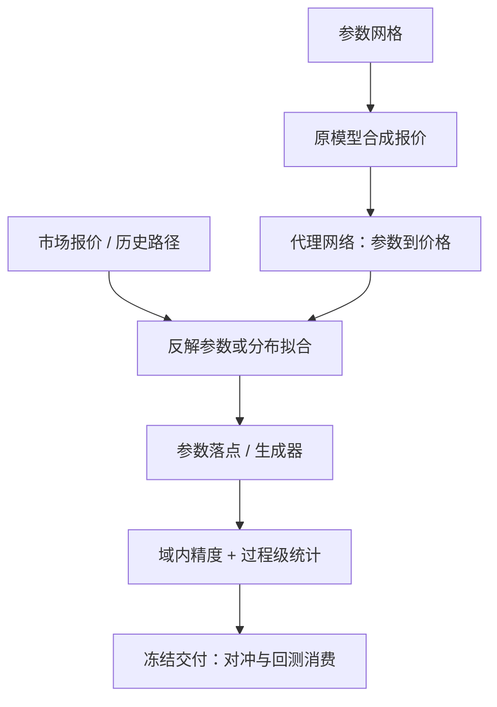

# 生成模型校准市场

校准的对象从十几个参数搬到了整条路径测度：不再只问「哪个模型贴近这张报价」，而问「哪个生成器长出与市场同分布的情景」——代价是验证从残差平方变成了分布距离加下游任务。

<footer>—— 据 Horvath, Muguruza and Tomas, Quantitative Finance, 2021；Wiese et al., Quantitative Finance, 2020 整理</footer>

[上一课](/quant/dp-rl-execution-deep)把执行 RL 收在环境构造上：策略的上限由仿真器的保真度决定。信号单元到此走完，课程进入定价与验证单元；第一件事是把「环境从哪来」从工程问题升格为建模问题。[局部波动](/quant/dupire)与[随机波动](/quant/stochastic-volatility)的经典校准把测度压进少数参数，病态时靠[正则化](/quant/calibration-regularization)稳住；深度学习从两个方向改写这条链：把校准映射本身学成代理，或把市场直接学成生成器。本课写这两种「校准」各校的是什么、误差记在哪本账上。

## 问题

第一个方向是代理校准：参数模型不变，变的是求逆的速度。训练网络学会「参数到价格或隐含波动」的正映射，市场报价进来后对网络反解参数——分钟级的数值优化降到毫秒级前向。难点在覆盖与精度：网络在训练参数域内插值极好、域外静默外推，落点检测与回退数值优化必须写进流程。第二个方向是生成校准：[Market Generator](/quant/market-generator-vae)、[Sig-Wasserstein GAN](/quant/sig-wasserstein-gan) 与 [Neural SDE](/quant/neural-sde) 三条路线直接拟合路径测度，输出可抽样的情景族。测度纪律在这里最先崩：$\mathbb{P}$ 上训出的生成器长出的是「像历史的情景」，不是定价用的风险中性情景；拿 $\mathbb{P}$ 样本平均支付当价格，错得系统而无声。

### 两本误差账

代理校准的误差是「与原模型价格差多少」，对照物是参数模型自己；生成校准的误差是「与真实市场分布差多少」，对照物是留出的真实路径。两本账不能混着报：用分布距离小去担保报价精度，或用贴报价去担保情景质量，都是记账错误。

## 方法

代理校准的配方：在参数网格上用原模型生成大量合成报价与目标——价格、希腊、隐波——训练网络逼近映射；精度验收用域内留出参数与域外落点检测两件套。

Horvath、Muguruza 与 Tomas 的两步法：先在参数网格上生成数十万级合成报价，再训网络学「参数到价格」，把波动率模型校准从分钟级数值优化降到毫秒级前向。精度以合成域内为准——落点出域，先检测再回退数值校准。生成校准的配方：损失用签名 Wasserstein 或似然项，硬约束（正价格、无套利边界）用结构与投影施加，不指望损失自己学会；条件化——体制、宏观状态——进编码器与解码器两端，条件统计先于生成统计。验证走[生成式回测评估](/quant/generative-backtest-eval)的协议：过程级统计（自相关、杠杆、波动聚集）加下游任务稳定性——策略排名随生成器种子要稳定。交付前冻结：生成器冻结之后，下游的对冲、风控与回测才许开始训练。

## 机制

代理可行，机制在光滑性：价格对参数的映射在合理参数域内是光滑的，插值正是网络的强项；风险全在域外，所以覆盖与检测比容量重要。生成校准的机制变化更深：经典校准用几十个报价钉住一族测度，生成校准对齐的是整段过程的矩结构——匹配到二、三阶签名，杠杆与波动聚集才被迫出现。但无套利不由损失保证：生成器可以长出自相交的簿或负蝶式的曲面，下游网络会把这类伪影当成 alpha 吃掉，这是[深度对冲](/quant/deep-hedging-buehler)课预先警告过的接缝，下一课正面处理。

## 边界

生成器不替换生产定价器：香草曲面的日常报价仍归参数模型与数值法，生成校准的价值在路径依赖、压力情景与「一条历史不够用」的下游。小数据是硬边界：单条历史切窗带来的伪复制，窗口方案要写进实验记录，危机段单独条件化。校准对象变了，误差预算要重立：从贴报价的点误差，换成分布距离与下游决策稳定性的双指标——预算随用途定，不随架构定。

## 小结

- 深度校准两形态：代理（学参数到价格的映射换速度）与生成（直接拟合路径测度换情景）。
- 两本误差账分开记：域内贴模型精度，分布距离对留出路径。
- 测度纪律先行：$\mathbb{P}$ 生成器产情景，$\mathbb{Q}$ 定价归参数模型，混用即系统性错误。
- 硬约束用结构施加；验证含过程级统计与下游稳定性，交付前冻结。
- 出处：Horvath, Muguruza and Tomas, *Quantitative Finance*, 2021；Wiese et al., *Quantitative Finance*, 2020（Quant GANs）；Kondratyev and Schwarz, *Risk*, 2019。
