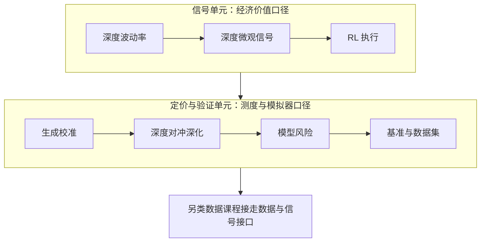

# 深度定价收束

深度学习没有取消金融模型的任何一问——测度是谁、模拟器可信吗、失效谁先知道——它只是把答案从方程搬进了管线；这门课的任务是搬家之后每个问题仍有人回答。

<footer>—— 据 Buehler, Gonon, Teichmann and Wood, Quantitative Finance, 2019；Ruf and Wang, Journal of Computational Finance, 2020（综述）整理</footer>

[上一课](/quant/dp-benchmarks-datasets)把基准、数据集与协议钉成底座。本课收束全课程：把八课重排成一张地图，重申贯穿口径，交还边界。下一门课程会从信号与数据的接口接走这套管线，那是另类数据的事。本课程到此收束。

## 问题

八课要收的是两条主线。信号单元（前三课）给的是经济价值口径：[深度波动率](/quant/dp-deep-vol)对 HAR 与 QLIKE 交卷，[深度微观信号](/quant/dp-deep-micro-signals)对线性基线与冲击成本交卷，[RL 执行](/quant/dp-rl-execution-deep)对解析基线与短缺分布交卷——三课共享一个判据：扣掉基线与成本之后剩下的才叫增量。定价与验证单元（后五课）给的是测度与模拟器口径：[生成校准](/quant/dp-generative-calibration)立起测度纪律与两本误差账，[深度对冲深化](/quant/dp-deep-hedging-deep)消费冻结的模拟器并把 $\rho$ 钉成产品参数，[模型风险](/quant/dp-model-risk)与[基准数据集](/quant/dp-benchmarks-datasets)把验证制度化。

## 方法

方法是收束而不新增：把八课按「信号单元—定价与验证单元」两条主线重排成一张读序地图，每课只保留三样东西——它交卷的判据、它消费的上游、它留给下游的接口；各课结论仍以各自课内的验收为准，本课不重新计分。地图之后重申三条贯穿口径，边界只做重申、不做扩展。

### 一张地图

按读序：

- [深度波动率模型](/quant/dp-deep-vol)：$\mathbb{P}$ 测度信号，基线先于架构。
- [深度微观结构信号](/quant/dp-deep-micro-signals)：增量对成本结算，快照流与事件流并行。
- [强化学习执行的深入](/quant/dp-rl-execution-deep)：环境构造决定策略上限，解析基线同台。
- [生成模型校准市场](/quant/dp-generative-calibration)：代理与生成两形态，测度纪律先行。
- [深度对冲的深化](/quant/dp-deep-hedging-deep)：整本账、工具集、$\rho$ 即产品。
- [模型风险](/quant/dp-model-risk)：配方即模型，判据前置。
- [基准与数据集](/quant/dp-benchmarks-datasets)：配对表、时点纪律、显著性。

## 机制

把八课压成一个视角：深度学习把「模型」的边界从方程外扩到管线——数据窗口、表示、损失、模拟器、种子都是模型的一部分。三条贯穿口径由此而来。基线先于架构：HAR、OFI、TWAP/AC、参数校准、BS delta，每个任务的第一对照都是解析或线性时代留下的最强基线，深度增量在它们之上计量。测度先于用途：$\mathbb{P}$ 信号、$\mathbb{Q}$ 定价、对冲在哪个测度下训练，交付前写明，混用即系统性错误。验证先于部署：冻结、留出、支撑检测、多种子与显著性、台账与失效判据——部署是验证的下游，不是研究的下游。

Ruf 与 Wang 的综述清点了上百篇神经网络定价与对冲论文，比较协议几乎互不兼容。本课程的口径——基线、测度、冻结、台账——正是为「跨论文比较不可信」这个事实准备的。

## 边界

收束课不新增机制，边界重申三条。其一，深度增量是条件性的：它兑现于约束更真实、维度更高、解析形式够不着的地方，不是无条件超越；基线够用的地方不必上网络。其二，增量要同时过统计与经济两道折价，基点级改进覆盖不了成本就不算数。其三，管线每层都是失效点：数据、生成器、网络、$\rho$ 的选择——深度不减少模型风险，只改变它的形状；治理的问询不变，变的只是被问询的对象。深钻层继续向后延伸：下一门课程带着这套管线口径走进另类数据。

## 小结

- 两条主线：信号单元的经济价值口径；定价与验证单元的测度与模拟器口径。
- 一个视角：模型的边界外扩到管线，数据、损失、模拟器与种子都是模型。
- 三条口径：基线先于架构、测度先于用途、验证先于部署。
- 增量是条件性的：在解析够不着的维度兑现，过不了两道折价就不算数。
- 出处：Buehler, Gonon, Teichmann and Wood, *QF*, 2019；Ruf and Wang, *Journal of Computational Finance*, 2020；Wiese et al., *Quantitative Finance*, 2020。
