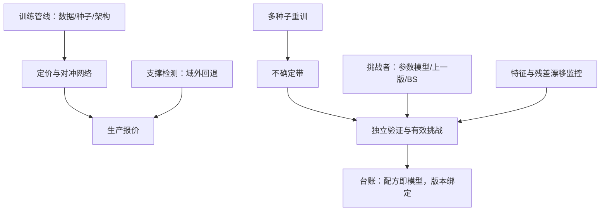
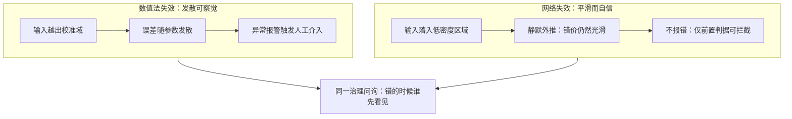

# 模型风险

深度定价把「模型」从一组方程搬成一条管线：数据、架构、种子、损失与模拟器都是模型的一部分——风险的对象跟着搬家，治理的问询却一字不改：谁挑战了它，失效时谁先知道。

<footer>—— 据 Board of Governors of the Federal Reserve System, SR 11-7, 2011；Cont, Mathematical Finance, 2006 整理</footer>

[上一课](/quant/dp-deep-hedging-deep)把整本账的对冲交给网络与冻结的模拟器。至此定价、校准、对冲三条链上都站着神经网络；本课问治理。[模型风险](/quant/derivative-model-risk)的经典对象是方程与参数：同一个头寸，换一族测度或一组相关系数，价格动多少；[SR 11-7](/quant/sr-11-7-model-risk) 把治理收成两条——有效挑战与独立验证。深度管线把这些对象全部替换：方程换成训练管线，参数换成权重与配方。框架仍适用，因为框架问的从来不是「方程长什么样」，而是「错的时候谁先看见」。

## 问题

深度管线特有的失效面有四层。其一，训练随机性：种子、初始化与数据顺序让同一条管线重训两次给出不同的价格与对冲——「这个模型的价格」本身是一个分布。其二，外推：网络在训练支撑内插值、支撑外静默外推，报价落出校准域时错误不发散、只「看起来合理」，比数值法发散的错更难察觉。其三，复合误差：系数网络、解算器、对冲网络层层叠加，[PINN 课](/quant/pinn-option-pricing)的冻结纪律是特例，一般情形是每层的误差谱互不相知。其四，基准模糊：「正确的价」依赖上一课选定的模拟器与 $\rho$——挑战者模型的地位更难立，因为连参照系都是模型。

Cont 2006 把模型不确定写成一族测度上的上期望。深度时代「一族测度」变成「种子 × 架构 × 数据窗口」的网格：枚举更难，但「把不确定带报出来」这一要求一字未变。

「报价是一个分布」代入数字：同一条管线换 20 个随机种子重训，某期权报价在 10.32 到 10.51 之间散开，极差近 20 个基点。这个极差不是 bug，而是管线对种子的敏感度，应当作为不确定带随报价一起交付，而不是只报一个点。

## 方法

验证协议按失效面逐条立。随机性：固定预算内多种子重训，输出分布当不确定带；带太宽本身是发现——说明管线对无关细节敏感。外推：输入落在训练支撑之外的检测器与回退路径（回数值法或参数模型），域外不报价是默认策略。复合：每层冻结后单独验证，误差谱分层记账。挑战者制度保持经典形态：参数模型（Heston、局部波动）、上一版网络、极简基线同台报价，分歧超阈值的头寸进人工清单。治理件：[模型台账](/quant/model-risk-inventory)记训练配方——数据窗口、清洗规则、种子、超参、早停点——配方即模型，版本与回滚绑定；上线后监控特征分布与残差的双重漂移；失效判据（价格误差、对冲误差分位、希腊一致性）在上线前钉死，不由事后解释权决定。

## 机制

深度把模型风险变得更集中而非更分散：失效模式从「发散可察觉」变成「平滑而自信的错误」——网络穿过无套利边界时不会报错，只会给出一条光滑的错价曲线；低密度区域的插值带着训练域内的自信。这解释了为什么治理框架一字不改反而更必要：有效挑战的本质是「另一个独立视角必须能否决它」，而独立视角——数值法、参数模型——恰好是深度管线最容易缺的东西，因为整条管线都是学的，没有一层是推的。失效判据前置的机制理由相同：后验地给一条光滑错价找理由太容易，判据必须在上线前变成数字。

两种失效形态的差异与各自被谁拦截：

「平滑而自信的错误」可以想象成一名背题型的学生：题目稍加伪装，他仍笔不停挥地写出工整的错误答案；数值法则像不会做就留白，错误可见。正因如此，拦住深度管线的只能靠考前定好的评分标准——上线前钉死的失效判据。

## 边界

两个上限不可消除：备选模型无法枚举——Cont 的测度族选择本身是模型决策，种子网格只是近似；回测样本对低频事件永远太短——深度管线在「没见过的危机」上的表现没有历史证据，只能靠压力测试与情景外推替代实证。「数据驱动」不豁免：数据窗口、清洗规则、标签定义都是模型决策，全部进台账；管线里没有无主的部分。

初学者容易以为「数据驱动」就能免责：行情数据是真的，所以模型没有假设。实际上窗口取多长、异常值怎么清洗、标签如何定义，全是人为决策——这些决策错了，再真实的数据也救不回来，所以必须逐项写进台账接受检查。

## 小结

- 深度管线的四层失效面：训练随机性、静默外推、复合误差、基准模糊。
- 验证逐条立：多种子不确定带、域外检测与回退、分层误差谱、挑战者同台。
- 配方即模型：数据窗口、种子与早停点全部进台账，版本与回滚绑定。
- 失效判据上线前钉成数字；光滑的错价不报错，只能靠前置判据拦截。
- 出处：Federal Reserve SR 11-7, 2011；Cont, *Mathematical Finance*, 2006；Ruf and Wang, *Journal of Computational Finance*, 2020（综述）。
