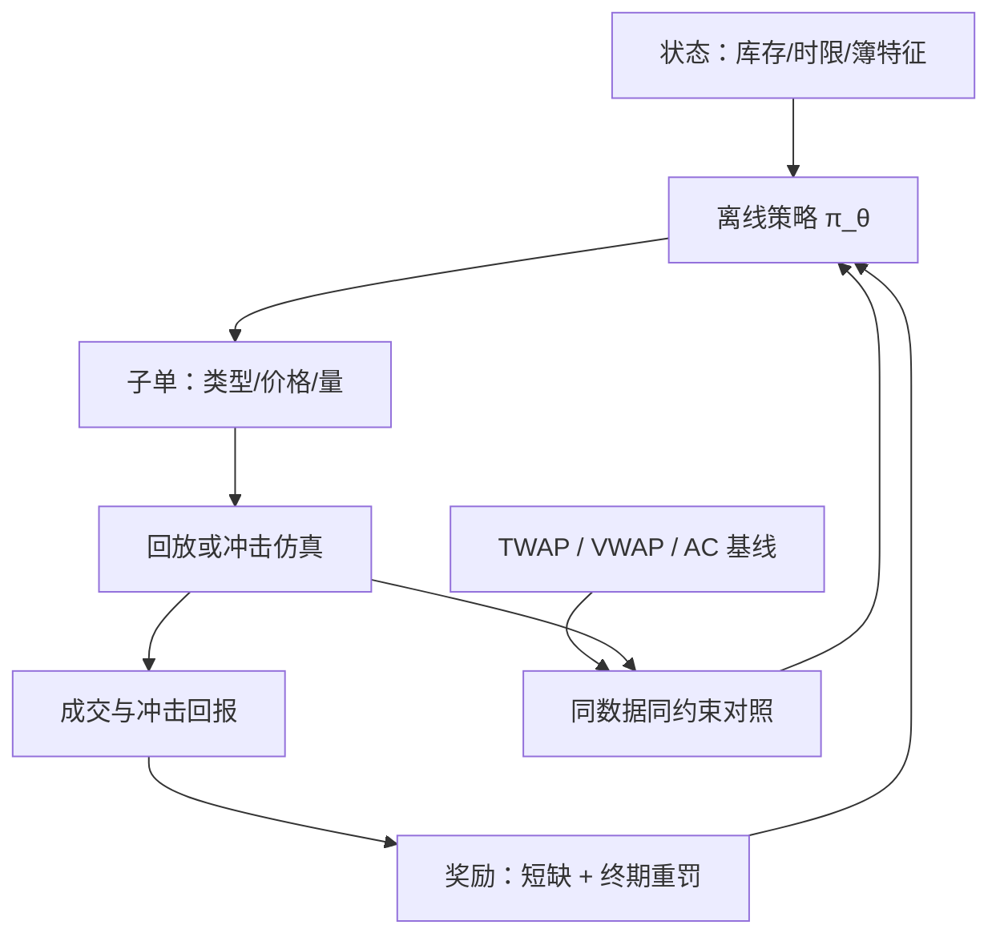

# 强化学习执行的深入

执行的基准从来不是「赚最多」，而是同一落地风险下少付成本；强化学习在这里替换的不是交易员，是线性二次假设本身。

<footer>—— 据 Nevmyvaka, Feng and Kearns, ICML, 2006；Dabérius, Granat and Pakkanen, Quantitative Finance, 2020 整理</footer>

[上一课](/quant/dp-deep-micro-signals)把微观结构信号的成本口径钉住：信号值多少，要扣掉冲击之后才算。本课把信号换成动作：执行是微观结构里第一个正面回答「我的订单会改变环境」的控制问题。[Almgren–Chriss](/quant/almgren-chriss) 在线性冲击与二次风险的世界里给出最优切片；[强化学习执行](/quant/rl-execution)早已把这个问题搬进马尔可夫决策过程；报价侧的竞争版本见[强化学习做市](/quant/rl-market-making)。本课做深化：状态与动作怎么设计、环境从哪来、策略必须与哪些解析基线对照才算数。

## 问题

线性二次框架的三条假设在真实簿上都绷得紧：冲击是临时加永久两项、线性于成交速率；市场参数静态已知；订单只有连续量。真实执行面对的是：冲击依赖簿密度与价差状态（上一课的条件化口径）、限价与市价是离散且带成交概率的选择、剩余时间是硬约束、对手算法在适应。强化学习换掉的是「策略空间受解析形式约束」这一条——代价是把模型假设从方程挪进环境：环境怎么造，策略的上限就在哪。金融没有可交互的物理环境：历史回放不响应你的订单，生成仿真引入设定误差，在线试错在真金白银上不可行。这是执行 RL 与游戏 RL 的根本差别，也是方法选择的出发点。

### 状态、动作与奖励的设计

状态收进：库存、剩余时间、价差与深度、近期订单流失衡、已付冲击；动作是子单的类型、价格层级与数量；奖励用相对[到达价](/quant/arrival-price)的实现短缺，加终期未清库存的重罚——让拖到最后市价清算的代价显式化。奖励塑形改变问题本身：把成交概率加进奖励，策略会学出挑软柿子成交的伪影；延迟到期的信用分配见[延迟奖励](/quant/delayed-reward-trading)。

Nevmyvaka、Feng 与 Kearns 2006 的训练环境是历史 TAQ 回放，比较的是相对基准的执行改进，不是绝对盈利；环境里没有自己冲击的位置，结论只覆盖限价放置这一小步动作。环境登记从此是执行 RL 交付物的一部分。

## 方法

环境三条路：历史回放最保守、零冲击反事实，适合限价放置这类小额动作；解析冲击模型（[Obizhaeva–Wang](/quant/obizhaeva-wang) 型暂态加永久冲击）可控可解释，检验策略对冲击形态的敏感度；撮合仿真（[ABIDES](/quant/abides-simulation) 一类事件级环境）最真实也最贵。训练用离线方法——拟合 Q 或带约束的策略学习——因为在线探索不可行；对环境的每一处简化都要登记，交付时随策略冻结，[仿真到实盘](/quant/sim-to-real-trading)的缝不是稳健性检查，是验收项。对照协议：同一数据、同一约束下与 TWAP/VWAP、Almgren–Chriss 切片及朴素分批同台，报实现短缺的分布而不只均值——RL 的优势若只在尾部情景，均值对照会抹掉它。

## 机制

学出的策略要能被存货逻辑解读：无交易区（价差贵、时限宽时不动）、限价与市价的切换随紧急度移动、临终加速清算。这些与解析解的定性一致，是「学对了问题」的证据。反过来，若策略的收益集中在回放器的人造可预测性上——比如对固定刷新节奏的反应——那是仿真伪影，不是执行智能。深度网络的真正增量在状态依赖：把冲击系数做成上一课那类条件函数后，最优切片随簿状态实时变形，这是线性二次闭式给不了的；但增量越大，对环境的依赖越深，验收越要按[部分可观测](/quant/pomdp-fills)的口径，把看不到的量——隐藏量、对手意图——排除出状态幻觉。

## 边界

执行 RL 的合法目标是基准改进，不是在执行层找方向性 alpha——观点属于组合层，混进来会把评测污染成回测过拟合。做市是相邻问题：双侧报价、赚价差付逆向选择，状态与合法动作都不同，结论不可平移。延迟、限额与合规写成动作掩码与硬约束，不进奖励——「学合规」等于允许网络在训练分布里找绕开的路径。

## 小结

- 执行 RL 换掉的是线性二次假设；环境构造决定策略上限，模型假设从方程挪进仿真器。
- 状态含库存、时限与簿特征；奖励以到达价短缺加终期重罚，塑形项即问题定义。
- 环境三条路：历史回放、解析冲击、事件级仿真；简化登记，交付时随策略冻结。
- 对照协议：同数据同约束对 TWAP/VWAP/AC，报短缺分布；学出的结构要能被存货逻辑解读。
- 出处：Nevmyvaka, Feng and Kearns, *ICML*, 2006；Dabérius, Granat and Pakkanen, *Quantitative Finance*, 2020；Almgren and Chriss, 2000。
