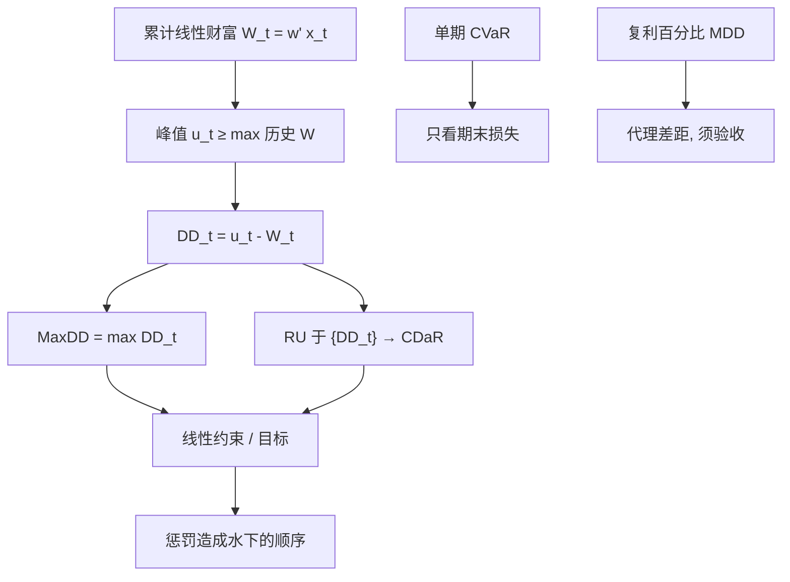

# 回撤约束优化

    
把净值从峰值下落的路径写进凸约束，最小化的就不再是对称方差或单期尾巴，而是样本路径上允许的水下深度；条件回撤风险是把 CVaR 用到回撤过程上。

    <footer>—— Chekhlov, Uryasev and Zabarankin, Drawdown Measure in Portfolio Optimization, International Journal of Theoretical and Applied Finance, 2005</footer>

[最大回撤与 Calmar](/quant/drawdown-calmar) 一文写 MDD 作为评价统计、抽样性质与不要把历史最深一次「优化掉」。[CVaR 优化](/quant/cvar-opt) 与 [RU 表示](/quant/cvar-ru-opt) 写单期损失的凸尾巴。本篇写**把回撤过程本身当作优化对象**：未复利财富上的回撤线性于权重，Chekhlov–Uryasev–Zabarankin 的 CDaR 把 RU 套到回撤路径上，最大回撤、平均回撤、条件回撤是同一族约束的不同 $\alpha$。它补的是路径约束，不是再定义一遍 Calmar。

## 问题

单期 CVaR 不读顺序：把坏日子排在样本开头或末尾，CVaR 不变，账户是否穿强制平仓可以变。委托合同、融资与心理止损吃的是峰值到谷底的路径。把 $\max_t\mathrm{DD}_t(w)\le\delta$ 或 $\mathrm{CDaR}_\alpha(w)\le\delta$ 写进可行集，组合必须在**给定的那一条（或那一批）路径**上控制水下。问题立刻是路径的代表性：约束钉死的是样本里已经看见的峰谷顺序，下一危机的顺序可以不同。这与单期 CVaR 过拟合「最坏那几天」同构，只是过拟合的对象从截面尾巴换成了时间顺序。

第二问题是凸性。对数净值、复利财富的回撤对 $w$ 一般非凸。文献与可解 LP 用的是未复利（或单期加权累加）财富 $W_t=w^\top R_{1:t}^{\mathrm{cum}}$，回撤 $\mathrm{DD}_t=\max_{s\le t}W_s-W_t$ 对 $w$ 凸（作为凸函数的点态最大与线性的差）。复利账户的真实 MDD 与这个代理有差距，杠杆与再投资越大差距越大。必须声明优化的是哪一种财富，不能把 LP 的最优值当成对数净值 Calmar 已经受控。

### 回撤过程上的三类标量

未复利路径 $\{W_t(w)\}$，

$$
\mathrm{DD}_t(w)=\max_{0\le s\le t}W_s(w)-W_t(w).
$$

**最大回撤** $\mathrm{MaxDD}=\max_t\mathrm{DD}_t$，对应 $\alpha\to 1$ 的极端。**平均回撤**是 $\mathrm{DD}_t$ 在 $t$ 上的均值。**条件回撤风险** $\mathrm{CDaR}_\alpha$ 是回撤过程的 CVaR：对最坏的那一段 $(1-\alpha)$ 时间上的回撤取平均（RU 意义下）。α 低则接近平均水下，α 高则接近 MaxDD。一族约束用同一个辅助变量装置，只改尾巴深度。Chekhlov 等人证明在未复利设定下这些都是凸的，可进线性规划。

评价用的 MDD 通常是复利净值百分比。优化用的 MaxDD 常是未复利金额或累加超额。两套数字不能对账到小数点，但方向应一致：约束收紧时，样本路径上的水下应变浅。若 LP 可行而复利 MDD 仍深，代理选错了。

## 方法

辅助变量：峰值 $u_t\ge u_{t-1}$，$u_t\ge W_t$，$\mathrm{DD}_t=u_t-W_t\ge 0$。MaxDD 约束：$u_t-W_t\le\delta$。CDaR：对 $\{\mathrm{DD}_t\}$ 做 RU，

$$
\min_{\zeta,z_t}\ \zeta+\frac{1}{(1-\alpha)T}\sum_t z_t,\quad z_t\ge\mathrm{DD}_t-\zeta,\ z_t\ge 0,
$$

并令该值 $\le\delta$，或直接当目标。$W_t=w^\top x_t$，$x_t$ 为到 $t$ 的累计收益向量，故对 $w$ 线性。加上 $\mathbf{1}^\top w=1$、盒子约束、换手，仍是 LP。多条情景路径：每条路径一套 $\{u_t,z_t\}$，CDaR 对路径与时间的联合经验测度取，或对每条路径的 MaxDD 再做一层 CVaR（最坏路径的回撤）。后者更接近「怕的是另一条 2008」，前者更接近「怕的是这条历史上反复水下」。应声明是哪一种经验测度。

与单期 CVaR 并列：可以同时要 $\mathrm{CVaR}_{\alpha}(L_T)\le c$ 与 $\mathrm{CDaR}_{\beta}\le\delta$。两个尾巴对象不同，情景集应同一套生成器，否则一个管期末、一个管路径，校准窗口错位。现金与无风险累加进 $W_t$ 的方式必须与评价净值一致（含费、含融资）。

### 再平衡、杠杆与不可执行的浅回撤

权重 $w$ 若代表全程静态持仓，回撤约束会偏好样本里回撤浅的资产，静态在真实再平衡世界里不可复制。应把 $w$ 写成分段常数或把再平衡规则展开进 $W_t$ 的线性（或分段线性）近似，否则最优是「假如从不调仓且收益可加」。杠杆使未复利代理更差：真实回撤在跌时杠杆若因保证金上升而被动提高，路径凸性被破坏。工程上可在压力路径上把去杠杆写成预先固定的线性规则再进 LP，或把回撤约束只当检验：主问题仍是 CVaR 或均方，回撤在样本外路径上验收——与 [分数 Kelly 边界](/quant/fractional-kelly-bound) 把回撤当 $\lambda$ 的检验同一精神。

计算：$T$ 日 × $S$ 条路径，辅助变量 $O(ST)$，中等规模可解。真正成本是路径是否含交易规则与冲击。未扣冲击的浅回撤，一加上 [交易成本](/quant/tcost-opt) 就破约束。冲击应进 $W_t$，哪怕近似为换手的线性惩罚，否则可行集在可交易世界上是空的。

## 机制

机制是**峰值状态变量把路径依赖收成不等式**。$u_t$ 记住历史最高财富，DD 是相对这个状态的下落。优化器要降低 CDaR，必须避免在样本里已经出现的那种「先创新高再沿某资产深跌」的顺序——于是减配当时从峰到谷贡献最大的名字。这与单期 CVaR 减配「坏截面日」的名字可以不同：一个资产可以期末不在尾巴里，却在年中制造了深水下（先大涨后大回吐）。回撤约束会惩罚它，期末 CVaR 可能放过。这正是引入路径对象的理由。

过拟合机制也更强：顺序统计量比分位数更吃样本。一条独特的峰谷模式会主导 MaxDD 约束，最优 $w$ 变成「避开那两个月」的主题组合。缓解与 RU 相同：多情景、降 $\alpha$、对 $w$ 正则、滚动样本外——在 $t$ 用 $t$ 以前路径优化，看 $t$ 之后实现回撤是否真浅，而不是样本内 MaxDD 降了多少。

把止损做成「刚好避开历史 MDD」再优化剩余，会把规则与约束双重拟合同一路径。止损是改变未来动力系统的交易规则；CDaR 是对给定动力系统的路径统计。二者不要在同一段回测上互相标定。

### 与波动、ERC、Kelly 的分工

波动 / ERC 不读顺序；单期 CVaR 读期末尾巴；CDaR 读水下过程；Kelly 读复利增长与破产。账户能活下去往往是 CDaR 或分数杠杆约束在起作用，不是 $\sigma$ 最小。但 CDaR 最优不必增长最优：过度规避样本回撤会把仓位压到现金，增长率消失。实务是硬约束 $\mathrm{CDaR}\le\delta$ 下最大化期望未复利财富或带 $\mu$ 的二次，而不是无约束最小化 MaxDD——后者几乎总会拟合那一次最深回撤的方向。$\delta$ 应来自委托与融资，不是来自历史 MDD 乘 0.8。

## 边界与工程取舍

不要宣称样本内 CDaR 最优在样本外控制了复利 MDD。不要对期权非线性路径用未复利线性 $W_t$ 而不全定价。不要把 Calmar 当目标函数做非线性全局搜还引用 2005 年凸 CDaR——Calmar 的分母是 MaxDD、分子是复利收益，一般非凸。多空、衍生品使 $W_t$ 对 $w$ 的线性失败时，应用情景全定价得到 $W_t(w)$ 的凸包近似或改回检验模式。

时间一致性：静态 $w$ 的路径约束不是动态规划意义下时间一致的回撤度量。中途再优化会改变峰值状态的参照。若账户真的每日重解 CDaR，应研究动态回撤文献，而不是把单次 LP 当日频策略。对多数委托，用较慢的再优化频率 + 样本外验收更诚实。

Chekhlov–Uryasev–Zabarankin 的贡献是把回撤收进 RU 式凸规划，不是提供一个不会深回撤的定理。路径换了，约束钉住的历史峰谷不再保护你。

## 小结

- 未复利财富上的回撤对权重凸；CDaR 是回撤过程的 CVaR，与 MaxDD、平均回撤同族，可用 RU 辅助变量做成 LP。
- 单期 CVaR 不读顺序；回撤约束惩罚「先创新高再深跌」的路径，过拟合的是峰谷顺序。
- 必须声明财富定义；LP 最优不能直接当复利 Calmar 已受控，样本外验收不可少。
- $\delta$ 来自委托与融资，不要无约束最小化历史 MaxDD。
- 与分数 Kelly：一个约束权重路径，一个约束杠杆标量；不要双重拟合同一段回测。
- 出处：Chekhlov, Uryasev & Zabarankin, *IJTAF*, 2005（及更早的技术报告）；CVaR 表示见 Rockafellar–Uryasev, 2000；评价侧对照 Young 的 Calmar 与 Magdon-Ismail 等对 MDD 抽样的讨论。
