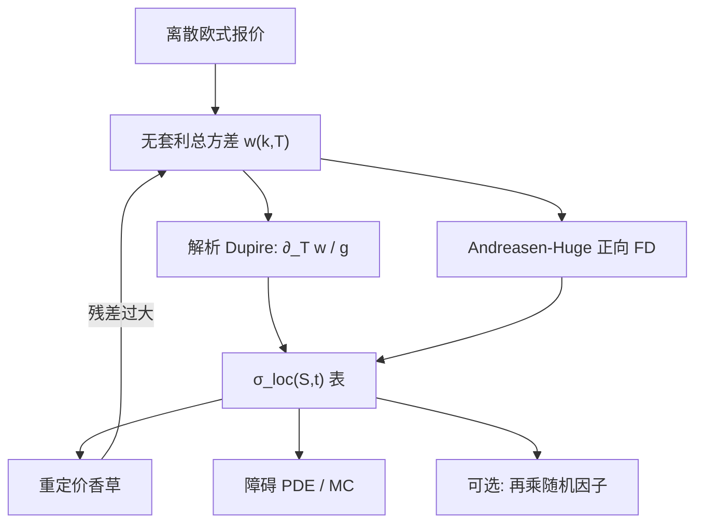

# Dupire 局部波动校准

    
公式把 $\sigma_{\mathrm{loc}}^2$ 写成日历斜率除以蝶式凸性；校准要做的是从有噪声、有缺口的离散香草，构造一个处处正、可插值、可重现全部欧式的 $\sigma(S,t)$ 表，而不是对原始报价做二阶差分。

    <footer>—— Dupire, Pricing with a Smile, Risk, 1994；总方差形式见 Gatheral, The Volatility Surface, 2006；稳定插值见 Andreasen and Huge, Risk, 2011</footer>

[Dupire 局部波动](/quant/dupire) 给出纯扩散下的恒等式：$\sigma_{\mathrm{loc}}^2$ 等于价格对期限的导数除以执行价上的凸性。那一篇写假设、条件期望解释与动态缺陷。本篇写反问题：**市场只给有限个 $(K_i,T_j)$，如何抽出一张能送进 PDE 与蒙特卡洛的局部波动表**。直接差分几乎总失败；实践是先把报价映到 [Gatheral 无套利](/quant/gatheral-arb-free) 的总方差 $w(k,T)$，再用 $w$ 的解析或稳定数值导数代入 Gatheral 形式的 Dupire 公式，或用 Andreasen–Huge 一类正向有限差分把曲面「长」出来。它不替代 [局部随机波动](/quant/local-stoch-vol) 的粒子校准，也不把 Heston 动态再讲一遍。

## 问题

理想公式需要 $C(K,T)$ 对 $K$ 二次可微、对 $T$ 一次可微，且 $\partial_{KK}C>0$、分子为正。交易所给的是买卖价差里的离散点，短到期隔夜与周末让 $T$ 的定义本身有噪声，远翼流动性消失。对中间价做 $\Delta_T / (K^2\Delta_{KK})$，分母在相邻执行价上振荡，局部波动正负跳、翼部爆炸。校准的对象因此不是「再写一遍 Dupire」，而是三条工程约束同时成立：（1）重定价全部输入香草到价差以内；（2）$\sigma_{\mathrm{loc}}^2(K,T)>0$ 在定价网格上处处成立；（3）表在 $S$ 与 $t$ 上足够光滑，使希腊字母不随网格抖动。

Gyöngy 保证存在某个马尔可夫扩散匹配给定边际，但存在性不管离散与噪声。有跳时公式读出的是有效局部方差，短端会异常大——校准器若不去正则化，会把跳质量写成 $10^3$ 的 $\sigma_{\mathrm{loc}}$，PDE 失稳。问题还包括离散股利、美式溢价、利率期限结构：这些不在 1994 年短文的零利率扩散设定里，却决定表能不能用于股票簿。

### 总方差坐标下的 Dupire

令 $k=\ln(K/F_T)$，$w(k,T)=\sigma_{\mathrm{imp}}^2(k,T)\,T$。在远期测度、适当标准化后，

$$
\sigma_{\mathrm{loc}}^2(k,T)=\frac{\partial_T w}{g(k,T)},
$$

其中 $g$ 即 Gatheral 的密度核（切片无蝶式条件）。分子是日历，分母是蝶式。校准应在 $w$ 上求导，而不是在 $C$ 上：Black 坐标已经把价格的数量级压平，SVI/SSVI 或凸样条对 $w$ 可解析求导，避免价格空间里深度实值看涨的差分被最小报价单位淹没。$g\to 0$ 的区域必须切断或外推，不能把爆炸写进表的最后一列还称之为「市场翼部」。

公式里的 $k$ 是哑变量。模拟与 PDE 查表时要用当前现货 $S_t$ 与日历 $t$ 去取 $\sigma(S,t)$。用期权执行价当状态去查，是实现错误。表的坐标是 $(S,t)$ 还是 $(K,T)$，必须在接口上写死。

## 方法

**管道 A：光滑 $w$ → 解析 Dupire。** 用 [SVI / SSVI](/quant/svi-ssvi) 或带凸约束的样条拟合各切片，期限上对固定 $k$ 做单调总方差插值，见 [无套利插值](/quant/arb-free-iv)。然后对 $w$ 做自动微分或解析导，代入上式，得到 $\sigma_{\mathrm{loc}}(k,T)$，再映回 $(S,t)$ 网格。翼部按 Lee 矩切断。优点是快、与做市曲面同一套 $w$；缺点是 $w$ 的参数噪声会进入导数，日度表可能跳。

**管道 B：Andreasen–Huge 正向插值。** Jesper Andreasen 与 Brian Huge（2011）不显式求 $\partial_{KK}C$。在相邻上市到期之间，假定局部方差只是 $K$ 的函数（对该时段分片常数于时间），用一维有限差分把密度从 $T_j$ 推到 $T_{j+1}$，反解该层的 $\sigma(K)$ 使网格上的欧式价匹配市场。一步隐式格式无 CFL，整张面在构造上无负密度、无日历倒挂。适合必须送进 PDE 的场景。代价是层内时间齐次假设：到期之间的 $\sigma_{\mathrm{loc}}(t)$ 被冻住，短端形状由上市期限的疏密决定。

**离散股利与美式。** 现金股利在除息日把 $S$ 网格切开，局部波动在除息前后是两张表，不能对「含息现货」直接套连续 Dupire。美式个股报价含提前行权溢价，必须先剥成欧式或改用指数欧式上市合约；把美式中间价塞进 $C(K,T)$ 会把早行权质量读成假局部波动。利率用与远期一致的折现曲线，否则全部偏斜是持有成本误差。

### 正则化：正性、光滑与拟合的三角

未正则的反问题病态：高频振荡的 $C$ 几乎不改价格，却剧烈改变 $\partial_{KK}C$。Tikhonov 一类惩罚 $\int(\partial_K\sigma_{\mathrm{loc}})^2$ 或惩罚 $g$ 的倒数为代价，把表拉回光滑；权重必须声明，否则「今日局部波动图」不可复现。过强的光滑会抬高翼部残差，方差条带积分（见 [方差互换复制](/quant/var-swap-replication)）会偏。过弱则 PDE 的 $\Gamma$ 乱跳。生产上用香草残差、蝶式扫描、以及一张障碍或数字期权的抽检，作为三个停止准则，而不是只看 $\sigma_{\mathrm{loc}}$ 图好不好看。

Coleman–Li–Verma 等较早的样条校准、Berestycki–Busca–Florent 的短到期渐近，提供的是正则的先验：短端 $\sigma_{\mathrm{loc}}$ 应接近短端隐含波动的某种变换，而不是任意尖峰。校准器若在 $T\to 0$ 放出与短端香草无关的巨峰，应先怀疑插值而不是「市场预期跳」。

## 机制

扩散的 Fokker–Planck 把 $\sigma(S,t)$ 锁进密度的时间演化。校准是这条 PDE 的反问题：已知各 $T$ 的边际（由香草给出），反求扩散系数。边际在离散 $T_j$ 上，时间维的信息不足，必须假设到期之间的插值（总方差线性、或 AH 的分片时间齐次）。不同插值给出不同的 $\sigma_{\mathrm{loc}}(\cdot,t)$，但在上市到期上欧式仍对——这正是「完美拟合香草」可以对应许多过程的离散版本。障碍依赖中间时刻的 $\sigma$，所以同一张香草表、两种插值，障碍价可以分开。

Gatheral 形式把病态集中在 $g$：价格凸性差一点，$g$ 过零，比值爆炸。AH 把同一约束藏进隐式差分的离散最大值原理，不让密度变负。两条路都在执行「分母不能小」；差别是显式求导还是正向演化。随机波动下，校准得到的 $\sigma_{\mathrm{loc}}^2(K,T)=\mathbb{E}[\sigma_T^2\mid S_T=K]$，表是条件期望，不是因子 $v_t$。用这张表去对冲，等于假设条件方差已被 $S$ 完全解释，偏斜随现货的搬迁通常与市场 sticky 不符——这是公式篇已经强调的动态裂缝，校准再精细也补不上，要靠 SLV 或 Bergomi。

### 验证：重定价、日历切片与网格收敛

校准后必须把全部输入执行价用同一 PDE 或树重定价，残差应落在买卖价差内；只报「Dupire 公式算过了」不够。另取一列不在校准集里的执行价（若有）做样本外。把 $\sigma_{\mathrm{loc}}$ 沿 $T$ 切片，检查是否在上市到期处出现与插值假设一致的台阶（AH）或平滑过渡（$w$ 导数）。加密空间步与时间步，欧式价应收敛；若不收敛，是表的外推或翼部切断在动，不是 PDE 格式问题。

局部波动表是模型状态。只存 SVI 五参数、不存 $\sigma_{\mathrm{loc}}$ 网格与插值规则，无法复现昨日障碍价。版本应包含：$w$ 的来源、AH 或解析路径、股利处理、翼部切断。

## 边界与工程取舍

纯扩散假设在短端常被跳与粗糙波动同时违反，见 [粗糙波动](/quant/rough-vol)。此时校准仍可给出一张「有效」表以拟合欧式，但表的短端尖峰没有过程解释，障碍会错。随机利率、外汇的国内—国外利率，要在远期测度重写分子，不能把股票零利率代码换标的就跑。篮子与个股相关不是一维 Dupire 能吸收的。

Andreasen–Huge 的一步法对极短到期、极陡偏斜需要细空间网格，否则隐式扩散把翼部抹平。解析 Dupire 对 SVI 参数日度跳敏感，希腊字母要做参数平滑或用 JW 空间正则。Dupire 1994 年是恒等式；Gatheral 的书给出 $w$ 坐标与数值警告；Andreasen–Huge 2011 年是插值算法。引用时不要合成一篇 *Risk* 文章。Derman–Kani 隐含树是同一反问题的早期离散版，稳定性更差，现已少用。

「校准到数值误差」仅对欧式香草。数字期权对 $\partial_{KK}C$ 更敏感，是表质量的更好探针：数字价若振荡，说明 $g$ 仍不够干净，尽管香草看起来已贴上。

不要用校准残差再叠一层无约束样条去「完美贴点」。残差层若破凸，静态套利从补丁里回来，与公式篇、插值篇是同一条裂缝。

## 小结

- 校准是病态反问题：先造无套利 $w(k,T)$，再用 $\partial_T w/g$ 或 Andreasen–Huge 正向差分抽出 $\sigma_{\mathrm{loc}}(S,t)$。
- Gatheral 形式把 Dupire 分母写成密度核 $g$；$g$ 近零必须切断，禁止对原始报价二阶差分。
- 到期之间的插值假设会改变障碍价，却仍可在上市到期上拟合香草。
- 离散股利、美式溢价与远期一致性是表能用的前提，不是公式的推论。
- 表需与 $w$ 来源一起版本化；动态缺陷要靠 SLV 或随机方差，不能靠更细的校准网格。
- 出处：Dupire, *Risk*, 1994；Gatheral, *The Volatility Surface*, 2006；Andreasen and Huge, *Risk*, 2011；密度见 Breeden and Litzenberger, 1978。
