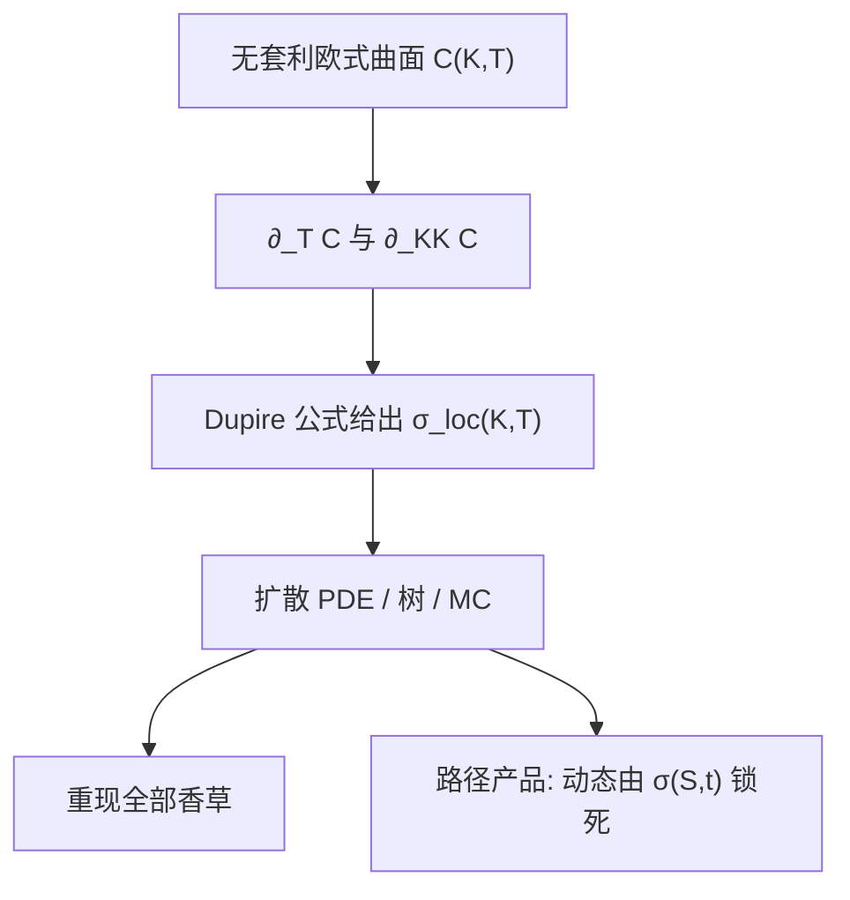

# Dupire 局部波动

    
若标的是扩散过程，欧式看涨价格对期限与执行价的导数唯一决定局部波动：$\sigma_{\mathrm{loc}}^2$ 等于日历斜率除以二分之一执行价平方上的蝶式凸性。

    <footer>—— Dupire, Pricing with a Smile, Risk, 1994</footer>

给定一整张无套利的欧式价格 $C(K,T)$，是否存在一个只依赖当前 $S$ 与 $t$ 的波动函数 $\sigma(S,t)$，使扩散 $\mathrm{d}S=(r-q)S\mathrm{d}t+\sigma(S,t)S\mathrm{d}W$ 恰好重现所有这些香草？Dupire（1994）给出肯定答案，并写出公式。Derman 与 Kani（1994）在离散树上做了同一件事：从切片倒推节点上的局部波动。这是把 [隐含波动率曲面](/quant/vol-surface) 翻译成过程的最直接方式：不增加新的随机因子，只用状态相关的瞬时波动去扭曲密度，生成 [Skew](/quant/vol-skew)。优点是今日香草可以拟合到数值误差以内；代价是动态——当 $S$ 移动时，未来的微笑由 $\sigma(S,t)$ 的形状锁死，通常与市场真实的 sticky 行为不符。本篇写公式、假设与数值陷阱，PDE 实现见 [有限差分](/quant/option-pde)。

## 问题

欧式看涨 $C(K,T)=e^{-rT}\mathbb{E}[(S_T-K)^+]$。若 $S$ 是 Itô 扩散，Fokker-Planck 描述密度演化，对 $K$、$T$ 微分并与 Kolmogorov 正想方程对照，可以把瞬时方差从密度里解出来。问题是只用可观测的 $C$ 及其导数，不经过显式密度，得到

$$
\sigma_{\mathrm{loc}}^2(K,T)=\frac{\partial_T C+(r-q)K\partial_K C+q C}{\tfrac12 K^2\partial_{KK}C},
$$

利率为零时更常写成 $\partial_T C\big/\bigl(\tfrac12 K^2\partial_{KK}C\bigr)$。分子是日历，分母是蝶式（风险中性密度）。二者必须为正，否则不是扩散或数据破坏无套利。有跳跃时，同一比值不再是扩散的瞬时方差：公式会把跳的质量误读成极大的局部波动。

唯一性是在「纯扩散 + 给定边际」的类里：Gyöngy 的引理保证存在一个马尔可夫扩散，其边际匹配给定过程的边际；Dupire 把它写成可计算的 $\sigma_{\mathrm{loc}}$。随机波动过程有同样的欧式边际时，对应的 $\sigma_{\mathrm{loc}}^2(K,T)$ 是那一族随机方差在 $S_T=K$ 处的条件期望，不是因子模型里的瞬时 $\sigma_t$。

### 与 Breeden-Litzenberger 的关系

Breeden-Litzenberger（1978）给出 $\partial_{KK}C=e^{-rT}p^{\mathbb{Q}}(K)$。Dupire 多了时间维：密度如何随 $T$ 流动，在扩散下由瞬时方差决定。只有切片没有期限结构，不能确定 $\sigma_{\mathrm{loc}}(\cdot,T)$ 的时间依赖；只有 ATM 期限结构没有偏斜，不能确定 $\sigma$ 对 $K$ 的依赖。必须要曲面，而不是一条曲线。

局部波动是 $K$、$T$ 的函数，定价时把它当成当前状态 $S$、日历 $t$ 的函数 $\sigma(S,t)$。记号上常混用：$K$ 在公式里是哑变量，模拟时要用当下的 $S_t$ 去查表。查错成执行价而不是现价，是实现错误而不是理论错误。

## 方法

数据：把离散的欧式价插成对 $K$ 凸、对 $T$ 足够光滑的 $C(K,T)$，使分子分母为正且稳定。直接差分几乎总失败——蝶式太噪。实践是：先用 SVI/SSVI 或带约束的样条拟合总方差，再解析或自动微分求 $\partial_T$、$\partial_K$、$\partial_{KK}$。翼部要按 Lee 矩公式外推，否则分母趋零、$\sigma_{\mathrm{loc}}$ 爆炸。得到 $\sigma_{\mathrm{loc}}(K,T)$ 后，在 PDE 或树、MC 上用 $\sigma(S,t)$ 给障碍、亚式、美式定价。

Derman-Kani 的隐含树：在重组树上每层用相邻执行价的期权匹配节点概率，反解向上概率与局部 $u$、$d$，使树的欧式价等于市场。数值上比连续公式更早出现稳定性问题：负概率、节点错位。后来的实现多用 Dupire PDE 正向或用 Andreasen-Huge 一类加速，而不是手搭隐含树。

### 条件期望解释

若真实过程是随机波动 $\mathrm{d}S=rS\mathrm{d}t+\sigma_t S\mathrm{d}W$，则匹配边际的局部波动满足

$$
\sigma_{\mathrm{loc}}^2(K,T)=\mathbb{E}[\sigma_T^2\mid S_T=K].
$$

这解释了为什么局部波动能复制香草却复制不了动态：它把随机的 $\sigma_T$ 压成 $S_T$ 的确定函数，条件方差被丢掉。障碍依赖路径上的波动何时出现，不只依赖终点边际。因此用 Dupire 给 down-and-in 定价，等于假设波动是 $S$ 的确定函数，通常比带负相关的随机波动更「局部」。校准流程上，人们常先用 Heston 抓住动态，再把残差香草用杠杆局部波动（SLV）贴上，避免纯 Dupire 的错误动态。

## 机制

扩散的生成元由漂移与 $\sigma(S,t)$ 完全决定。边际密度的演化（Fokker-Planck）因而被 $\sigma$ 锁住。倒过来，已知所有边际，就能在扩散族里解出 $\sigma$。这是信息论意义上的「刚好」：欧式给边际，扩散给马尔可夫，二者钉死局部波动。市场若还有跳，信息过多或过少取决于你是否坚持扩散——坚持的话只能得到一个有效的、被跳污染的 $\sigma_{\mathrm{loc}}$，短端往往异常大。

对冲上，局部波动的 $\Delta$ 与 Black-Scholes $\Delta$（插入 $\sigma_{\mathrm{imp}}(K,T)$）不同：前者知道未来切片如何随 $S$ 搬迁。不幸的是，这种搬迁通常把偏斜往错误方向带——股价下跌后，局部波动模型里的微笑往往变得更平或反向，而市场的负偏斜会保持甚至变陡。这是 Dupire 作为「完美拟合工具」与「动态模型」之间的裂缝。交易员仍用它给当日香草与某些障碍做无套利插值，但会用随机波动或历史来覆盖动态风险。

公式分母里的 $\partial_{KK}C$ 是密度。密度接近零的远翼上，任何价格噪声都变成巨大的 $\sigma_{\mathrm{loc}}$。报告局部波动图时，应切掉没有流动性的执行价，而不是把爆炸画成「市场的翼部预期」。

### 随机局部波动

纯 Dupire 动态差，纯 Heston 贴不严当日所有执行价。随机局部波动（SLV）让瞬时方差等于随机因子乘杠杆函数 $L(S,t)$，$L$ 用来补残差香草，随机因子用来保留杠杆相关与波动聚类。$L$ 的校准常通过粒子法或 PDE 去匹配 Dupire 的 $\sigma_{\mathrm{loc}}$ 与条件期望关系。结果是香草仍拟合、障碍价格落在局部与随机之间。SLV 参数多、识别弱，必须用少量路径产品锚定混合权重，否则 $L$ 与因子会互相替代。

## 边界

纯扩散、无跳、利率与分红确定、连续可微的 $C$，是公式的假设。离散股利要在除权日把网格切开。美式市价不能直接当 $C$ 代入。日历套利或蝶式为负时分子或分母变号，应先修曲面再求 $\sigma_{\mathrm{loc}}$，而不是在负区域取绝对值。随机利率下有类似公式，但要在远期测度里写，不能把股票 Dupire 直接贴到债券期权。

数值上，时间轴太稀会让 $\partial_T$ 变成粗差；到期日之间的插值假设（总方差线性 vs 其他）会改变 $\sigma_{\mathrm{loc}}$ 的期限结构。MC 实现要二维插值 $\sigma(S,t)$，外推规则必须声明。Dupire 1994 年发表在 *Risk*，是短文与公式；严格的分析条件与 Gyöngy 联系在随后的数学文献里。Derman-Kani 同年的 *Risk* 文章是树版本，引用时不要合成一篇。

局部波动「完美拟合」指的是欧式香草。对美式、障碍、回望没有完美二字：那些产品依赖过程，而 Dupire 只锁定了边际。若市场同时报障碍，一般不能再用同一 $\sigma_{\mathrm{loc}}$ 同时拟合两类合约。

## 小结

- Dupire（1994）给出扩散下局部波动与欧式价格导数的恒等式，$\sigma_{\mathrm{loc}}^2=\partial_T C\big/(\tfrac12 K^2\partial_{KK}C)$（零利率形式）。
- 分母是风险中性密度，分子是日历；无套利是公式可计算的前提。
- 该 $\sigma_{\mathrm{loc}}$ 重现全部欧式边际，等价于随机方差在 $S_T=K$ 上的条件期望。
- 动态被锁死，偏斜随现货的搬迁通常与市场不符，路径产品有模型风险。
- 数值必须先光滑凸插值，禁止对原始报价直接二阶差分。
- 有跳时公式不再是瞬时扩散方差；实践常用 SLV 把局部与随机波动叠加。
- 出处：Dupire, *Risk*, 1994；Derman and Kani, *Risk*, 1994；密度见 Breeden and Litzenberger, *Journal of Business*, 1978。
