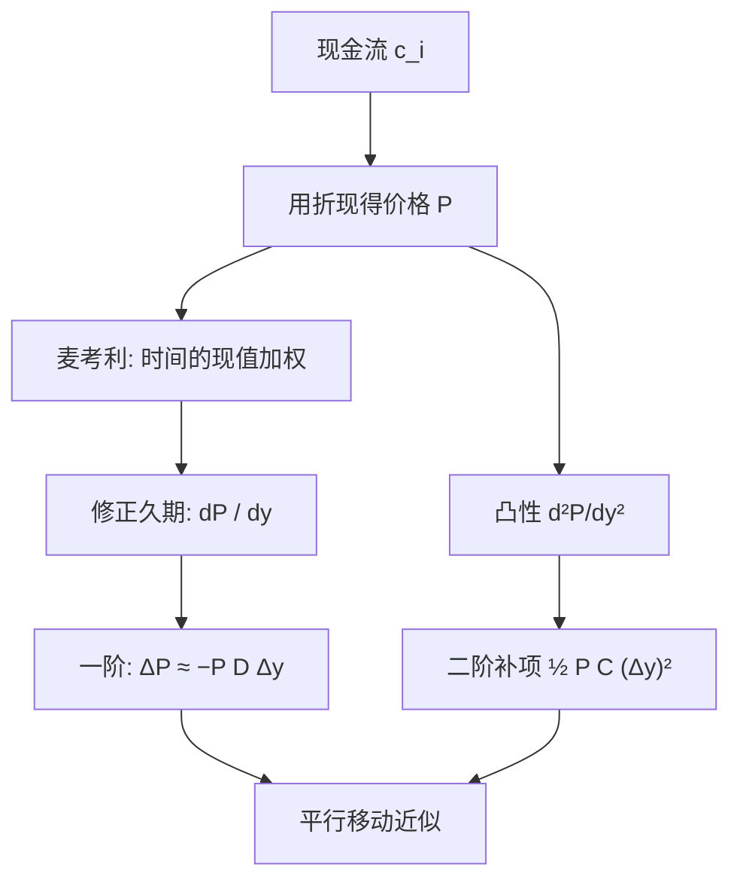

# 久期、凸性

    
麦考利久期是现金流到期的现值加权平均；修正久期是价格对收益率的对数导数；凸性是二阶项，使收益率大变动时线性近似不再够用。

    <footer>—— Macaulay, Some Theoretical Problems Suggested by the Movements of Interest Rates..., NBER, 1938；教科书表述见 Hull 与 Fabozzi</footer>

Frederick Macaulay 1938 年在 NBER 的研究里引入后来所称的麦考利久期：把债券看成一串现金流，用到期时间的现值权重做平均，得到一个以年为单位的「有效到期」。它最初服务的是利率变动与资产负债匹配，而不是交易台的 01。后来市场把价格对收益率的敏感性写成修正久期（modified duration）：在常用报价惯例下，它等于麦考利久期除以 $1+y/m$。凸性是价格对 $y$ 的二阶导，平行移动很大时，久期线性项低估了普通债券的价格（正凸性）。Hull 把这些对象放进固定收益风险的入门；它们描述的是整条曲线的平行移动，形状风险要交给 [关键利率久期](/quant/key-rate-duration)。

## 问题

债券价格 $P$ 是收益率 $y$ 的非线性函数。交易与风控需要一个一阶数字回答「收益率升 1bp，价格掉多少」，以及一个二阶数字回答「升 50bp 时一阶是否够」。直接对每个现金流用折现因子扰动更精确，但报价与限额仍习惯用收益率坐标。久期把一阶收成标量；凸性把弯曲收成标量。二者都依赖「什么是 $y$」：到期收益率、曲线的平行平移、还是某条基准曲线上的平行冲击，数值不同。

麦考利久期还有现金流时间的解释，便于免疫：若负债的麦考利久期与资产匹配，平行的瞬时小移动下净值一阶稳定。大移动与非平行移动破坏免疫，这是凸性与关键利率要补的洞。问题不在公式难，而在误把一个平行情景的标量当成全部利率风险。

### 麦考利、修正与 DV01

对周期付息、到期收益率 $y$（每期 $y/m$）的债券，

$$
D_{\mathrm{Mac}}=\sum_{i} t_i \frac{\mathrm{PV}(c_i)}{P}, \qquad D_{\mathrm{mod}}=\frac{D_{\mathrm{Mac}}}{1+y/m}=-\frac{1}{P}\frac{\mathrm{d}P}{\mathrm{d}y}.
$$

DV01（或 PV01）是收益率变动一个基点的货币价格变化，约 $P\cdot D_{\mathrm{mod}}\times 10^{-4}$。浮动利率债在刚重置后麦考利久期接近下次重置的时间，而不是名义到期——这是「有效到期」相对日历到期的要点。零息债的麦考利久期等于到期；票息越高、久期越短。

修正久期的分母随复利次数变。把年复利公式用到半年付息国债上，会差一个与 $y$ 同阶的相对误差。任何跨市场比较久期，先统一 $y$ 的惯例。

## 方法

价格的 Taylor 展开

$$
\frac{\Delta P}{P}\approx -D_{\mathrm{mod}}\Delta y+\frac12 C(\Delta y)^2,
$$

其中凸性 $C=P^{-1}\mathrm{d}^2P/\mathrm{d}y^2$。普通固定票息债 $C>0$：收益率无论大升大降，二阶项都补正价格，期权空头或按揭负凸性产品则相反。计算上可以对解析公式求导，或对 $y$ 做 $\pm\Delta$ 的中心差分；含权债券没有单一 YTM 的干净导数，应在曲线上做平行冲击，用模型价格差分，得到有效久期与有效凸性。

免疫策略：匹配久期后，小平行移动下资产与负债的现值同比例变。凸性不匹配时，大移动仍裂开。资产凸性高于负债时，平行大移动对净值有利，这是「多凸性」的民间说法；代价是收益率不变时往往付出票息或期权费。Hull 提醒：免疫是对瞬时平行移动的一阶陈述，不是保证持有期收益。

### 与折现因子坐标的关系

在 [即期、远期与折现](/quant/spot-forward-df) 里，价格对 $P(0,T_i)$ 线性。平行移动 $y$ 是对整条即期曲线加常数，对应的折现扰动随期限放大，不是每个 $P(0,T_i)$ 同比例。因此久期是特定方向上的方向导数，不是现金流向量的范数。换一条基准（政府曲线还是互换曲线）或换平行的定义（即期平行还是远期平行），久期数字会变。报告必须写明冲击的坐标。

## 机制

久期随时间自然缩短，也随收益率反向变化（收益率升，久期通常略降）。再平衡免疫组合需要交易。凸性来自现金流的分散：两次支付离得越开，对 $y$ 的二阶越强。 barbell（两端现金流）比 bullet（集中到期）在同样久期下凸性更大，平行大移动中 barbell 更占优，非平行的扭转中则可能更差——这把话题推向关键利率。

负凸性出现在可赎回债、MBS：利率降，提前偿付或赎回截断涨价。此时「收益率升跌都对你有利」的正凸性故事反转，有效久期随冲击大小变化，必须用模型情景而不是 YTM 解析式。这与期权的 Gamma 是同一类二阶：利率期权的 Gamma 在债券账上表现为凸性。

### 平行移动假设的代价

若曲线只扭转、总水平不变，麦考利匹配帮不上忙。经验上，水平因子解释利率变动的一大部分，故久期仍是第一风险；但残差的斜率与曲率足够在杠杆组合里造成损失。用一维久期对冲互换与国债的组合，会在基差与扭转上裸奔。多曲线下还有 OIS 与投影两条水平，单一修正久期更加不够，见 [OIS 与多曲线](/quant/multi-curve-ois)。

把「久期中性」写成无利率风险，等于假设曲线只做平行移动且冲击无穷小。限额上应同时有凸性或曲率限额，以及分桶暴露。

## 边界

YTM 久期把债券压到一个内部收益率，信用与流动性溢价混在 $y$ 里，政府曲线冲击与信用冲击分不开。通胀挂钩、浮动债、外汇债要重新定义「收益率」。Macaulay（1938）的对象是美国长期利率与债券平均到期的理论问题，不是今日互换 DV01 的软件规格。现代计算应对曲线做明确冲击，YTM 公式只适用于简单固定票息的教学与报价近似。

凸性对 $\Delta y$ 的平方敏感，单位要与久期一致（年²）。混淆百分比凸性与货币凸性会造成数量级错误。含权产品的有效凸性可以在情景间变号，不宜写成一个常数。

DV01 是货币，久期是百分比敏感。比较两只债券的风险用 DV01 更干净；用久期比较必须在价格相近或先换成货币。

## 小结

- 麦考利久期是现金流到期的现值加权平均（Macaulay, 1938）；修正久期是价格对收益率的一阶相对敏感。
- 凸性是二阶，普通固息债为正，可赎回与 MBS 可为负。
- 一阶加二阶只对所定义的平行 $y$ 冲击成立；扭转与基差不在内。
- 有效久期用曲线冲击与模型重定价，适用于含权产品。
- 免疫匹配的是瞬时平行移动，需要再平衡，且不覆盖形状风险。
- 出处：Macaulay, NBER, 1938；Hull, *Options, Futures, and Other Derivatives*；固定收益操作细节见 Fabozzi。
