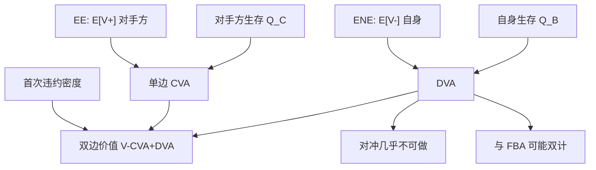

# DVA 自身信用调整

双边估值把「我可能违约、对手方因此免于向我索偿」记成一项收益；会计上它随自身利差波动，经济上却很难用卖出自己的保护来对冲。

<footer>—— Gregory, Counterparty Credit Risk and Credit Value Adjustment，及其后续 xVA 论述中对 DVA 的专门处理</footer>

[CVA 要点](/quant/cva-lite) 把单边 CVA 定义为对手方违约时我的正暴露损失，并明确：先把单边做对，再引入其他字母。DVA（Debit Valuation Adjustment，有时称自身信用调整）是同一逻辑的镜像：我违约时，对手方的正暴露（对我为负的市值）得不到全额，我的负债被减记。Gregory 反复分开两件事——会计公平价值往往包含 DVA，交易台却不能像买对手方 CDS 那样对冲自身违约。本篇写双边公式、首次违约、close-out 惯例，以及 DVA 与 [FVA](/quant/fva-funding) 的重叠；不把 [EE 剖面](/quant/cva-exposure-profile) 的构造再讲一遍。

## 问题

记 $V_t$ 为我对净额集的盯市。单边无违约价值为 $V$，单边 CVA 是对手方违约时钟对 $V^+$ 的积分。DVA 是自身违约时钟 $\tau_B$ 对 $(-V)^+=V^-$ 的积分：

$$
\mathrm{DVA}\approx (1-R_B)\sum_i \mathrm{DF}(t_i)\,\mathbb{E}[V_{t_i}^-]\,\bigl(Q_B(t_{i-1})-Q_B(t_i)\bigr),
$$

在独立、无首次违约调整时。双边报价常写成 $V-\mathrm{CVA}+\mathrm{DVA}$（符号惯例：DVA 使负债方账面更好看）。问题立刻有三：自身生存 $Q_B$ 用哪条曲线（自身 CDS、债券利差还是内部资金）；我违约与对方违约哪个先发生；违约时 close-out 金额是无风险替换还是已经含对方 CVA 的替换。后两条改变 DVA 是否可加、以及危机里利差齐飞时会不会双计。

第二问题是治理。自身 CDS 走阔，DVA 增加，利润上升——这是「自己更可能倒所以负债变轻」。股东与债权人并不认为这是可分配利润；对冲它意味着在自身违约时还要再支付，经济上接近增发自己的信用保护。Gregory 的立场是：DVA 可以出现在会计，但作为对冲簿必须另眼看待，不能与单边 CVA 同一套限额语言。

### 首次违约使 CVA 与 DVA 不能各算各的再相加

若双方都可能违约，先倒的一方触发 close-out。我的 CVA 只应在对方先违约的路径上计提，DVA 只应在我先违约的路径上计提。独立假设下可用生存乘积

$$
\mathbb{Q}(\tau_C\in\mathrm{d}t,\tau_B>t)=e^{-\int(\lambda_C+\lambda_B)}\lambda_C\,\mathrm{d}t
$$

修正密度。忽略首次违约，会在双方利差都宽时把 CVA 与 DVA 都算大，净调整偏「自身受益」或偏「双计损失」，取决于哪条曲线更宽。相关违约（共同因子）再改联合密度；金融对手方在危机里 $\tau_B$ 与 $\tau_C$ 同跳，首次违约调整与错向缠在一起，独立乘积不够。

自身 CDS 流动性往往极差，甚至没有。用自身债券利差当 $Q_B$，会把融资与税收送进 DVA；用高级无抵押曲线或内部评级映射，又与会计「自身信用」定义不一致。曲线选择本身就是 DVA 政策，应写进估值规程，而不是藏在贴现代码里。

## 方法

**镜像暴露。** DVA 用的是 $\mathbb{E}[V_t^-]$，即负暴露剖面，与 CVA 的 EE 来自同一套模拟、同一净额集，只取另一侧正部。抵押与 CSA 对两侧不对称：阈值、独立金额、评级触发可以只对一方严格，于是 $\mathbb{E}[V^+]$ 与 $\mathbb{E}[V^-]$ 不是简单翻转。取消权也不对称。不要用「CVA 换一个名字的 CDS」去套 DVA 而不重跑剖面。

**自身曲线。** 有自身 CDS 时，自举方法与对手方相同，见 [生存曲线自举](/quant/cds-survival-bootstrap)。回收 $R_B$ 是自身负债的回收，未必等于对手方回收。无 CDS 时，会计政策常指定一条高级无抵押利差或债券曲线。该曲线一动，DVA PnL 就动，即使组合的市场因子没动——这是 DVA 作为「自身信用因子」的定义。

**close-out。** ISDA 在危机后的讨论区分：替换价格是否包含剩余对手方风险。若 close-out 用无风险价值，双边公式接近 CVA−DVA 加首次违约；若用含 CVA 的替换，出现非线性，Brigo–Morini 等给出过不同约定下的定价核。工程上必须与法律和会计选同一约定，否则前台 DVA 与关闭时实际赔付对不上。

### 对冲为何几乎不可做

对手方 CVA 可以对冲：买该名字或指数 CDS。DVA 的对冲是卖出自身 CDS（或买回自身债）。卖自身保护在监管与市场看来接近增杠杆、且自身违约时对冲对手方也倒，回收重叠。买回自身债能实现一部分负债减记的经济，但需要现金，规模达不到衍生品负暴露的名义。于是 DVA PnL 通常裸奔：自身利差收窄（信用改善）会带来 DVA 损失，看起来像「好消息亏钱」。会计与管理报表应把这笔 PnL 单列，避免交易员用它抵 CVA 对冲成本。

指数对冲自身信用更弱：指数含许多名字，自身权重接近零。用指数空头「对冲 DVA」是在加一般信用风险，不是对冲自身回收。Gregory 把这类代理记为基差与错向，而不是完成的 DVA 对冲。

## 机制

经济机制是破产时债务减免：衍生品若对我为负债，破产财团不必按无风险全额支付，对手方加入债权人队列。这笔期权的价值随自身强度上升。它与买债券做空自身信用不同：债券要先融资，DVA 是未资金化的或有减免。正因为未资金化，它与 [FVA](/quant/fva-funding) 的融资收益（FBA）容易讲成同一件事：我为负暴露「占用了对手方的信用、减少了自己的融资需求」。双计会把同一自身利差算进 DVA 又算进 FBA。政策必须二选一或明确拆开哪一段利差进哪一个字母。

自身利差与市场因子的相关是自身错向：利率朝负债方向走时我更可能倒，DVA 大于独立公式。银行自身往往在利率下行、资产贬值时利差走阔，对接收固定的账簿，$V$ 变负的同时 $\lambda_B$ 上升，DVA 更大。这与对手方错向符号可能相反，双边净调整不是两个独立 CVA 相减。

监管资本通常不允许用 DVA 收益减信用风险资本。会计承认公平价值、资本扣回，是同一调整在两套制度里的分裂。内部转移定价若把 DVA 算给交易台当利润，会激励堆积不可对冲的自身信用。

### 与单边政策、CCP 的边界

许多机构对客户做单边 CVA（只收对手方风险、不把自身违约让给客户），对同业才谈双边。这是商业选择：客户合同往往不可对自身 DVA 讨价还价。CCP 清算后，双边 DVA 对会员之间的衍生品消失，变成对 CCP 的暴露与违约基金；自身违约由会员资格与损失分摊处理，不能再记一笔对 CCP 的 DVA 当利润。把清算当成「DVA 变现」是搞错对象。

## 边界与工程取舍

不要在管理 PnL 里用 DVA 对冲 CVA 的 CDS 成本而不披露。不要用自身债券 z-spread 当 CDS 强度而不扣 [基差](/quant/cds-bond-basis)。不要忽略首次违约却在双方利差都到 500bp 时仍把 CVA 与 DVA 线性相加。不要假设 $R_B=R_C$。自身曲线的映射误差是 DVA 的主成分，应做敏感度而不是一个数。

与 KMV、评级：自身 DD 恶化会同时抬升会计 DVA 与市场融资成本，但 EDF 不能直接进 DVA 公式，见 [KMV](/quant/kmv-dd)。DVA 用风险中性自身曲线。实现上，双边引擎必须输出 CVA、DVA、首次违约调整三列，便于会计与内部价切换政策而不重跑市场因子。

出处：Gregory 的 CVA 书与 *The xVA Challenge*。close-out 与双边核见 Brigo、Capponi、Pallavicini、Morini 一脉。会计与经济分裂是 DVA 文献的主线，不是实现细节。

## 小结

- DVA 是自身违约时负暴露被减记的价值，镜像于 CVA，用 $\mathbb{E}[V^-]$ 与自身生存曲线。
- 首次违约使 CVA 与 DVA 不能独立相加；相关违约在危机里更关键。
- 会计可含 DVA，经济对冲需卖自身保护或买回自身债，通常不可行，PnL 应单列。
- close-out 是否含替换 CVA 会改变公式；须与法律会计一致。
- 与 FVA 的融资收益可能双计同一自身利差，政策要拆开。
- 出处：Gregory 的 xVA 论述；双边与 close-out 见 Brigo 等。
