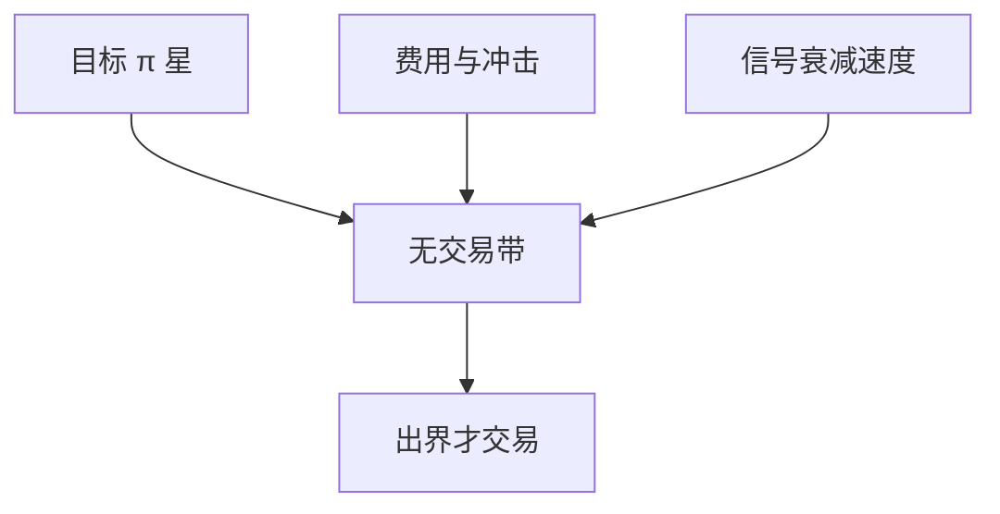

# 动态规划与再平衡

离散再平衡把连续 Merton 政策变成带费用的停时问题：不是每期都调到目标，而是等偏离足够大再动。

<footer>—— 动态规划见 Bellman；带交易费用的组合见 Constantinides, Capital Market Equilibrium with Transaction Costs, JET, 1986</footer>

[上一课](/quant/merton-portfolio-implementation)给出目标权重 $\pi^\ast$。缺口是**时钟**：连续再平衡在有费用时立刻不是最优。主干 [再平衡规则](/quant/rebalance-rules) 已写日历/阈值启发式。本课把同一件事写成动态规划：状态、价值函数、无交易带。后课 Gârleanu–Pedersen 把冲击写成二次，给出另一种显式政策。

## 问题

无费用时，离散时间幂效用的最优仍接近 myopic 加对冲，每期把权重拉回 $\pi^\ast$。有与成交金额成正比的费用（或冲击）时，最优是：存在一个无交易区域，权重在带内不动，到边界才调回（或调到边界）。问题是把「季度再平衡」从运营习惯升级为对费用参数的解，否则阈值只是拍脑袋，与 [净边缘](/quant/net-edge) 脱节。

状态至少包括：当前权重、财富、可选的预测状态。维度诅咒使完全 DP 只对低维可行；高维要用近似 DP、或二次冲击下的闭式（下一课）。

### 无交易带不是风险预算带

风险预算说「偏离因子暴露不超过 x」。无交易带说「偏离目标权重直到费用被期望增益覆盖」。两者可以同向，但参数来源不同：一个来自跟踪误差限额，一个来自 $\lambda_{\mathrm{cost}}$ 与信号衰减。混用会把风控限额当成最优再平衡。

T+1、涨跌停、最小手数把可行动作变成格点。DP 的动作空间必须是可执行动作，不能是连续 $w\in\mathbb{R}^n$。

## 方法

写 Bellman：$V_t(x)=\max_a \mathbb{E}[u(\mathrm{cashflow})+V_{t+1}(x')]$，动作 $a$ 含交易量。费用线性或固定+线性。解：低维用网格；高维用对无费用解加边界近似（Constantinides 的带）。校准费用用 TCA 的实现，不是用佣金表上的最低档。政策评估用同一模拟器比较：日历再平衡 vs 阈值 vs DP 近似，对象是扣费后的效用或增长率，不是周转率本身。

## 机制

再平衡的边际收益是把风险暴露拉回有效前沿（或拉回 Merton $\pi$）所增加的期望效用；边际成本是费用加冲击加税（后课）。最优在二者相等的边界上。信号衰减快（高频 alpha）时带变窄，该多动；信号是风险溢价慢变量时带变宽。这与「永远保持目标权重」的运营话术冲突，却与容量课一致。

## 边界

估计的 $\pi^\ast$ 本身在动（校准噪声），带会被噪声触发，需要把 $\pi^\ast$ 也平滑，见正则化课的隔日罚精神。多账户、税基批次让状态爆炸，税务课再加。DP 对模型误设敏感：费用低估会交易过度。

## 小结

- 有费用时最优是无交易带，不是每期精确再平衡。
- 带的宽度由费用与信号衰减共同决定，不是由日历。
- 高维求近似；可执行约束必须进动作空间。
- 出处：Bellman 动态规划；Constantinides, *JET*, 1986。
